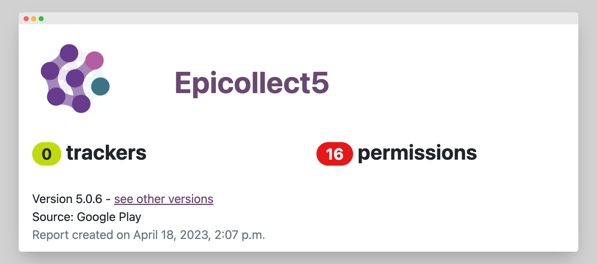

# Privacy Policy

This statement explains how the [**Centre for Genomic Pathogen Surveillance**](https://www.pathogensurveillance.net/) (**CGPS**) uses the personal information we collect from you when you visit the Epicollect5 website.

By visiting the Epicollect5 website you are consenting to our use of your information in this way.

We may make changes to this statement so please check from time to time for any updates.

#### User Accounts

Users can log in to Epicollect5 using:

* Google Account
* Apple Account
* Email

The only piece of information kept in the system is the user email for basic project user management.

Whether you want to use your personal email or another email just for Epicollect5 is up to you.

The mobile application is verified by [**Exodus Privacy Project**](https://reports.exodus-privacy.eu.org/en/reports/uk.ac.imperial.epicollect.five/latest/)**.**

<figure><figcaption></figcaption></figure>

Starting from version 6.0.0, our mobile applications now include a feature to collect **anonymous** error information. This data collection helps the Epicollect5 Team identify and address bugs effectively, ensuring a smoother user experience for everyone. Please note that **no personal details are collected during this process**. Additionally, we respect your privacy, and users have the option to opt-out at any time from the Settings page if they prefer not to participate.


Your feedback and participation in improving our platform are greatly appreciated.


#### User Data

Project managers retain ownership of the data. We will never share or access your data unless granted permission by you, to provide you with technical assistance.

Technically speaking, each user owns all of the content added to Epicollect5; therefore, they could copyright it. However, by uploading data to Epicollect5 a user gives direct access to that material to whoever has access to that project.

#### Personal Data and Your Responsibilities

CGPS is based in the UK and operates under the UK General Data Protection Regulation (“UK GDPR”). You may be in a different legal jurisdiction so must ensure that you follow UK GDPR as well as your own local laws. For more information on UK GDPR please see [Information Commissioner's Office (ICO)](https://ico.org.uk/).

When you use Epicollect5, CGPS is the Data Processor and you are the Data Controller, as you have control over the data you collect and CGPS only acts on your instructions.

\
**Publication of Data**

If you make a project public, ALL project data you have collected will be visible to anyone on the internet. Please ensure that you are not breaking any Data Protections laws that may apply. CGPS cannot be held responsible for data published by users.

#### Reasonable Use and Data Retention

The service is provided at no cost to you, however, we incur costs for managing and processing the data. We reserve the right to delete excessively large or dormant data sets after a period of time, however, we will attempt to contact you by email before doing so.

#### Protecting Your Data

Epicollect5 is part of the Big Data Institute at Oxford University ([**https://www.bdi.ox.ac.uk**](https://www.bdi.ox.ac.uk/)) and hosted on the world-class cloud hosting provider, **Digital Ocean:** [**https://www.digitalocean.com**](https://www.digitalocean.com)**,** in their **UK** data centre.

You can read about Digital Ocean data security here:

[**https://www.digitalocean.com/legal**](https://www.digitalocean.com/legal/)

Digital Ocean services fully comply with GDPR:

[**https://www.digitalocean.com/legal/gdpr**](https://www.digitalocean.com/legal/gdpr/)

Epicollect5 embraces industry-standard best practices to protect against unauthorised access to your data, including:

1. **Authentication and Authorization**: Secure authentication mechanisms such as OAuth and JWT tokens, ensuring that users only have access to the resources they are authorized to access.
2. **Input Validation**: Validating all inputs from users to prevent injection attacks and other malicious actions. Using parameterized queries for database interactions to prevent SQL injection.
3. **Data Encryption**: Data are sent over [**HTTPS**](https://en.wikipedia.org/wiki/HTTPS) and its TLS certificate uses SHA-256 with RSA encryption as a signature algorithm.
4. **Security Headers**: Implementing security headers to mitigate various types of attacks like CSRF attacks, cross-site scripting (XSS), clickjacking, and MIME sniffing.
5. **Secure Coding Practices**: Follow secure coding practices such as input validation, output encoding, error handling, and proper session management to minimize the risk of security vulnerabilities.
6. **Patch Management**: Keep all software components up to date with the latest security patches and updates to address known vulnerabilities.
7. **Least Privilege Principle**: Follow the principle of least privilege, where users and processes are granted only the minimum level of access or permissions necessary to perform their tasks.
8. **Monitoring and Logging**: Robust logging and monitoring mechanisms to detect and respond to security incidents in real time.
9. **Backups**: Daily backups of the server are run in case of a system fault.

**Privacy and Data Storage in Epicollect5 Mobile Application(s)**

Regarding the storage of data within the Epicollect5 mobile application, it's important to note that the app's data resides in the device's private application folder. This folder is exclusively accessible to the Epicollect5 application and is not accessible to other apps.

By default, data stored within the Epicollect5 app is not encrypted. However, for users requiring an additional layer of security, most modern Android and iOS devices offer the option of system-wide encryption. Activating this system-level encryption on the device can provide enhanced security for all stored data, including that within the Epicollect5 app. [**Read how to do it**](https://gizmodo.com/why-you-should-be-encrypting-your-devices-and-how-to-ea-1798698901).

#### Account and Data Deletion

In accordance with Google and Apple account deletion policies, we have implemented a process for data deletion.

Users can initiate an account deletion request by clicking on the designated button available both in the app and on the web, specifically on the user profile page. It is important to note that personal data, which includes only email addresses, will always be deleted.

Regarding user contributions (entries) to projects, the deletion process varies depending on the project role.

For projects where the user has a CREATOR role, all projects (both private and public) created by the user will be deleted, along with all associated entries.

For contributions made to private projects using the roles of MANAGER, CURATOR, or COLLECTOR, the entries will not be deleted but will be anonymized instead. Additionally, the user's access to these projects will be revoked.

Contributions to public projects are already anonymized by default when using mobile apps, but entries added via the web will also undergo anonymization.

Furthermore, users with a VIEWER role will be removed from any project. Since VIEWER role users cannot add entries to private projects, there won't be any entries to delete.

Finally, users have the option to delete contributions to private projects before proceeding with their account deletion. However, it's important to note that this process is manual, and each entry must be deleted individually. This is a deliberate choice to prevent unintended data loss and mistakes. By taking this approach, users have better control over their data and can carefully manage their contributions before proceeding with the account deletion.


We understand the importance of the data you collected. However, please note that account deletions are **automated and final**. Once a deletion request is submitted and processed, **all associated data is permanently removed** under data protection laws and our privacy policy.\
By law, we are **not permitted to retain or recover user data** after such a request has been completed.​


#### Contact Us

Our primary point of contact for all matters is the Epicollect5 Community at [community.epicollect.net](http://community.epicollect.net/)

If there is a need to discuss a particular request privately, we will provide users with a support email address to facilitate this private conversation. Subsequently, the public topic related to the request will be closed to ensure the confidentiality of the discussion.
