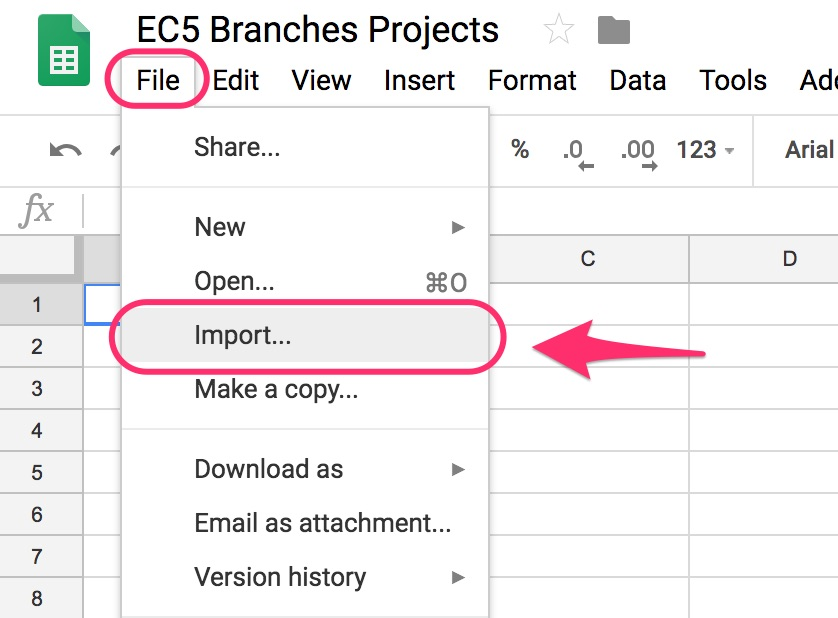
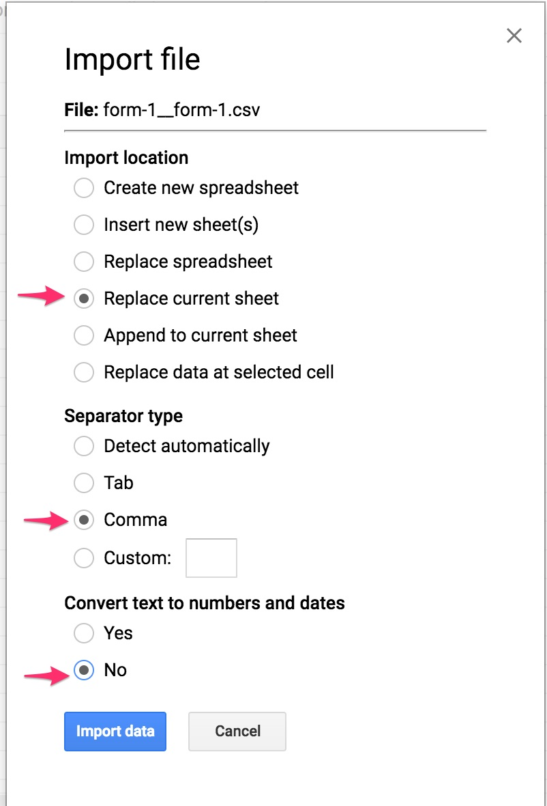
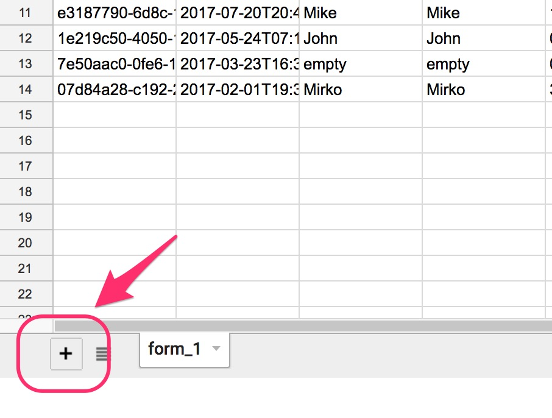
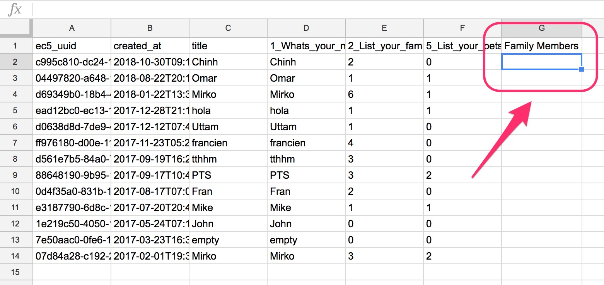
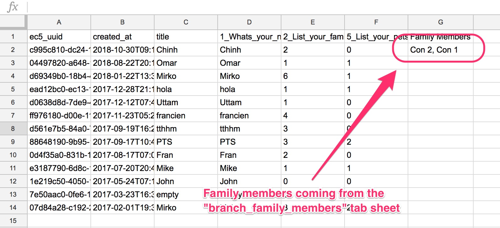
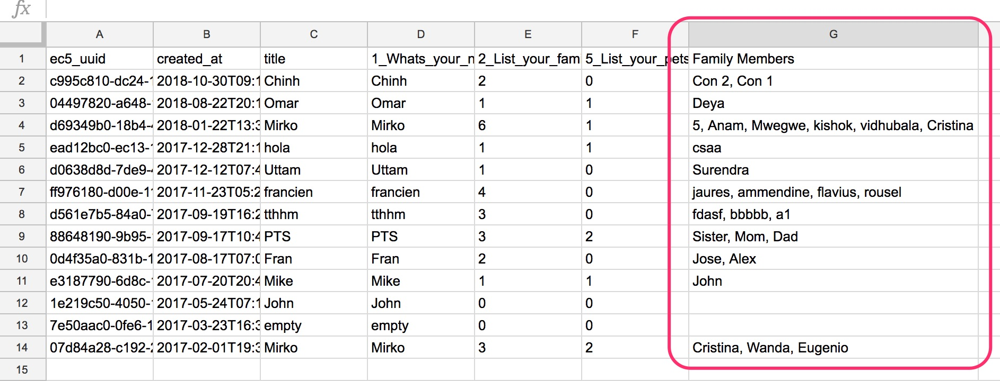
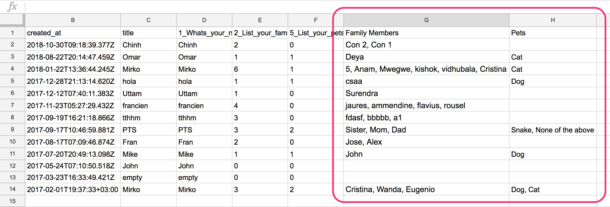
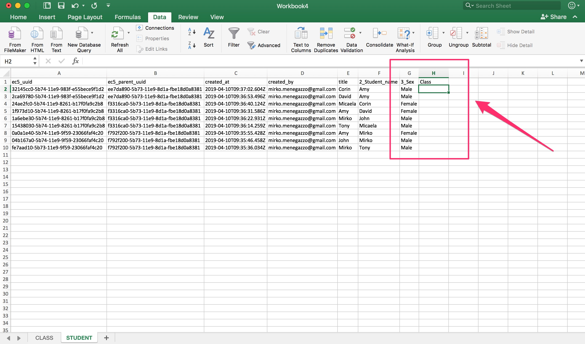
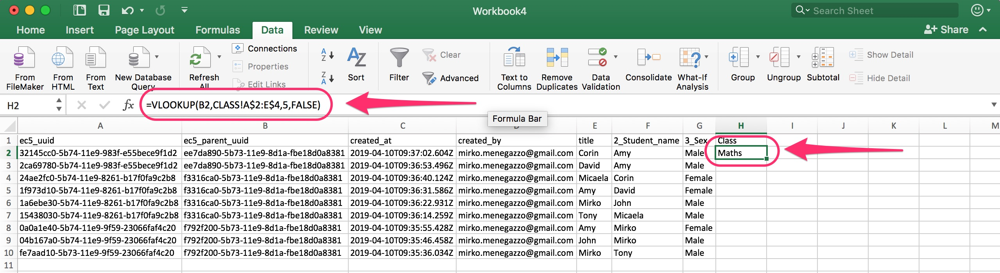
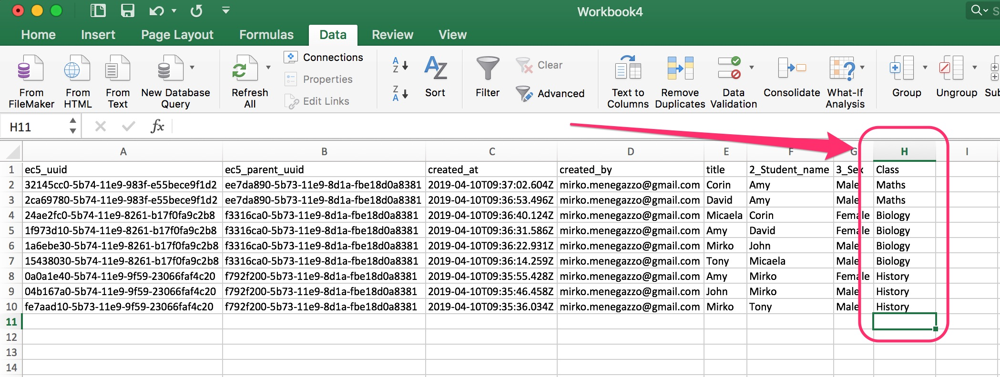

# Consolidate data

When you download data from Epicollect5, the system creates a file for each form and for each branch. Epicollect5 unique identifiers are added to the data set to link the data together.


Since each project requirements are different, we leave the data consolidation down to the user in the post-processing of data.


## Epicollect5 identifiers

Each hierarchy form data set will have a column called "**ec5\_uuid**" with a unique identifier per each row. Any child form down the hierarchy will also have a column called "**ec5\_parent\_uuid"** to reference data from its parent form**.**

Each branch data set will have a column "**ec5\_branch\_owner\_uuid**" which will reference each "**ec5\_uuid**" of a hierarchy form.

The values (which look like `d559da55-0df3-4121-8db0-5870d4faf038`) are system generated identifiers used to keep the relationships on the data.

These identifiers are always present on any downloaded data sets and API responses.

## Consolidate data using Google Sheets

We will use [Google Sheets](https://www.google.com/sheets/about/) for this example, but the same concept can be applied to [Excel](https://products.office.com/en/excel), [Apple Numbers](https://www.apple.com/lae/numbers/) and similar.


An Excel example using **VLOOKUP** function is shown below.


What follows is just a simple example about how to merge data coming from three files (one hierarchy form and two branches) based on our [EC5 Branches Project ](https://five.epicollect.net/project/ec5-branches-project)example project.

First of all, let's download the data in CSV format for that project and save it somewhere handy. The downloaded .zip will contain 3 CSV files:

* `form-1__form-1.csv`
* `branch-1__list-your-family-members.csv`
* `branch-2__list-your-pets.csv`

We created a new spreadsheet and imported the above mentioned files, one per each sheet tab, doing FILE > IMPORT



We use the following settings per each file:



Please make sure you add each file in its own tab sheet. To create a new tab sheet, just click on the "+" button at the bottom left:

We also called our tab sheets "form\_1", "branch\_family\_members", "branch\_pets". This is to make easier to reference them in our formulas.



On the "form\_1" tab sheet, create a new column called "Family Members" where we will fetch the data from the "branch\_family\_members" tab sheet. Click on the fist empty cell of that column to select it:



On that cell we add this formula: (_if you like to know more about Google Sheets and available formulas, the docs are_ [_here_](https://support.google.com/docs/topic/9054603?hl=en\&ref\_topic=1382883))

```
=iferror(JOIN(", ", QUERY( branch_family_members!$A:$F , "select E where A = '"&$A$2:$A&"'")))
```

We wrap everything in `iferror()` to fetch data only if there are some branches for that row, otherwise leave the cell empty.

We use `JOIN("," {QUERY(...)})` to concatenate the family members data found with a comma.

In the QUERY statement, we first reference the "branch\_family\_members" from column A to F, basically all the columns in the "branch\_family\_members" sheet. On the right side of the QUERY statement, we search for data on column E on that tab sheet (**3\_Family\_member\_name**) where the column A (**ec5\_branch\_owner\_uuid**) matches column A on the form\_1 tab sheet (**ec5\_uuid**)

**The values of "ec5\_branch\_owner\_uuid" and "ec5\_uuid" are the relationship link between the data sets.**

The result is this:



After the formula gets copied to all the cells, it will look like this:



Using the same steps as above, we can fetch the data from our "branch\_pets" tab sheet.

The formula gets updated to

`=iferror(JOIN(", ", QUERY( branch_pets!$A:$F , "select F where A = '"&$A$2:$A&"'")))`

The final result will be like below:



Awesome!

The final spreadsheet is available [here](https://docs.google.com/spreadsheets/d/1U-x3PmLlxMUAwcbNkx8FRQTpY0-\_8w1799BFBi7qr-8/edit?usp=sharing) for you to view.

The project used in this example is [here](https://five.epicollect.net/project/ec5-branches-project).

## Consolidate data in Excel using the VLOOKUP function

VLOOKUP is an Excel function to lookup and retrieve data from a specific column in a table. VLOOKUP supports approximate and exact matching, and wildcards (\* ?) for partial matches. The "V" stands for "vertical". Lookup values must appear in the first column of the table, with lookup columns to the right. [**More info.**](https://support.office.com/en-us/article/vlookup-function-0bbc8083-26fe-4963-8ab8-93a18ad188a1)

We are going to use the project EC5 VLOOKUP in EXCEL for this example. Download its data (2 files, `form-1__class.csv` and `form-1__student.csv`)

The project is really simple, there is CLASS > STUDENT hierarchy, one parent form and one child form. We just want to add CLASS entries and all the STUDENT entries attending each class. Obviously, a student can attend more classes.

Let's import the data into Excel, one file per sheet: ([**See how to do it**](https://support.office.com/en-us/article/import-or-export-text-txt-or-csv-files-5250ac4c-663c-47ce-937b-339e391393ba))


Select the STUDENT sheet. Create a new column called _Class_ and select its first empty cell:



Let's add the VLOOKUP formula. We would like to show the class name next to each student. The class name can be found on the CLASS sheet.

The formula will look like:

`=VLOOKUP(B2,CLASS!A$2:E$4,5,FALSE)`

More info on the formula and its arguments can be found [**here**](https://support.office.com/en-ie/article/video-vlookup-when-and-how-to-use-it-9a86157a-5542-4148-a536-724823014785)**.**

For this example, it is basically saying:

* `B2`: look for the B2 value (`ec5_parent_uuid`)
* `CLASS!A$2:E$4`: the whole CLASS sheet, all cells
* `5`: return value of column 5 from the CLASS sheet when found (_1\_Class\_name_ column)
* `FALSE`: look for an exact match

The value of "Maths" is returned:



Copying the formula down to the whole column, all class names are returned:



Another simple tutorial about Excel VLOOKUP [**here**](https://medium.com/import2/join-multiple-data-sheets-in-excel-using-vlookup-function-24e3a27d80cd).
