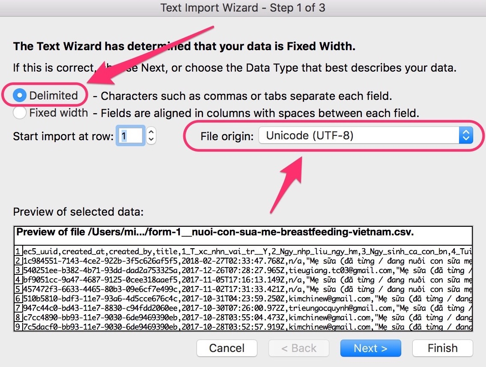
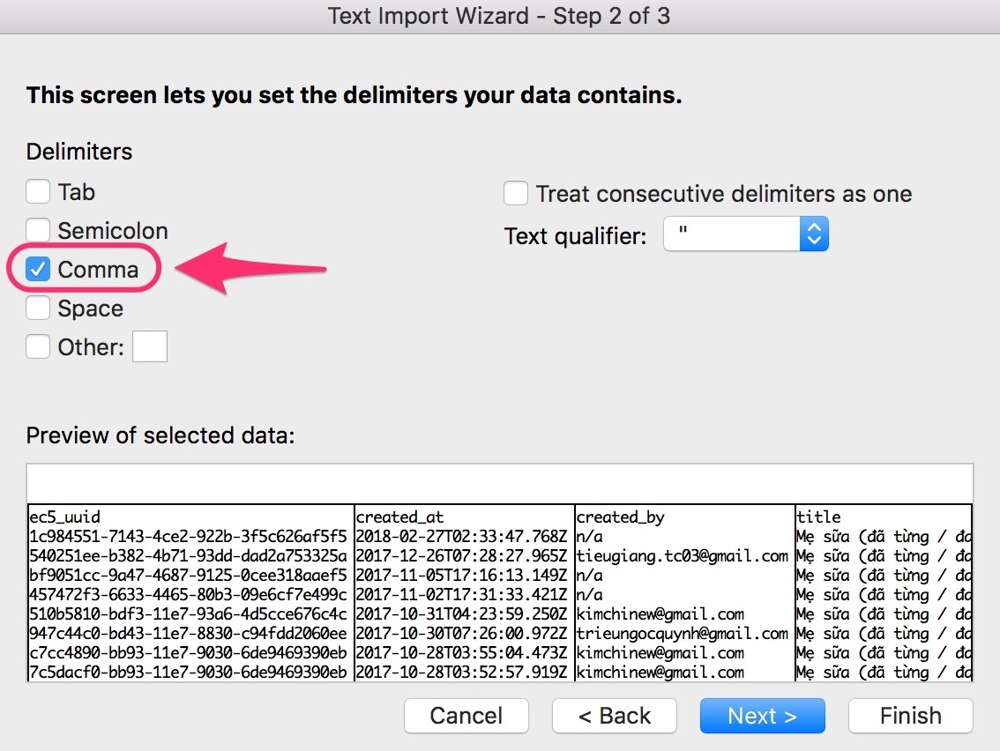
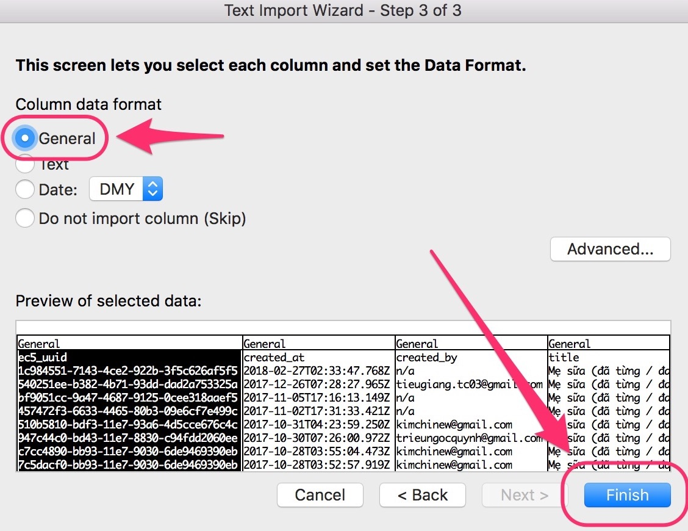

# Excel and UTF-8

For a solution, you can import the Epicollect5 CSV files as a UTF-8 origin.&#x20;

Here’s how you can do it:


The following example was done using a Mac. If you are on Windows or Linux, the procedure might differ.


Open up Excel and import your `csv` file:

Pick a `csv` file with data in a UTF-8 language rather than English. Select "Delimited" and set the file origin to Unicode(UTF-8)

Select "comma" and leave all other options unchecked:

Select "General" then click on "Finish" to import your data.

Select which sheet and you are done.

