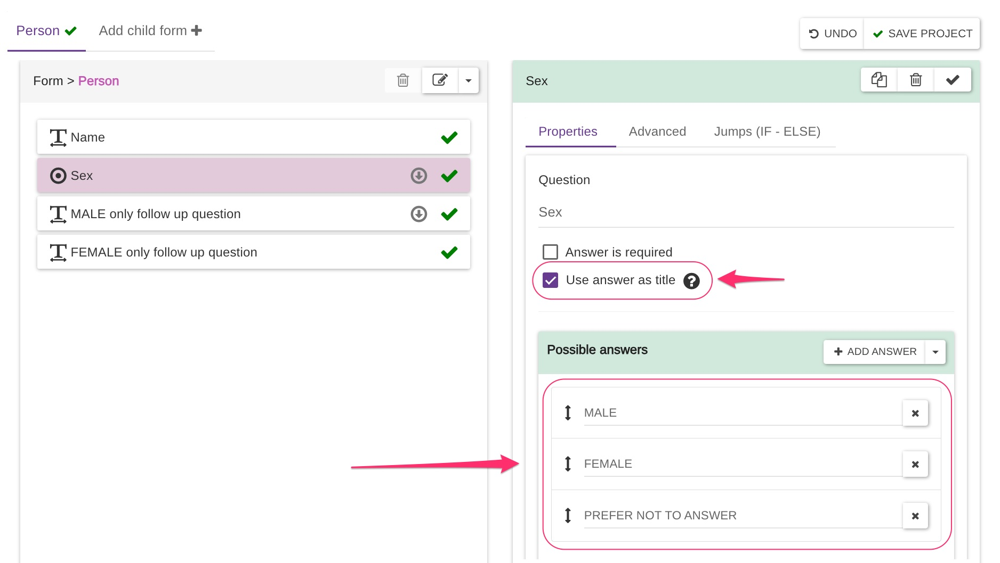
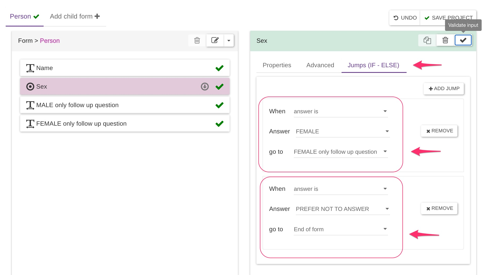
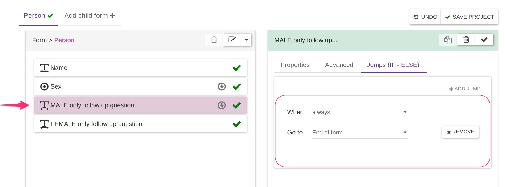

# Jumps 101

We created a playground project called [**EC5 Jumps 101**](https://five.epicollect.net/project/ec5-jumps-101) for anyone to explore and experiment with jumps logic. The form structure is straightforward, asking for a person’s **Name** and **Sex**. We designed the form to display a different follow-up question based on the selected sex or skip follow-ups entirely if the user prefers not to disclose that information.

<figure><figcaption></figcaption></figure>

#### Form Setup Details:

* The **Sex** question is set as **required**, ensuring users cannot skip it.
* Available answers: **MALE**, **FEMALE**, **PREFER NOT TO ANSWER**.

#### Jump Logic Configuration:

1. **If the user selects MALE:**
   * No jump is needed because the next question is already the **MALE-only follow-up question**.
2. **If the user selects FEMALE:**
   * We add a jump to the **FEMALE-only follow-up question**, effectively skipping the **MALE-only follow-up question**, which should not be asked to female users.
3. **If the user selects PREFER NOT TO ANSWER:**
   * We add a jump directly to the **End of the Form**, as no further questions are needed.

<figure><figcaption></figcaption></figure>

#### Resolving a Logical Flow Issue:

We noticed a small issue in the form flow:

* After selecting **MALE** and answering the **MALE-only follow-up question**, the user was still presented with the **FEMALE-only follow-up question**, which was unintended due to the standard form flow.

**Solution:**

To fix this, we added a jump on the **MALE-only follow-up question** to **always** jump to the **End of the Form** after it is answered. This adjustment skips the **FEMALE-only follow-up question**, ensuring the intended logic flow.

<figure><figcaption></figcaption></figure>

#### Final Outcome:

With this correction, the form now follows the proper logic, asking only relevant questions based on the user’s input while skipping unnecessary ones. This streamlined experience improves data collection accuracy and enhances user experience.
