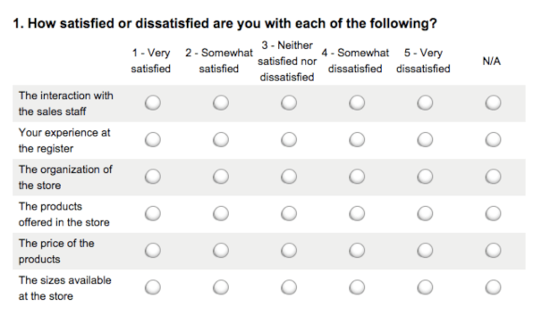
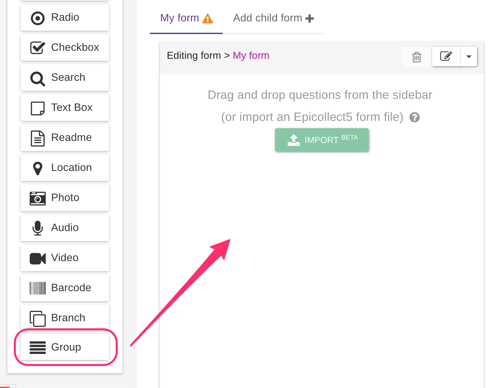
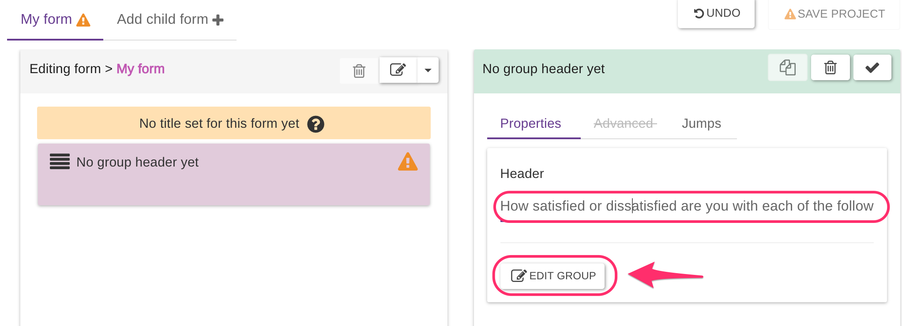
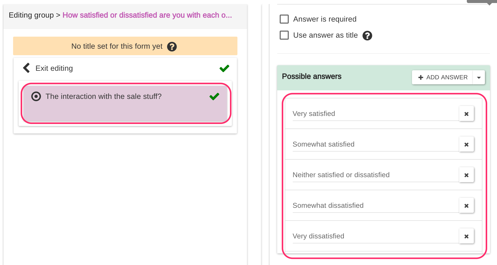
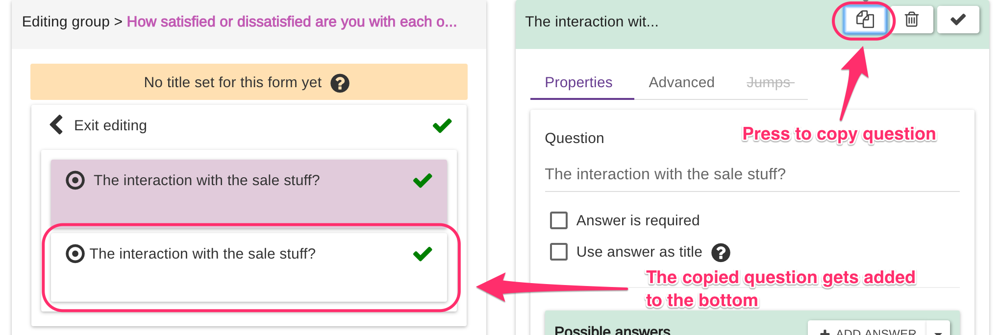
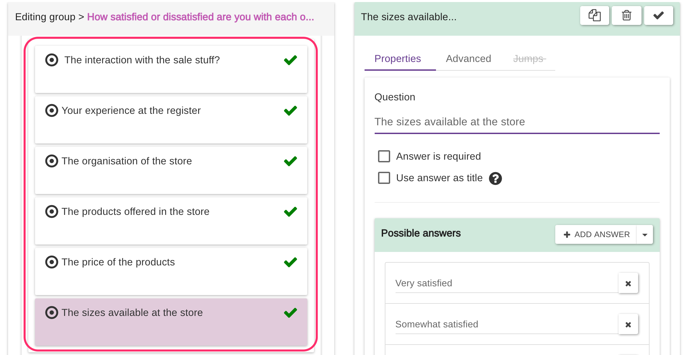
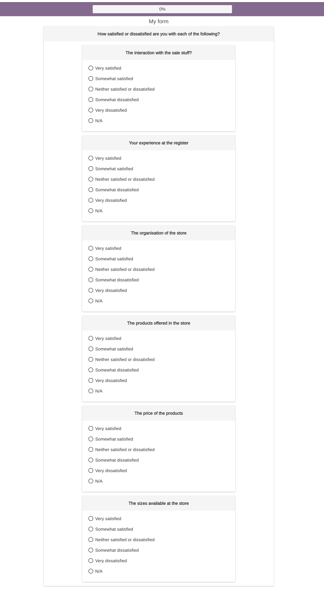

# Matrix Style Questions

Sometimes you might want to convert some "matrix" style questions to Epicollect5.

Like the following:

This type of layout is very common on desktop applications but it would be very tricky and clumsy to use on a mobile device due to the limited screen size. **The horizontal formatting of matrix questions is not ideal for smartphones**.

A common way to create this on Epicollect5 is using a combination of GROUP(s) and multiple-choice questions, like RADIO, DROPDOWN or CHECKBOX. Let's see how to do it!

1 - Create a new project ([how?](../web-application/create-a-project.md))

2 - Drag a **GROUP** question type to your form:

3 - Give your GROUP a header and then tap on edit:

4 - Now drag either a RADIO or a DROPDOWN question type. RADIO question types look better on tablets while DROPDOWN save space on mobile devices with a small screen. Just pick one according to your needs.


If you would like the user to pick more than one answer, use a CHECKBOX.


5 - Add the question text and the possible answers to the question you just added:

6 - The next questions are all similar since only the question text will change. The possible answers are always the same. To save time, we just validate the question we already have (to make it valid so we can copy it) and we copy it multiple times as we please:

7 - After we copied the questions, we just need to amend the question text on each one and we are done.

Let's save the project and see how it looks like on the web: ([How to add entries from the web?](../web-application/adding-data.md))

**The form above is also available as a** `json` **file for you to play with** ([see import & export forms](../formbuilder/importexport-forms.md)).

## [**Download it here**](https://drive.google.com/file/d/1lh1Vr\_GIRSC5bGcZS-dLKYlYfz3WrOre/view?usp=sharing)**.**
