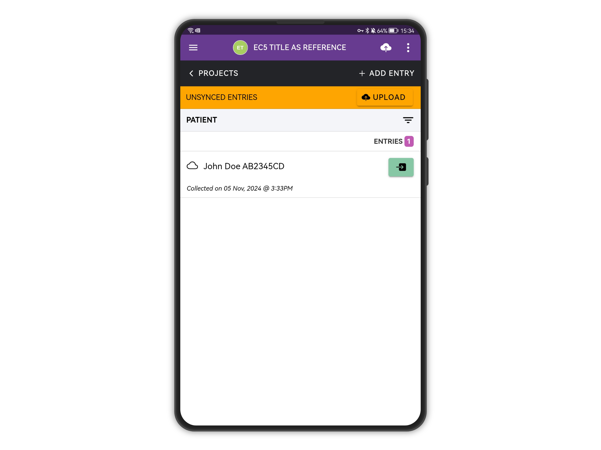
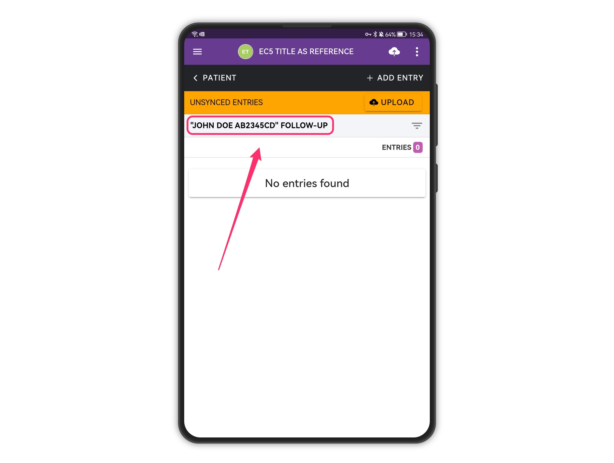
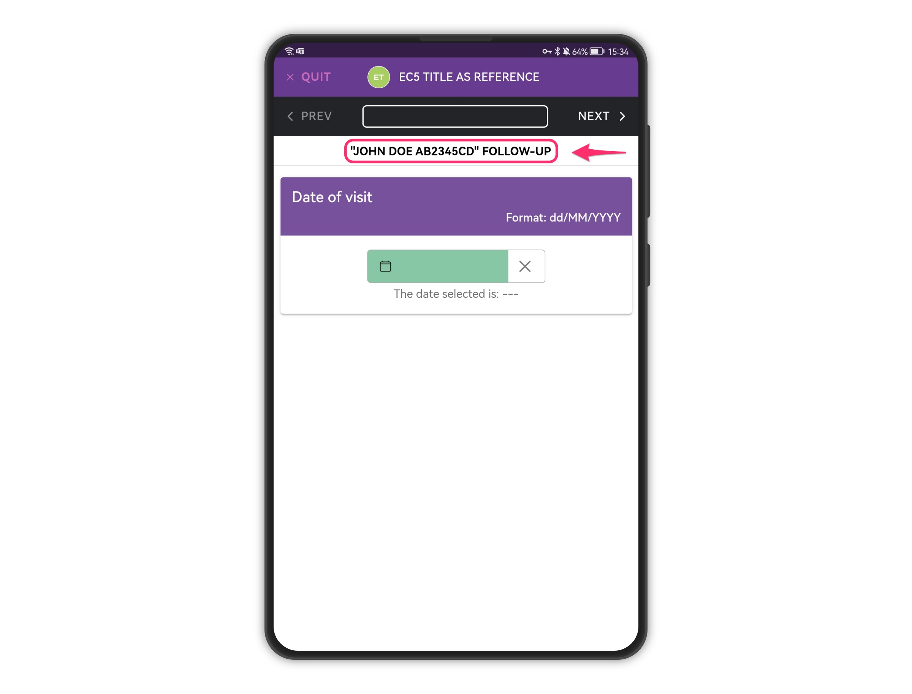

# Referencing Parent Form Responses

In Epicollect5, you can reference responses from a parent form while collecting data in a child form by setting the title attribute in the desired parent form question. \
This feature ensures that when you fill out a child form, the response from the parent form is displayed as a reference on the mobile app. \
\
This helps in maintaining context and ensuring accuracy in data collection, streamlining the process of gathering comprehensive and linked data sets.\
\
For example, try the [**EC5 Title as reference**](https://five.epicollect.net/project/ec5-title-as-reference) project on the mobile app**.**

<figure><figcaption>
PATIENT name and NHS number are used as title(s)
</figcaption></figure>

<figure><figcaption>
The parent form title(s) are referenced in the FOLLOW-UP child form when viewing the child entries
</figcaption></figure>

<figure><figcaption>
There is a reference to the parent form title(s) when adding a FOLLOW-UP entry
</figcaption></figure>
