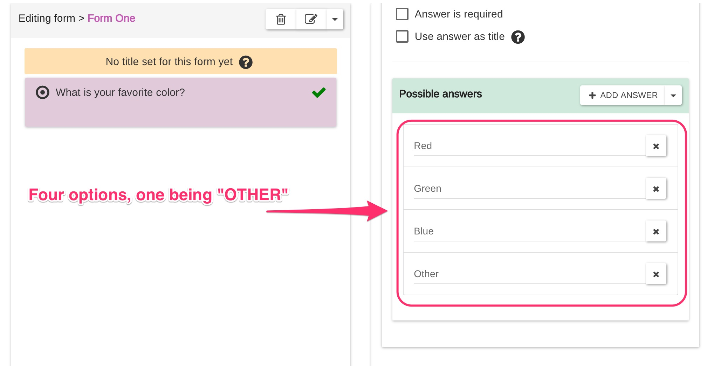
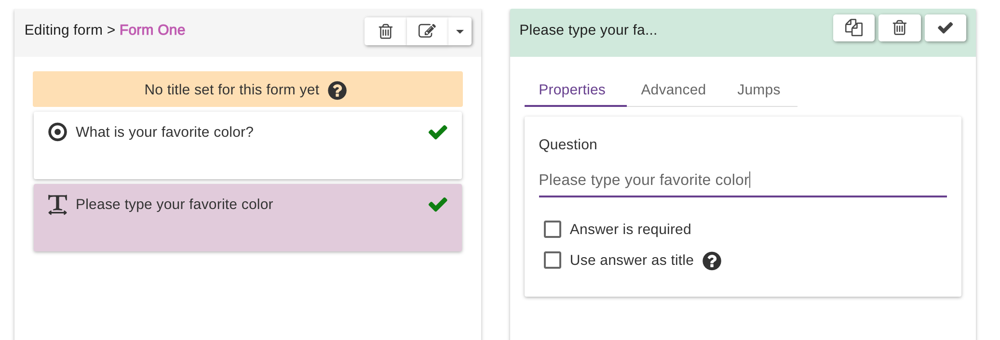
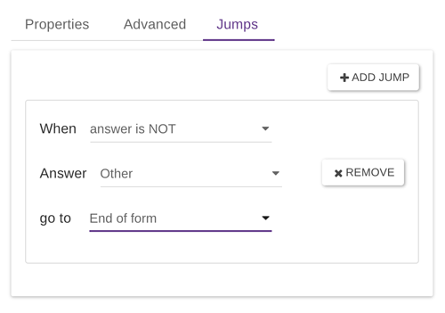
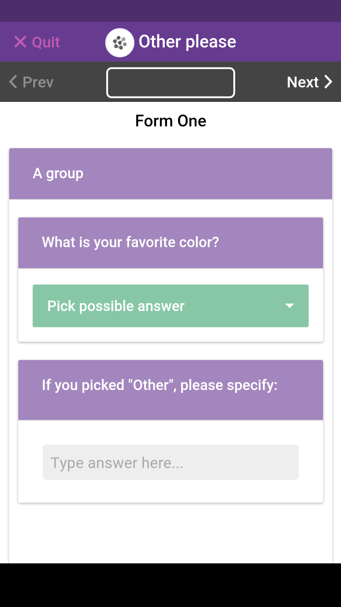

# Other, Please Specify

A very common scenario when converting a paper-based form to Epicollect5 is as follows:

When using a question type having a list of possible answers (like RADIO, DROPDOWN or CHECKBOX) sometimes you would like to collect an open answer when the user pick "Other" from the list of available possible answers. Let's have a look at a couple of possible implementations.

## 1 - Using Jumps

Open the formbuilder and add a question type with possible answers, like RADIO. For example, we could ask for a favourite colour and provide only three colours and the "Other" possible answer:

Since we want the user to see a text question when he picks "Other", we add a TEXT question below the RADIO question:

The concept is really simple. We need the users to see the text question only when they select "Other". Basically, they will "jump" that question if they pick any other possible answer.

On the RADIO question ("What is your favourite colour?") we click on the jumps tab and we add a jump like so:

This will make the users "jump" to the end of the form when they pick any answer aside from "Other". If they pick "Other", they will not jump therefore they will see the text question "Please type your favourite colour". It's that simple!

## 2- Using Groups

If your question with the "Other" possible answer is in a group, you cannot add a jump. In this case, just add the text question below your multiple-choice question, asking the user to specify if they replied "Other" to the question above.

Tip: use a DROPDOWN question to save space.

Here is how it will look on a device:

|                                     |                                          |
| ----------------------------------- | ---------------------------------------- |
|  | It will be similar to a paper based form |


Regardless of the approach used, the final data on the Epicollect5 server and the exported `csv` files will be spread over two columns, one for the main question and one for the "Other" question.&#x20;

To consolidate the data, it is pretty easy to merge columns in Google Sheets, Excel or similar in the post-processing.&#x20;

[**For Google Sheets see here**](https://support.google.com/docs/answer/9060449?hl=en\&co=GENIE.Platform%3DDesktop#zippy=%2Cmerge-rows-or-columns).

****[**For Excel see here**](https://support.microsoft.com/en-us/office/combine-text-from-two-or-more-cells-into-one-cell-81ba0946-ce78-42ed-b3c3-21340eb164a6)**.**

