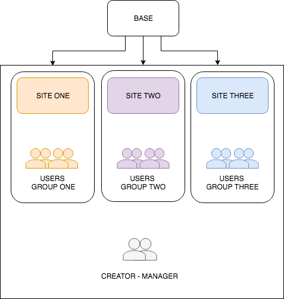
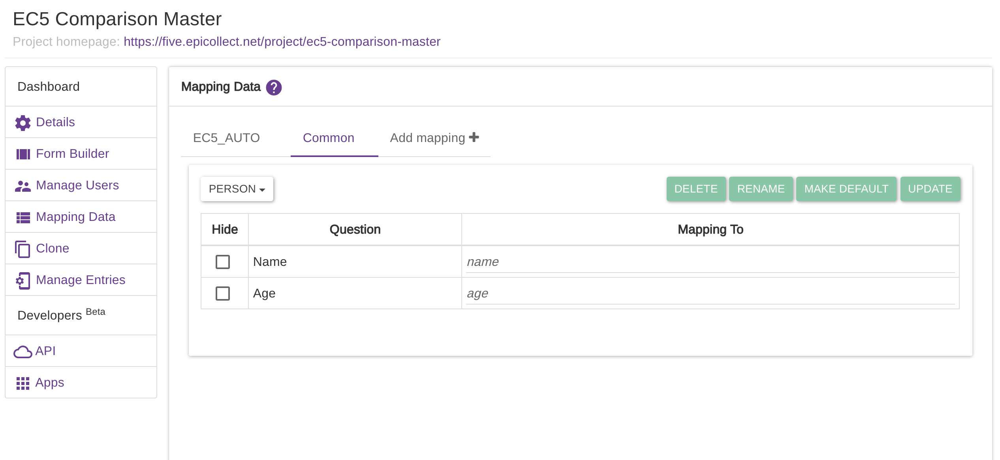
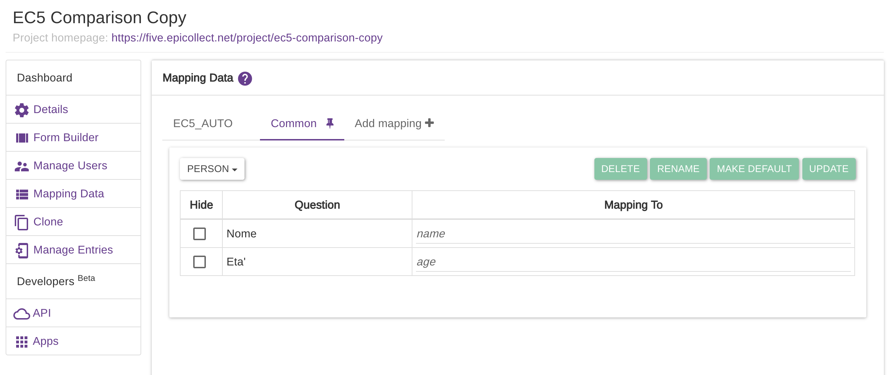
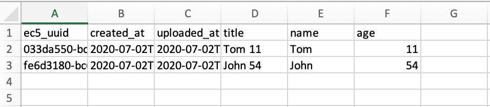
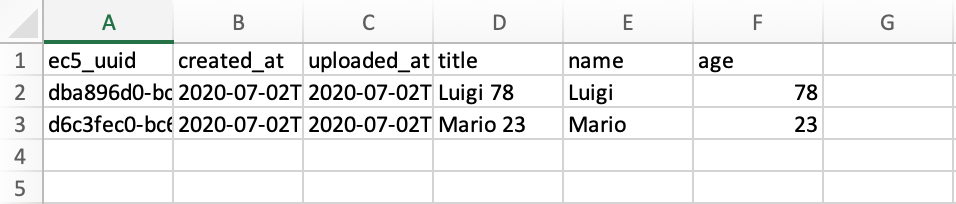

# Users Working Groups

There are some use cases where the same project needs to be assigned to different groups of users, for example, a different user group per each data collection site.

Each user group has access to the data collected by the same group only, but not the data collected by any other group. The project creator(s) and manager(s) need to have access to ALL the data though.

This use case can be solved by cloning a "base" project to multiple identical projects, one per user group, and then assign to each of the cloned projects different users. When [**cloning a project**](../web-application/clone-project.md), the project CREATOR stays the same so that user will have access to all the data. It is also possible to assign the same manager(s) to each of the cloned projects if needed. [**See Manage Users**](../web-application/manage-users.md)**.**

See the diagram below:


Remember to keep the projects private to limit users' access to only the users you specify!


### Creating copies of a project

For example, we could create a project called

CENSUS BASE 2019

and clone it three times to:

1. CENSUS BASE 2019 SITE ONE
2. CENSUS BASE 2019 SITE TWO
3. CENSUS BASE 2019 SITE THREE

Now we have three exact copies of the same project. To each project, we can assign different users so access is restricted to only the users belonging to a single project (therefore to a single site or single group).

Manager(s) can be assigned to all the projects so they will have access to all the data. Merging the data can be done in the post-processing of data using your favorite third-party tools like Excel or Google Sheets.


We recommend cloning the "base" project only when it is finalized and ready for data collection, otherwise each change made to it will have to be replicated manually to each of the cloned projects!



If there is the need to have a different CREATOR per each project, the ownership of a project can be transferred.        **(**[**See how**](../web-application/transfer-ownership.md)**)**&#x20;



It is also possible to export a project definition only (no users attached) so it can be imported by another user who will become its CREATOR after importing it. **(**[**See how**](../web-application/import-and-export-projects.md)**)**


### Compare data across projects

To compare data from multiple projects which share a similar structure, the  [**Epicollect5 mapping feature**](../web-application/mapping-data.md) comes in handy. Answers are mapped against unique identifiers no matter what the question text is, therefore it is just a matter of using the same identifiers for answers that need to be compared or merged.

For example, we created a project called **** [**EC5 Comparison Master**](https://five.epicollect.net/project/ec5-comparison-master) with a custom mapping called "Common", see below

We cloned the project as [**EC5 Comparison Copy**](https://five.epicollect.net/project/ec5-comparison-copy) **** and we decided to translate its questions to Italian for the Italian users. It is a very common use case to localize the language of the questions to the main language used in the area where the data collection will be performed. Therefore we renamed _**Name**_ to _**Nome**_ and _**Age**_ to _**Eta**_'. We have not changed the "Common" mapping which is still the same as before.

When downloading the entries for both projects (selecting the "Common" mapping) as `csv`, the following data sets are downloaded:

As you can see above,  the question answers are mapped to the same identifiers `name` and `age`, making a comparison of the two data sets extremely easy to do!

[**Read more about cloning a project**](../web-application/clone-project.md)****

****[**Read more about mapping data**](../web-application/mapping-data.md)****
