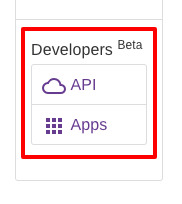
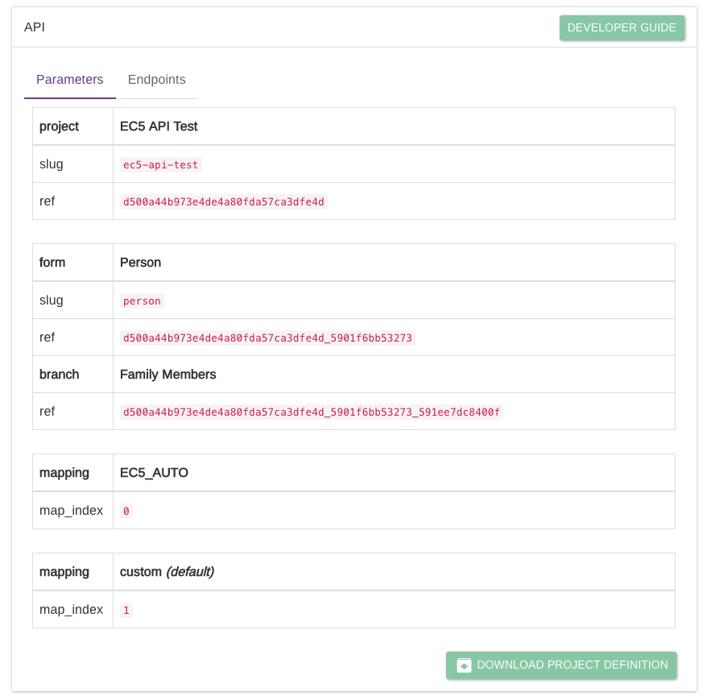
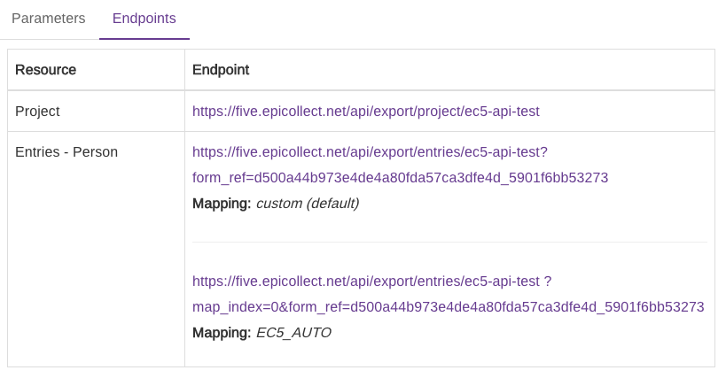

# API


A fully-fledged Developer Guide can be found at [**https://developers.epicollect.net**](https://developers.epicollect.net/)****


To access the API page go to your project details **(**[**show me how**](../web-application/set-project-details.md)**)** then on the left sidebar click on API under the Developers section:

You will get to a page with two tabs: parameters and endpoints.

The following screenshots are based on our [**EC5 API TEST project.**](https://five.epicollect.net/project/ec5-api-test)****

## Parameters

You can see the main parameters of your project and the `map_index` which is the unique identifier per each of your custom mappings:

## Endpoints

We list the most common endpoints to get the data for the selected project. If the project is public, you can view them directly via the browser. If the project is private you will have to [register your app](apps.md).

[**More info about Epicollect5 API.**](https://developers.epicollect.net/)****
