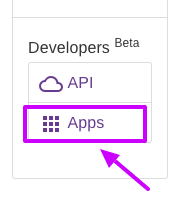
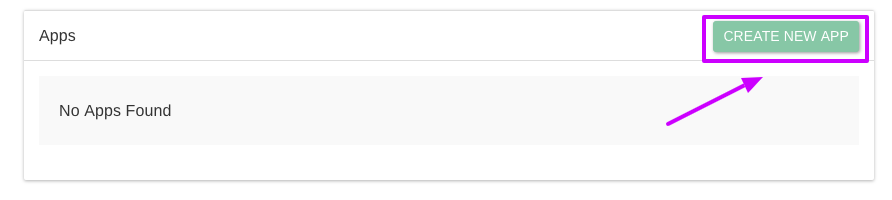
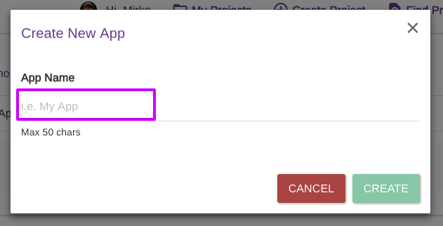
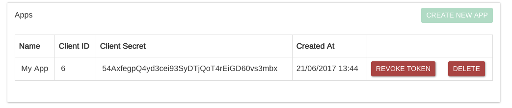

# Apps

If you want to use the Epicollect5 API to get data for a **private project**, you will have to register your "app" to get authentication details to exchange with the Epicollect5 server.&#x20;


A fully-fledged Developer Guide can be found at [**https://developers.epicollect.net**](https://developers.epicollect.net/)


Go to your Apps page under the Developers section:

Click on the "Create New App" button

Give a name to your App and click on "Create""

Now you can use the generated Client ID and client Secret in your script. [Show me how.](https://epicollect5.gitbooks.io/epicollect5-api/content/client-credentials-grant/retrieve-token.html)

**Notice you need to register your app only once for a project** and reuse the Client ID and Client Secret on your applications.
