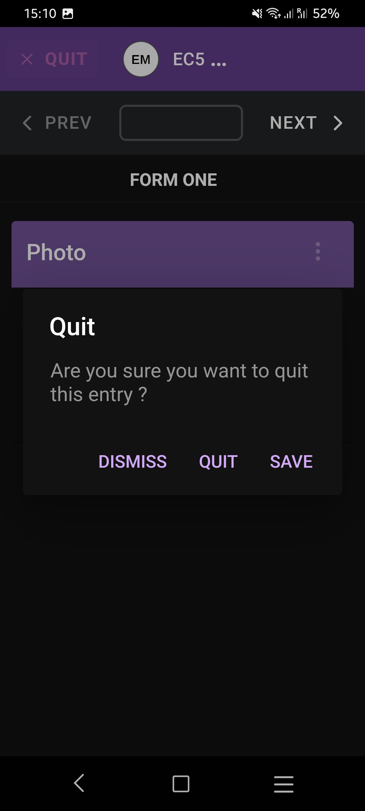
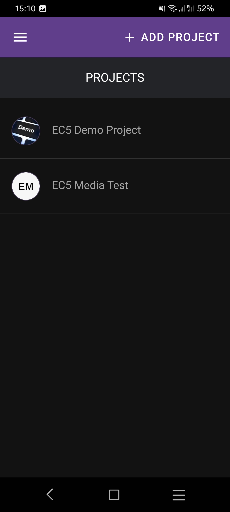
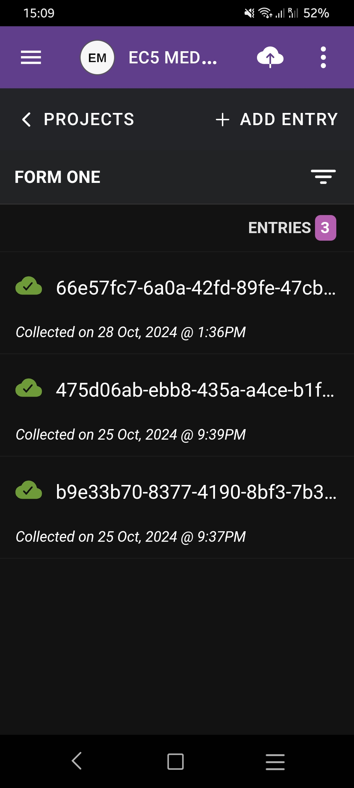

# Known Issues

### Error Code 1 (Mobile apps)

We've received several reports of users encountering an error labelled **"Code 1"** while attempting to save an entry with a photo on our mobile apps. This issue is predominantly observed on new installations and often resolves itself after reinstalling the app.

**Current Status:**

* We are actively monitoring these occurrences and testing various potential workarounds.
* Unfortunately, due to the sporadic nature of the issue and our inability to consistently reproduce it on our test devices, pinpointing the exact cause has been challenging.

**Temporary Solution:**

* If you encounter this error, we recommend uninstalling and then reinstalling the application. This has been effective for many users and may resolve the problem on your device.

**Next Steps:**

* Our development team is committed to resolving this issue and will continue to investigate and implement long-term solutions. We appreciate your patience and understanding as we work towards a fix.

<figure><figcaption></figcaption></figure>

\
Community discussion, feel free to contribute ->\
[https://community.epicollect.net/t/mobile-app-error-code-1/886](https://community.epicollect.net/t/mobile-app-error-code-1/886)

### Dark Mode

Currently, Epicollect5 does not support a native dark mode, but we understand that it is a highly desired feature. We are actively considering enhancements like this for future updates to improve the user experience.

If you are using an Android device, there is an option to enable "Force Dark Mode" within the Developer Settings, which could help achieve a darker interface across apps. To try this, you can access the setting by navigating to Developer Settings on your device. Here’s a helpful guide on how to enable it ->



Additionally, it’s worth noting that Android 15 is expected to make this dark mode option more widely available to all users without requiring developer settings. You can read more about this upcoming feature ->



<figure><figcaption></figcaption></figure>

 

<figure><figcaption></figcaption></figure>

 

<figure><figcaption></figcaption></figure>

If you are using an iPhone, you might try this approach ->



