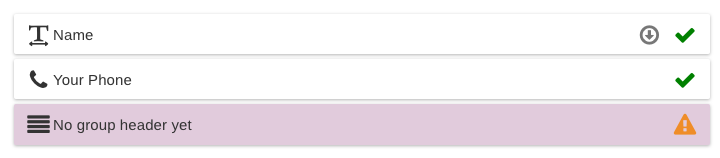
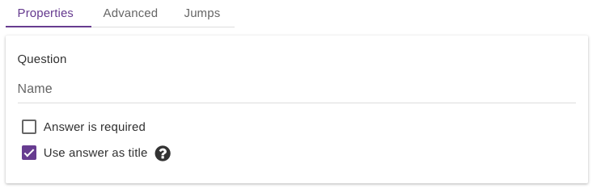
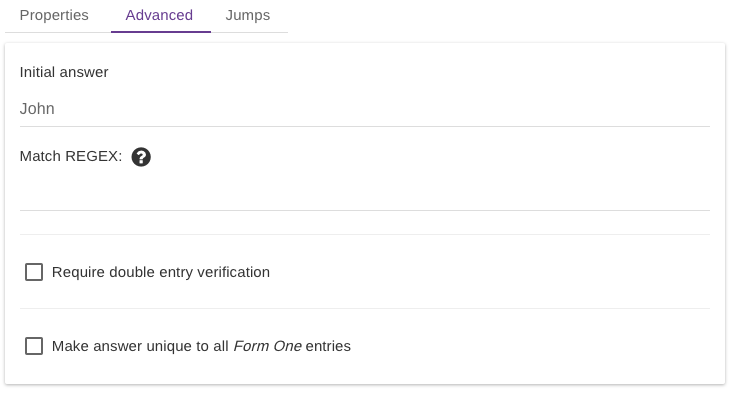
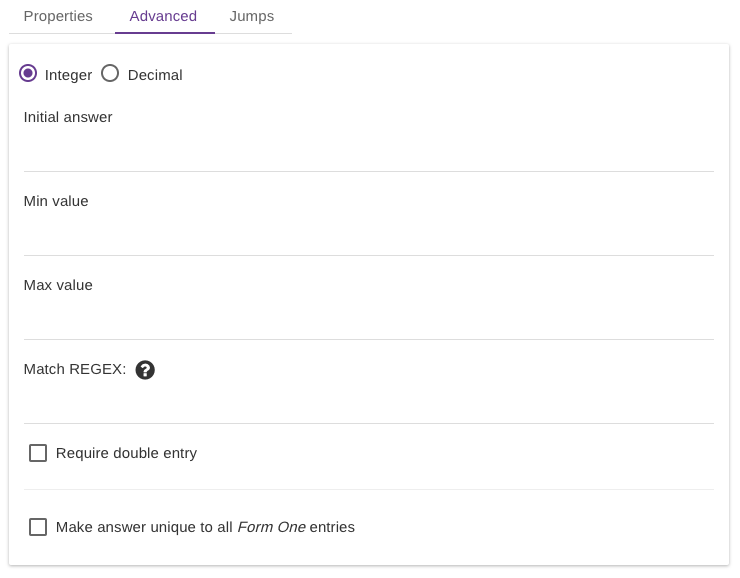
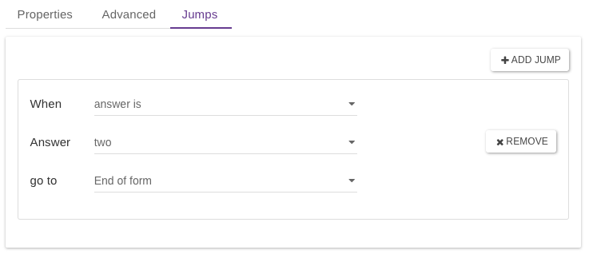

# Add Questions

Questions can be dragged from the left column into the middle one. A preview overlay will show you where the question will be placed.

Questions in the middle column can be re-ordered dragging them above or below other questions.

Notice some indicator icon on the right of each question:

* A green check: the question is **valid**
* A yellow warning sign: the question is **invalid**
* A down arrow: the question has some **jumps** set

Once a question gets selected (clicking on it, it also gets a purple colour), its settings panel appear on the right, divided in:

* Properties
* Advanced
* Jumps

## Properties

Here is where the basic properties for a question get set.&#x20;

### Question Text

The **question** text is always set here.&#x20;

Just type your question and you are good to go. You **MUST** have some text set for each question, or the question will be invalid.


A project can be saved only when **ALL** its questions are valid.


On this panel you also have the option to set a question as:

### Required

The answer is required by the user to proceed with the form. &#x20;

### Title

the answer will be used to identify a single entry when viewing the entries on a device or on the server **(**[**Read title section for more info**](title.md)**)**


If the question is of type README_,_ you can only specify some text to be shown, and basic formatting is available



If the question is of type RADIO_,_ DROPDOWN_,_ or CHECKBOX, you can list all the possible answers here as well. Just click on "Add Answer" and modify the placeholder text with anything you want. You **MUST** have at least one possible answer set.



For LOCATION, PHOTO, AUDIO, VIDEO, BRANCH, and GROUP you can only specify the question text.


## Advanced

Advanced settings depend on the question types. If the question does not have any advanced setting the tab will be disabled.

### Initial Answer (default answer)

The input field on the device will be pre-filled with the value set here, think of it as a default answer.

### Regex

The answer MUST match a regular expression. A regular expression (regex) is a special text string for describing a search pattern. You can think of regular expressions as wildcards.\
You are probably familiar with wildcard notations such as `*.txt` to find all text files in a file manager. The regex equivalent is `.*\.txt` **(**[**What is a regex?**](https://en.wikipedia.org/wiki/Regular\_expression)**)**

### Double Entry

**Require double entry verification:** two identical answers must be provided to proceed. It is useful for confirmation, like a code or an email.

### Uniqueness

**Make answer unique (form OR hierarchy):** the answer must be unique. You can select if you like to have it unique for any entries belonging to a form or just for the children of a particular entry (hierarchy). More on [**uniqueness.**](uniqueness.md)

### **Date & Time**

For DATE and TIME questions, **a selection of date or time format is available**. You also have the option to set the current date or time when the question is shown on the screen ("_Set initial answer to current date_" checkbox).

.png>)

### Numeric (Integer or Decimal)

NUMERIC questions: a **min** and **max** value can be set. Also, there is the option for the question to be **decimal** (float) or **integer.**\

## Jumps

Jumps are a way to set up conditional logic on your questionnaire.

Jumps allow you to define that, based on the choice made by a user, they will 'jump' **forward** in a form to a question further along in the questionnaire or carry on to the next question. For example, if for question one in a form, the user selects choice one in the dropdown, jump them forward to question five, else continue on to question two.

Single or multiple jumps can be defined for a particular form input and can jump forward to any kind of form field (text or media) or to the end of a form. [**More on jumps**](jumps.md)**.**
