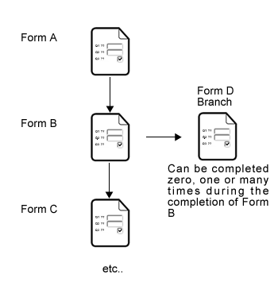
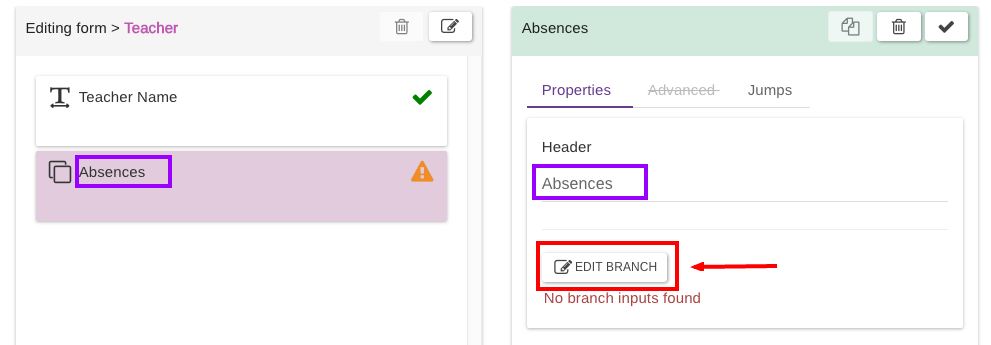
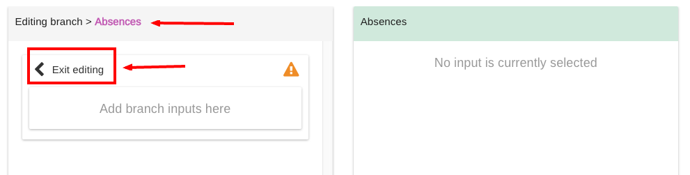

# Branches

There may be cases when data you wish to collect within a form does not fall into the hierarchical structure previously described.\
EpiCollect5 provides another method of adding flexibility that we describe as **branches**.\
Briefly, a branch question is a container for nested questions you want to ask more times for a single hierarchy entry.\
For example you might have a form Person, and add a branch question called "Family members". The "Family members" branch will contain sub-questions like "Name?", "Age?" and "Relationship?".

On a paper based form, you usually see something like:

| Name  | Age | Relationship |
| ----- | --- | ------------ |
| Mirko | 39  | brother      |
| John  | 67  | father       |
| Lucy  | 12  | sister       |
| ...   | ... | ...          |

It is dynamic in the way users answering could add none, one or more family members, depending on how many family members they have.

In our previous Schools project example ([see Linking forms](multiple-forms.md)) we may wish to collect data on each teacher's absences during the year due to sickness.

In this case we would have a question on the teacher form asking the number of episodes of absence due to sickness. Some teachers may answer ‘none’ and some may answer 1, 2, 3 etc.\
Branch forms allow us to define a new form (in this case about sickness (form D)), outside the hierarchical structure, that appears once or more times in response to a the answer in another form.

Branches can be added like any other question, just drag the branch question into your form:

Once dropped, type the branch header (required) and click "Edit Branch" to enter the branch editing mode:


You MUST type a header to enable the edit button!&#x20;

In branch edit mode, just drag any input as usual.&#x20;

You CANNOT have a branch within a branch. Also, a branch MUST have at least one question to be valid.


To exit the branch edit mode, click the left arrow on the top left, to go back to the usual hierarchy form editing.

