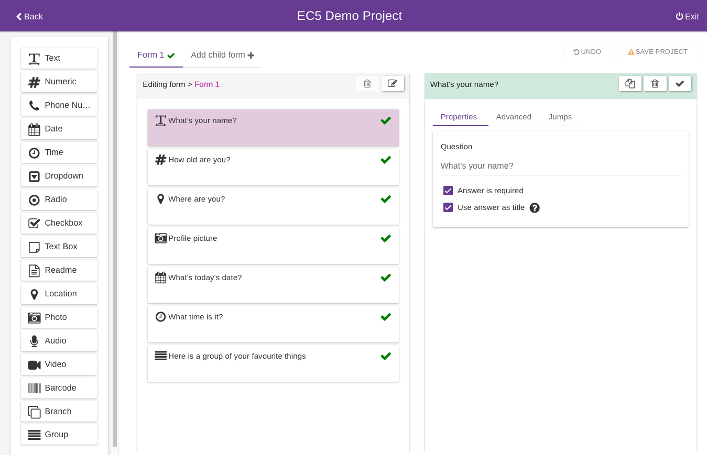

# Intro


The formbuilder requires a mouse or trackpad so touch device like iPads or Android tablets are not supported yet. We therefore recommend to build your form(s) on a desktop or laptop.&#x20;

A minimum screen width of **1024 px** is also required to be able to show all the user interface controls.


Currently, Epicollect5 allows a maximum of **300** questions per a single form, and a maximum number of **5** linked (hierarchy) forms.

The form builder features a three columns layout:

* Left column: the available inputs&#x20;
* Middle column: the inputs added to each form
* Right column: the currently selected input settings

By default, each input is shown on a single screen on the mobile app. This allows space for the popup keyboard and the question at the same time. You might want to have more than one question on a page, in that case just use a [**group**](groups.md).


Remember, **you cannot set jumps on inputs within a group**, just on the group input. [**More on jumps.**](jumps.md)****


### Video Tutorials





