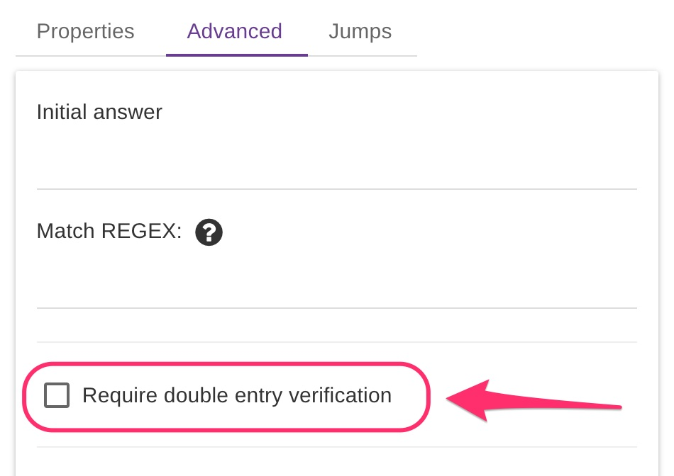
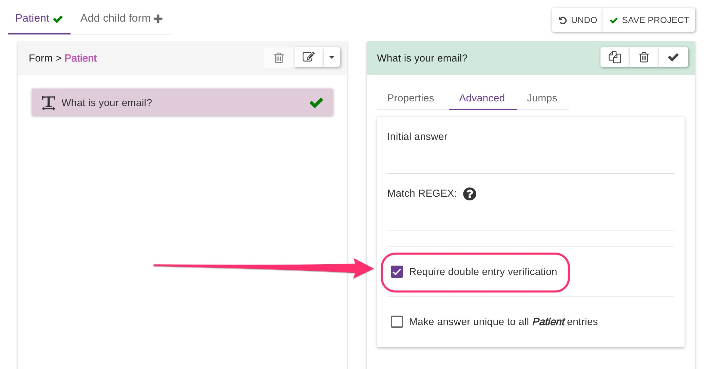
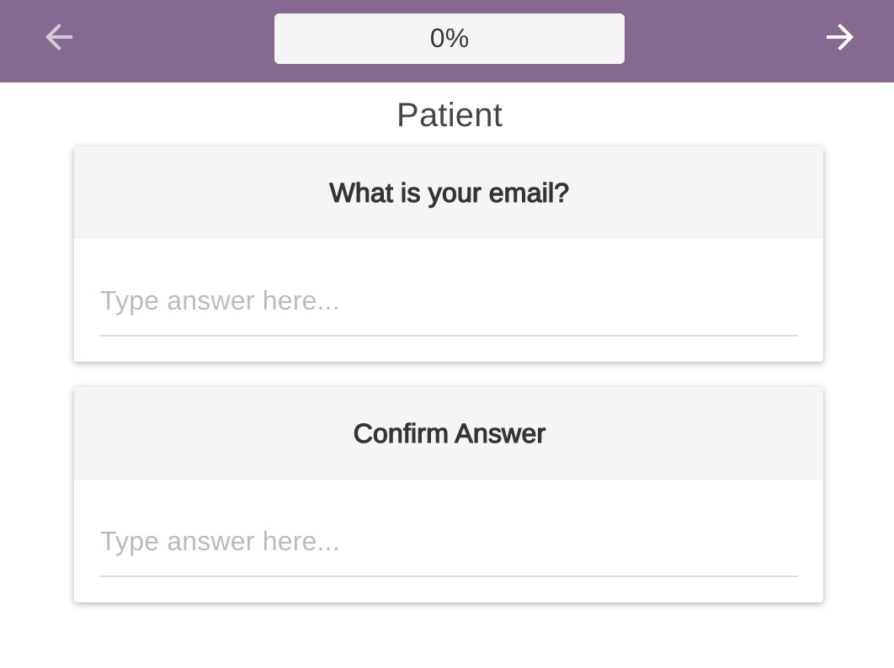
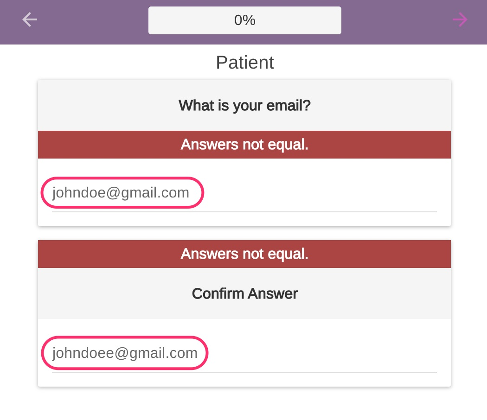
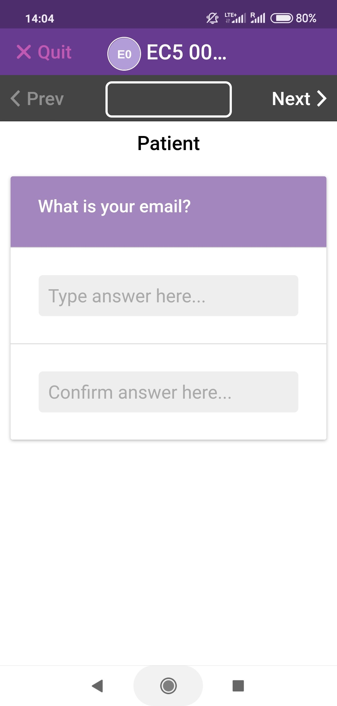
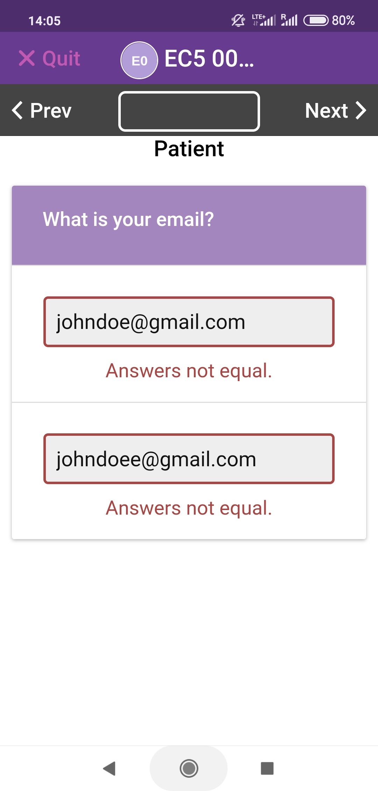

# Double-entry Verification

The options is available as an advanced option for the following question types:

* TEXT
* NUMERIC
* PHONE
* TEXTBOX

When this option is enabled, the users will have to answer the same question twice and **both responses MUST match**. A common use case could be the user email address, social security number and so on. This validation is performed on the device directly therefore it will work both online and **offline** reducing the chances of collecting wrong data.


The comparison is case sensitive, i.e "John" and "john" do NOT match.


Let's see it in action: on the form below we enabled the option for a _"What is your email?"_ question

When the users answer this question they will have to enter the email address twice to proceed.

### Web application

|   |   |
| ------------------------------------------------------------------------------ | ------------------------------------------------------------------------------ |

### Mobile application

|   |   |
| ------------------------------------------------------------------------------ | ------------------------------------------------------------------------------ |
|                                                                                |                                                                                |

Have a look at the example project [**EC5 Double Entry Example.**](https://five.epicollect.net/project/ec5-double-entry-example)****
