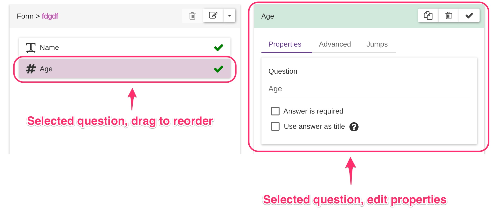
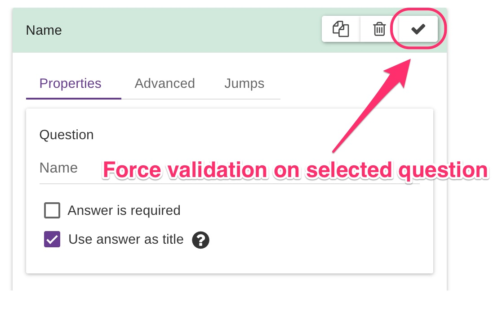
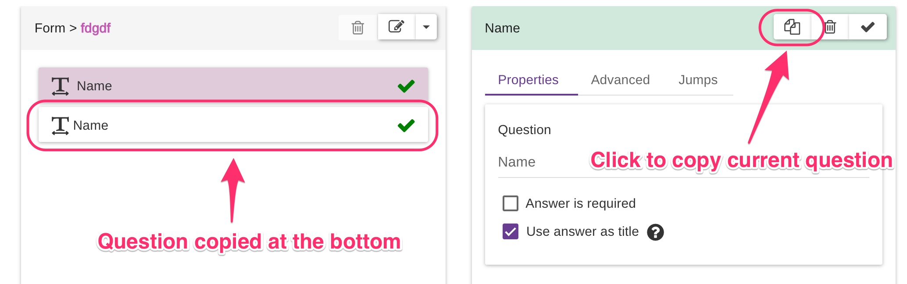
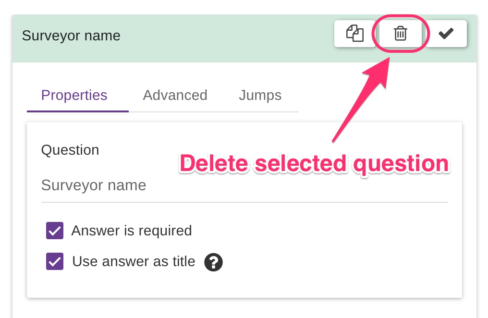
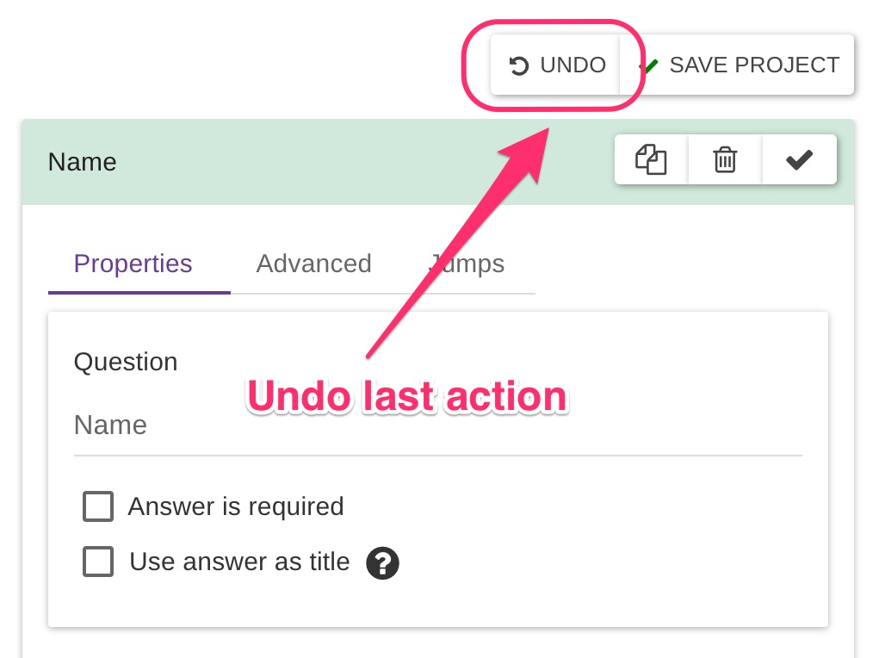
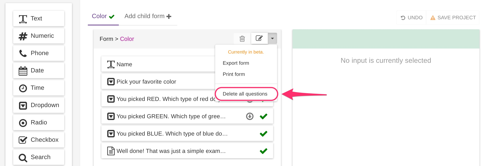

# Edit Questions

To edit a question, select it from the middle column by clicking on it. If you want to re-arrange the order of the questions instead, just click and drag the input where you want it.

### Edit question details

On the right column, the settings panel for the selected question is activated when clicking on a question. Perform your edits here.

The formbuilder validates questions automatically most of the time, just by interacting with it.

If you would like to **force validation** on the selected question, click the validate button on the top right of the settings panel:

### Copy questions

A **valid** question can be copied to the bottom of your question list by clicking on the copy button:


**Title** and **jumps** will not be copied.

**Existing data** belonging to a previous question will not be copied.


### Delete questions

A question can be deleted by clicking on the delete button:


**Be aware: deleting a question will also delete the data associated with it if any).**


If it happens you make changes by mistake, do not worry. Just do **NOT** save, but click on the **UNDO** button instead:


Remember: a project can be saved only when ALL its questions are valid.


### Delete questions in bulk

All the questions for a form can be deleted at once, without deleting the enclosing form.

Select the form and click on the "Delete all questions" button in its context menu.

