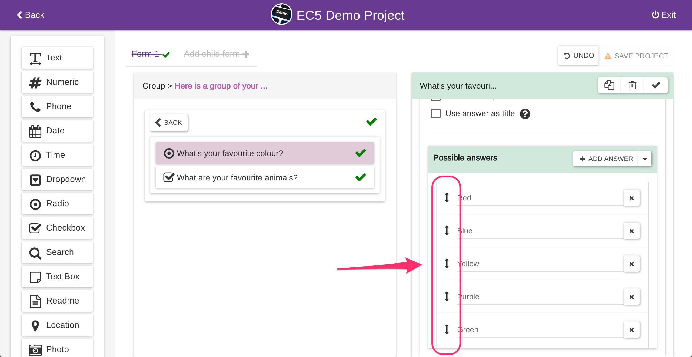
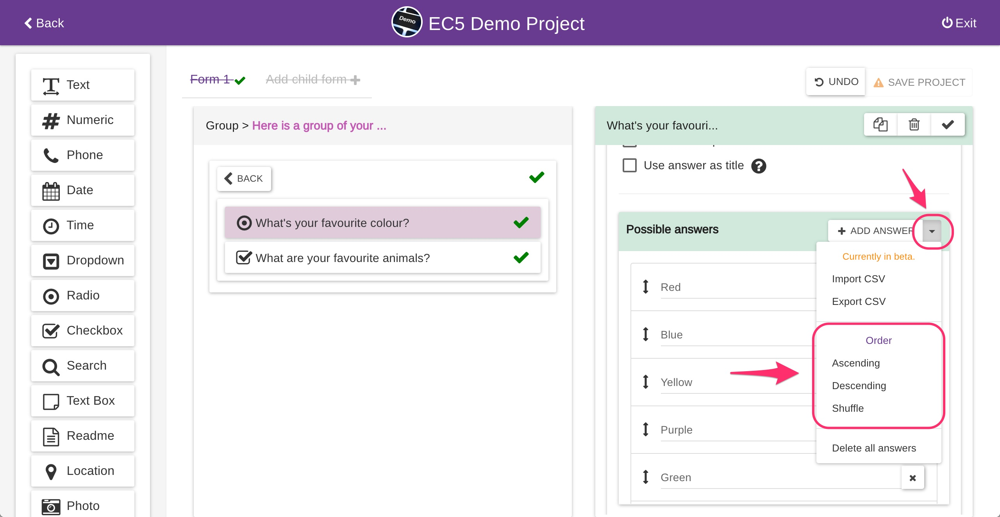

# Edit Possible Answers


The following applies to RADIO, CHECKBOX, DROPDOWN, and SEARCH question types only.


### Amending possible answers' text

You can amend the possible answers text at any time by typing on the input field and saving the project.

Changing the possible answers text will propagate the change to your existing entries if any.

For example, if you have a question with YES and NO as possible answers, you collected some data and later you decided to change NO to NOPE, all your previous NO responses will become NOPE.

### Deleting possible answers

If you delete a possible answer and you have some entries already collected, you will lose only the responses matching the possible answer you are deleting.

For example, if you have a question with YES and NO as possible answers, you collected some data and later you decided to delete the NO possible answer, all your previous NO responses will be empty but you still have all your YES responses.

### Sorting possible answers

You can re-order the possible answers by drag and drop using the handle next to each one of them.

You can sort in bulk by using the presets provided: ascending, descending, shuffle. Epicollect5 will sort the possible answers alphabetically with numeric collation (such as "1" < "2" < "10").

### Adding possible answers

Adding possible answers to a project does not affect your existing entries. For example, on a question like "What if your favorite color?" of type RADIO, you could have "Red", "Green", "Blue" as possible answers.

After collecting some entries, you decide to add "Yellow" to the list of possible answers. Your existing "Red", "Green" or "Blue" responses will not be affected, as expected.


If the questions you modify are set as TITLE, the TITLE for your existing entries **will not be affected**.

