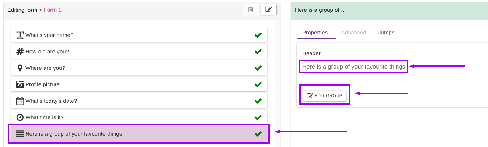
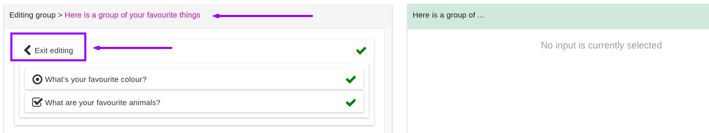

# Groups

Groups can be added like any other question, just drag the group question into your form:

Once dropped, type the group header (required) and click "Edit Group" to enter the group editing mode:


**You MUST type a header to enable the edit button!**


In group edit mode, just drag any input as usual. You **CANNOT** have a group within a group. You can have branches though.&#x20;


A group MUST have at least one question to be valid.



Moreover, you **CANNOT** have JUMP(s) within a GROUP.


To exit the group edit mode, click the left arrow on the top left, to go back to the usual hierarchy form editing:

Using GROUP(s) it is possible to add matrix style questions to your form(s). [**See how**](../common-use-cases/matrix.md)**.**
