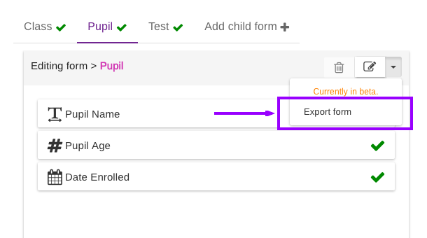
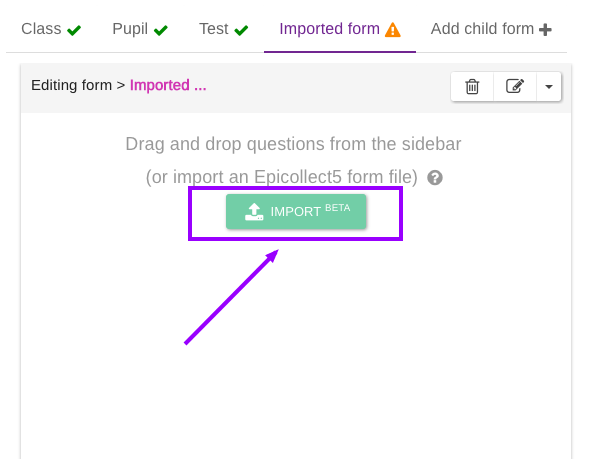
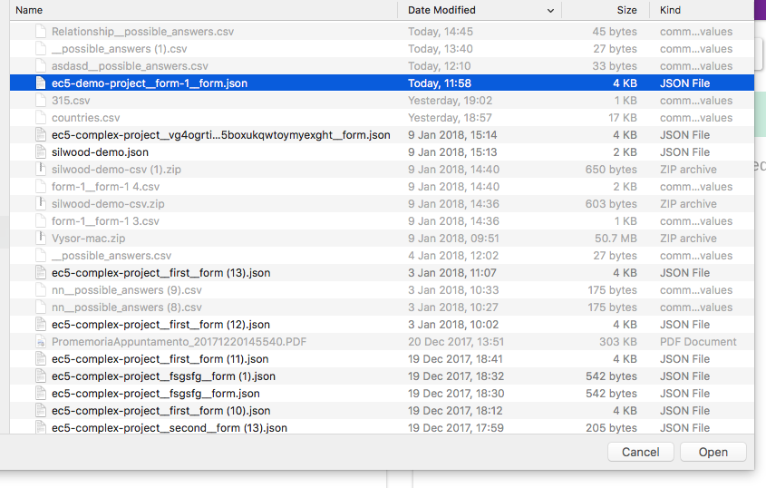
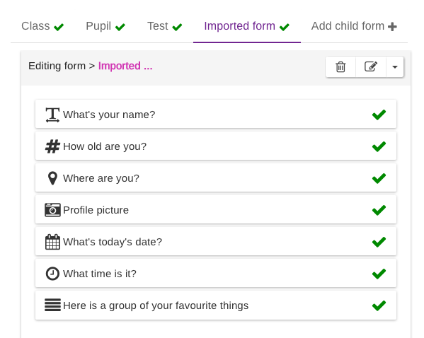

# Import & Export Forms

Single forms can be exported and imported within the same project (as child forms) or to other projects. You could for example export a child form from an old project and use it as the first form on your new one.

## Export a form

To export a form, select the form you would like to export and open the context menu by clicking on the arrow at the top right:


Please remember the form MUST be valid.


Save the file where you prefer. It will be a `.json` file

## Import a form

To import a form first create a [new project](../web-application/create-a-project.md) and open the formbuilder or create [a new child form](multiple-forms.md) on an existing project.

Click on the "IMPORT" button:

Select an EC5 form file i.e. a form file you previously exported (`.json`) and the form will be imported.

Save your project and you are ready to go!
