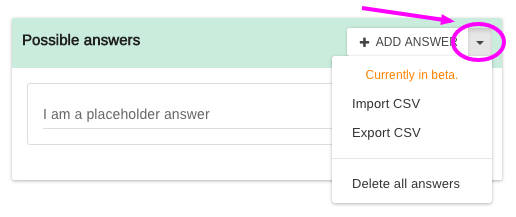
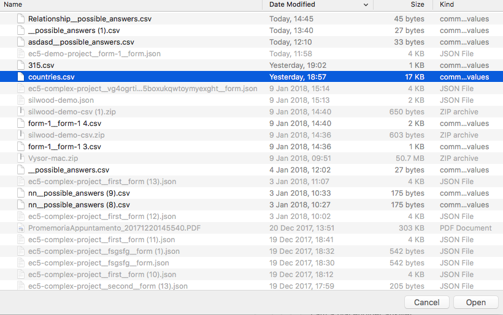
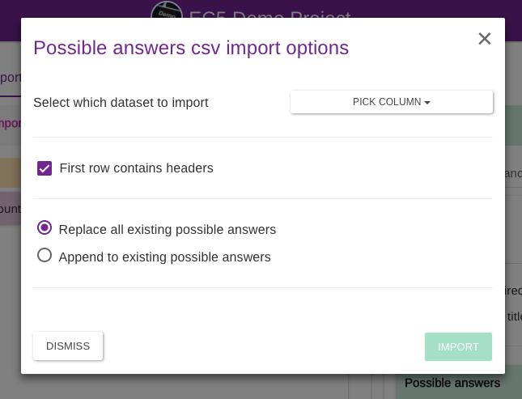
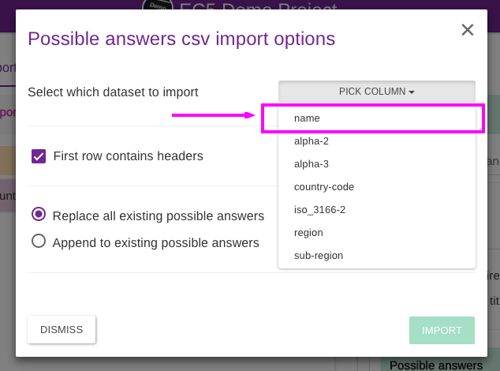
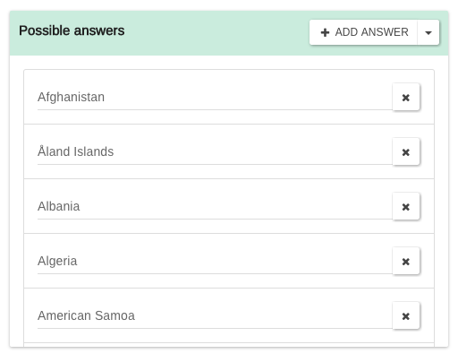
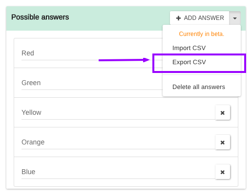
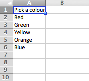

# Import & Export Possible Answers

For the question types where a list of possible answers must be provided (_RADIO_, _CHECKBOX, DROPDOWN & SEARCH_) you can import/export your list of options from/to a CSV file.

## Import possible answers

To import the list, click on the arrow next to the "Add answer button" to open the context menu:

Then click on "Import CSV". The file browser of your machine will open. Pick the `csv` file with the list you would like to import.

For this example, we are importing a list of world countries found [here](https://github.com/lukes/ISO-3166-Countries-with-Regional-Codes/blob/master/all/all.csv).

Once you import the file, a dialog with some options will open up:

Here you need to pick which column in your `csv` file contains the list of data.

You can also specify if the first row contains headers or not and whether to append the list to the existing possible answers already on that input or to replace them with the newly imported list.

In this example, we are going to import the column "name" and replace all the existing possible answers. Our file has got the headers in the first row so we will leave the "First row contains headers" checkbox checked:

After a column is select, click on IMPORT proceed.


The import button is disabled until you select a column.


The list is imported successfully!


The maximum number of possible answers for a single input is **300**. Once that limit is reached, further list items will be ignored.

&#x20;Empty values will be skipped.

Invalid symbols like "<" and ">" will be removed.


## Export possible answers

If you have a question with a list of possible answers you need to export, for example, to re-use it across multiple projects, click on the "Export CSV" option in the context menu:

For example, we had a simple list of colors to export:

Save the file where it suits you best and presto! Please note the question text will be used as the column header on the exported file:

