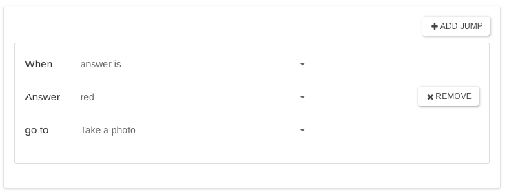
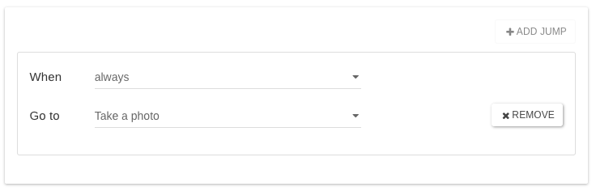

# Jumps

Jumps allow a questionnaire to follow a conditional flow based on the user's answers. **It is possible to only jump forward**, to one of the next questions, not backward.

## When

Four conditions can be set:

_**answer IS**_

For example, within question one, jump to question five if the user selects value two.

_**answer**_**\*\*** IS NOT\*\*

For example, within question one, jump to question five if the user does not select value two.

**no answer is given**

For example, If a user does not select a value for question one, jump to question five

**always**

For example, If a user selects any answer, jump to question five.

Useful when you want to skip questions regardless of the user input to keep the flow going.

## Answer

Pick the answer that will trigger the jump from the list of possible answers.

_You CANNOT have more jump than the total of possible answers you have._

## Go to

Select the jump destination i.e. the question to go to when the condition is met.&#x20;


By design, you cannot jump to the immediate next question (it would not be a jump, technically), you need to jump at least one question.&#x20;


So if you have questions A, B, C, etc, setting a jump on A will list the next questions starting from C. Question B will not be listed, as it is just next to A.

To reach the end of the questionnaire, just select "_End of form_".

## **Multiple jumps**

You can of course add more than one jump clause. However, **please be careful to make sure you do not add conflicting jump clauses to a field**. If that is the case, the jumps will follow the order from top to bottom i.e. **in the case of more than one condition met, the first jump from the top will win.**

For example, you may have a drop-down with five items, and you would like to specify that if a user selects item one, they jump to question five, but if they select item three they jump to question ten. All other choices would proceed normally within the form.


**In every case, you cannot add more jumps than the total number of possible answers you have.**


Jumps can be used in many circumstances to give great flexibility when defining a single form. In many cases, multiple forms that may normally be given to a user can be combined into a single form with logic defined by jumps.

## Questions without possible answers to choose from

The logic described above is for RADIO, DROPDOWN, and CHECKBOX.

All the other questions will allow you to only enter a single simple "always" jump if needed:

The reason behind that is to make it possible to jump from one question to another regardless of the user inputs.

Useful when a question is the destination of a jump, but all the following questions are the destination of other previous jumps the user might have skipped.

This situation is quite common when many jumps are set and you want to keep the proper questionnaire flow.

## Jumps and Groups

By design, when using [Groups](groups.md), it is possible to apply only a jump "always" on the whole group, not any jumps on any questions nested in that group. This makes a lot of sense. A group is a set of related questions displayed at the same time as they would appear on a paper- based form. Jumps are a tool to hide questions from the users when they are not supposed to answer them.

If there is the need to have conditional questions within a group, the paper based approach will work. Something like: "If you answered B to previous question, tap on Next to go to the next section." Also, you could use README question types to offer even more instructions to the user.


If your logic is more complex, try to restructure your form so you will not need to use a jump within a group.


### Jumps and Branches

Coming soon...
