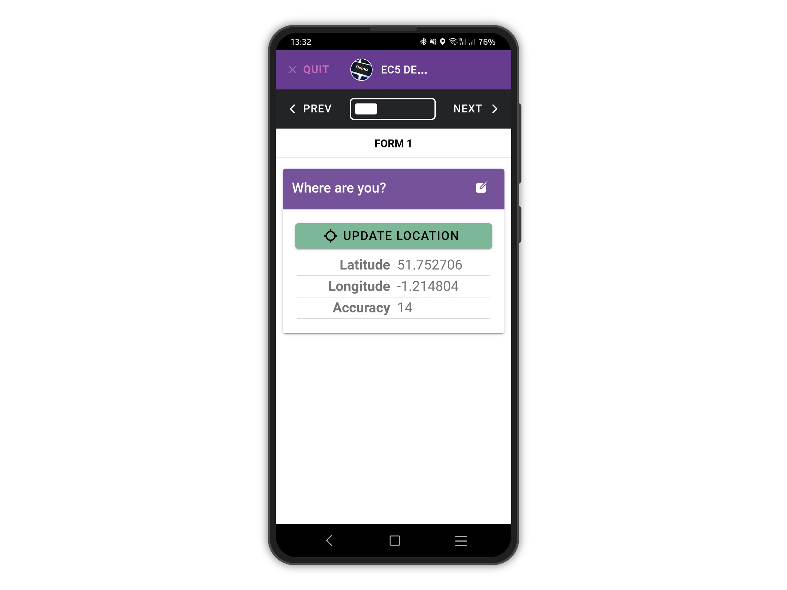
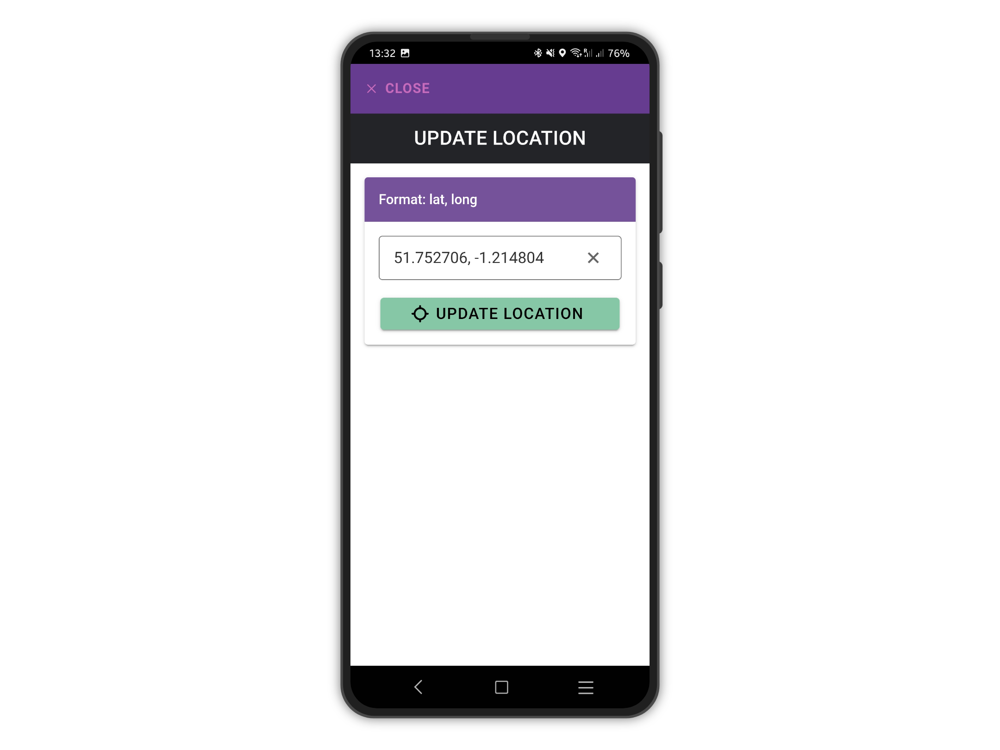
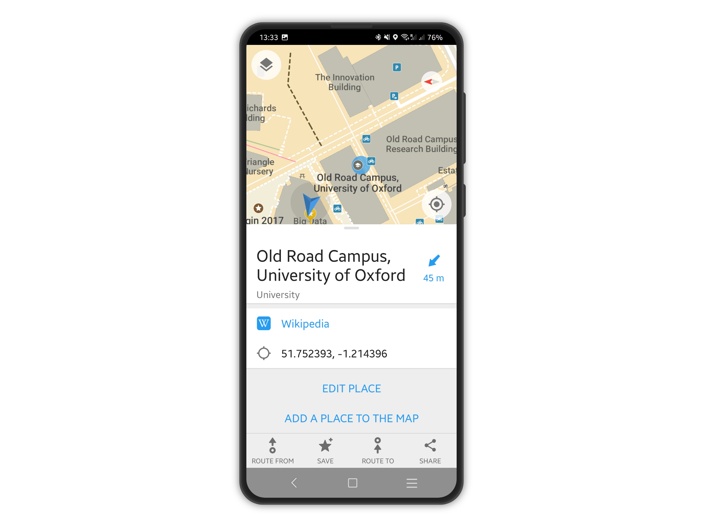
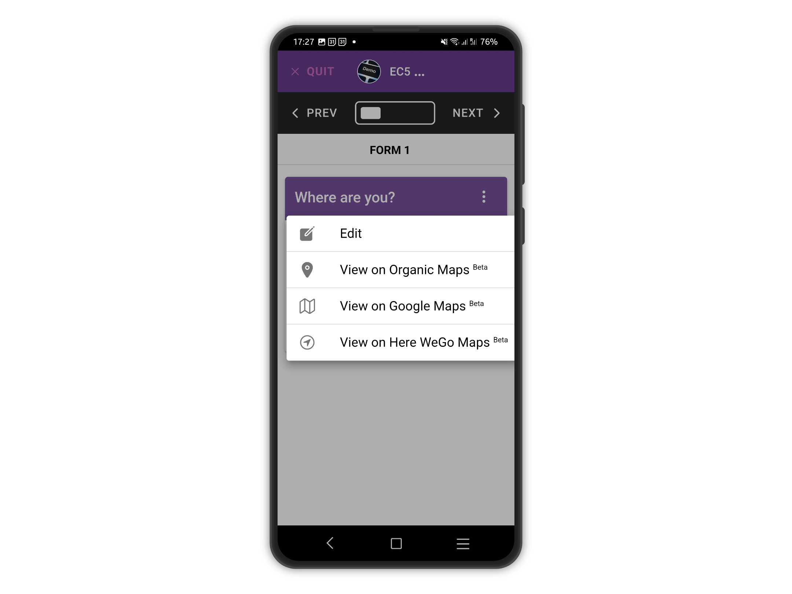

# Location Questions

### Device Location

The user needs to tap on the "Update Location" button to get the location data stored (see below).

<figure><figcaption></figcaption></figure>

Basically tapping that button gives the app the consent to store the user's location.

### Manual Location

It is possible to enter the latitude and longitude values manually by tapping the menu icon and then Edit.

<figure><figcaption></figcaption></figure>

The format must be `latitude, longitude`in decimal degrees format.

This feature is useful when copying coordinates from third-party apps, like [**Organic Maps**](https://organicmaps.app/).

<figure><figcaption></figcaption></figure>


Device location tracking cannot be done automatically for privacy reasons.

If you ever used Facebook or Instagram, you might have noticed they use the same approach, as when adding a post the location needs to be added separately.



**A location question cannot be required**: a user might not want to answer that, or the device might lack GPS capabilities (for example a cheap Android tablet).

Moreover, often getting a GPS lock is not possible for a number of reasons. If that happens and the location question was required, the user would not be able to complete the form.


### Mobile app

On the mobile app, the interface will show:

| Data                   | Format                                                                                                                                                                               |
| ---------------------- | ------------------------------------------------------------------------------------------------------------------------------------------------------------------------------------ |
| Latitude and Longitude | **Signed degrees format**, with 6 decimal places to pinpoint a location within 11cm.                                                                                                 |
| Accuracy               | **Meters**, refers to how close the device's calculated position is from the truth, expressed as a radius. Consumer smartphones devices can get a maximum accuracy of 3 or 4 meters. |


The interface and features are kept to a minimum to be able to work both online and **offline.**


**Third-party Offline Maps Integrations**&#x20;

Starting from version **6.0.0**, our mobile applications now offer seamless integration with popular mapping apps such as Google Maps, Organic Maps, and Here WeGo. This integration allows users to view locations directly within these apps and conveniently copy latitude and longitude values (in decimal degrees) for use in Epicollect5.

With this new feature, users can leverage the familiar interfaces and robust functionalities of these mapping applications to enhance their experience with Epicollect5. Whether you're navigating through remote areas or pinpointing specific locations, our integration with these offline maps ensures flexibility and accuracy in capturing geographic data.

We're committed to providing our users with intuitive tools and versatile features, and we believe that this integration will streamline your data collection process while maintaining the highest standards of usability and convenience.

<figure><figcaption></figcaption></figure>

### Web Application

When adding or editing data via the web application ([**See how**](https://app.gitbook.com/adding-data.md)), more features are available since the application will always be **online**.

You could:

* Enter the coordinates manually.
* Find a location based on an address (it is called [**geocoding**](https://en.wikipedia.org/wiki/Geocoding)).
* Find your current location and drag the marker where you want.
* Change map tiles to your preferences.

Latitude and longitude values are shown as **signed degrees format**, with 6 decimal places to pinpoint a location within 11cm.

### Exported location data

When exporting your datasets, by downloading a `csv` or `json` file and by using the API endpoints, location data are provided in both signed degrees format and UTM.

### Reverse Geocoding

Epicollect5 does not feature any way to automatically pick up an address based on latitude and longitude. Such a feature would require a reverse geocoding service (usually not free) and an internet connection thus it would not work offline.

For projects requiring it, latitude and longitude values can be converted to addresses in the post-processing of the data by using a third-party service like [**What3Words**](https://what3words.com/products/batch-converter/) or [**Geocodio**](https://www.geocod.io/upload/).

### Offline Location

A GPS lock can be obtained even when offline. Epicollect5 will try to read the location data from the GPS receiver of the device, not the wifi or the network.

If the device is offline, the satellite lock is slower and will not work indoors. Therefore, be sure to place the device outdoors, under a clear sky, and not close to any magnetic fields. Buildings, mountains and trees can stop satellite signals. Then try again until you get a lock.

To diagnose problems with your device’s GPS, we recommend the app [**GPS Status and Toolbox**](https://mobiwia.com/gpsstatus/), available for both Android and iOS.
