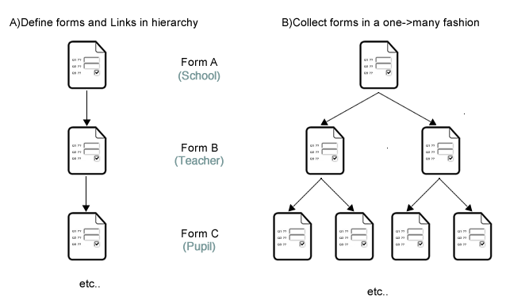
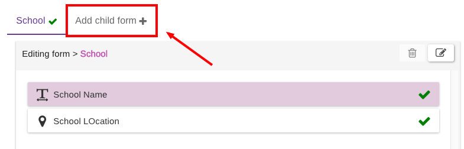
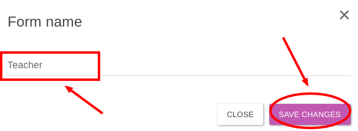
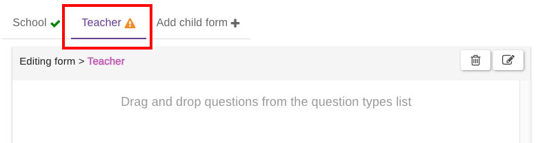

# Linking Forms

Sometimes a single form may not be adequate for the kind of project you wish to undertake, and we provide the ability to link multiple forms together within a single project in two ways; **hierarchy** or [branches](branches.md).

## Forms hierarchy

For example, on a _Schools_ project, we might define a set of questions that allow us to gather certain kinds of information about a particular school. However, maybe, as we carry out our project, we realise that it would also be useful to capture information about all the teachers within a particular school. In this instance, we would like to ask a series of questions to each teacher, within each school.

We could simply define a second project with a 'Teacher' form and carry out a second survey but data for each school would not be linked to each teacher. What would be more convenient would be for us to add multiple instances of a teacher form, to a particular school, all within the same project. Furthermore, what if we decided that as we are undertaking the project, we would also like to collect information about pupils linked to each teacher?

This expanded schools project would consist of three single forms - one for a school, one for a teacher and one for a pupil. Data gathering would occur in what can be envisioned as a hierarchical fashion (or one to many). For each school, there will be many teachers, and for each teacher, there will be many pupils.

These relationships can be visualised as in the following diagram:

This hierarchy is top to bottom and allows data gathering in a 'one to many' fashion. For example, each Form A entry (a school) can have many Form B entries (each teacher in the school), which in turn can have many Form C entries (each pupil of each teacher in the school).

The hierarchy (parent -> child) relationship across the entries is set automatically by the system.

To add a form, just click on the formbuilder page:

A popup will appear. Just enter the form name and click "SAVE CHANGES":

The form will be available as a new tab:

By default, the new form is set as invalid (you see the warning icon) as it does not have any questions.


You cannot save a project if a form does not have at least one question!&#x20;

The maximum number of forms you can link is 5. If you feel the need of having more forms, have a look at [**branches**](branches.md) (i.e. subforms).


## Add entries to child forms

Please see [**this page**](../mobile-application/add-child-entries.md)**.**
