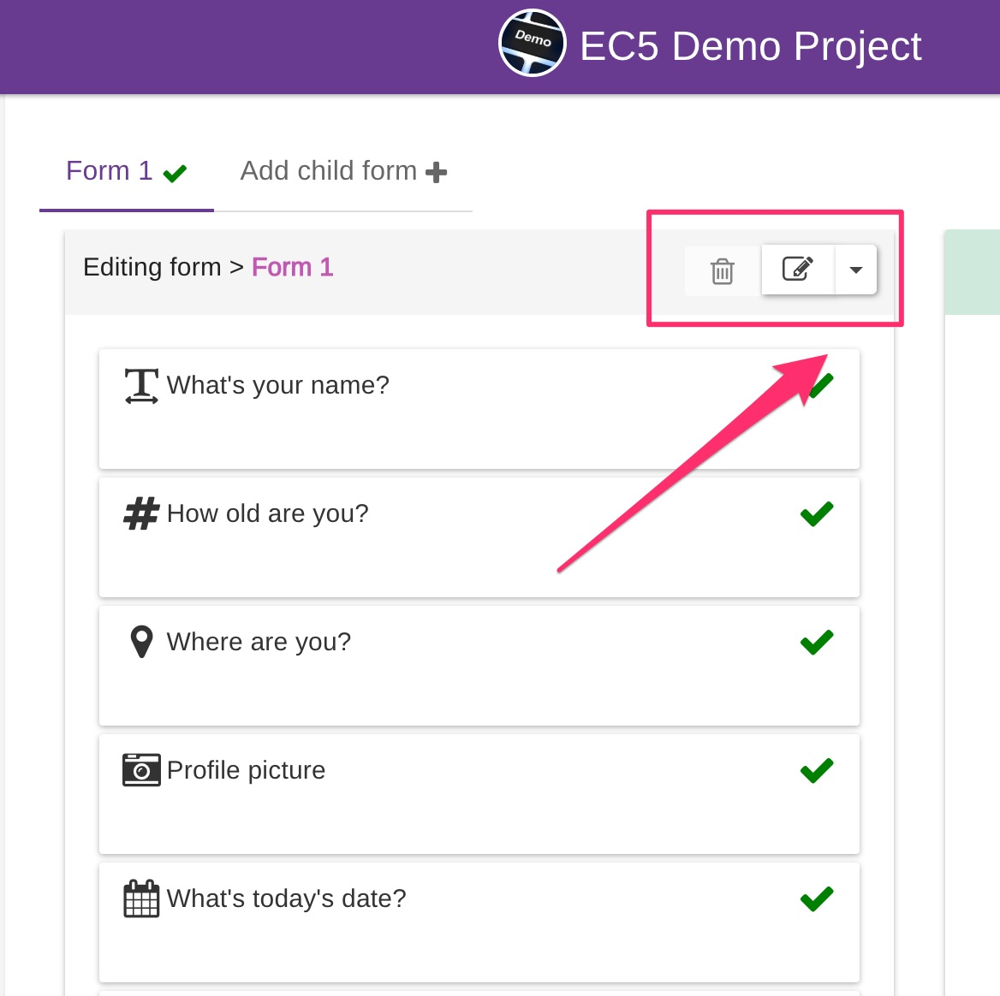
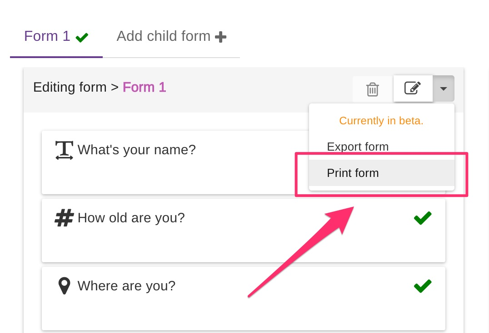
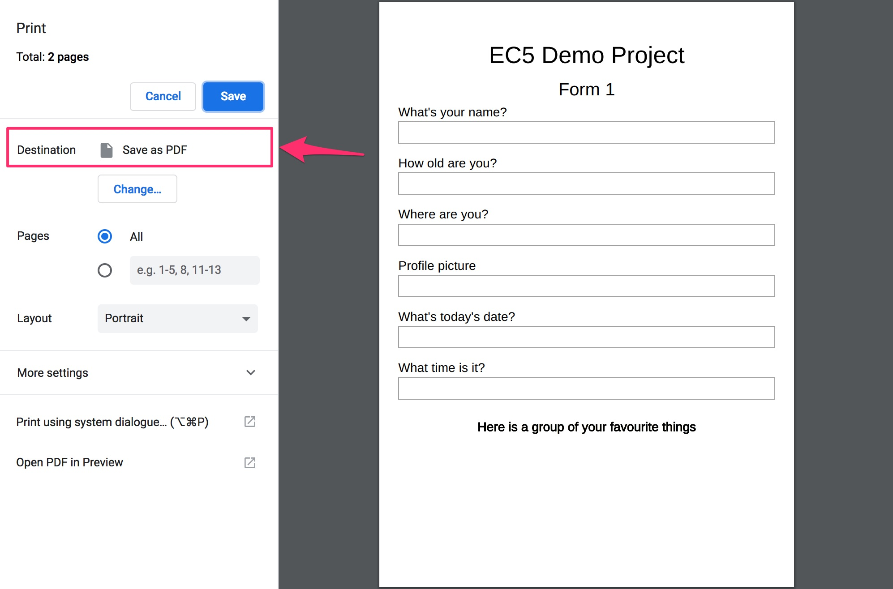
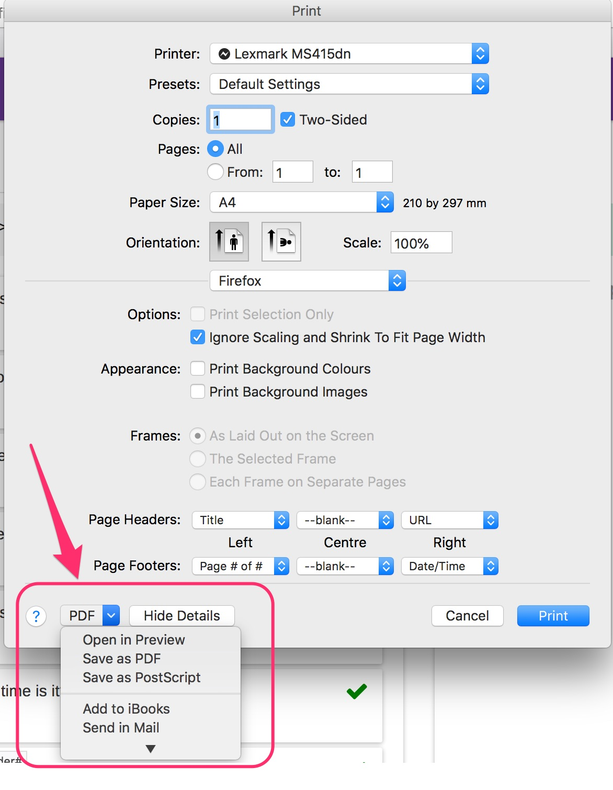
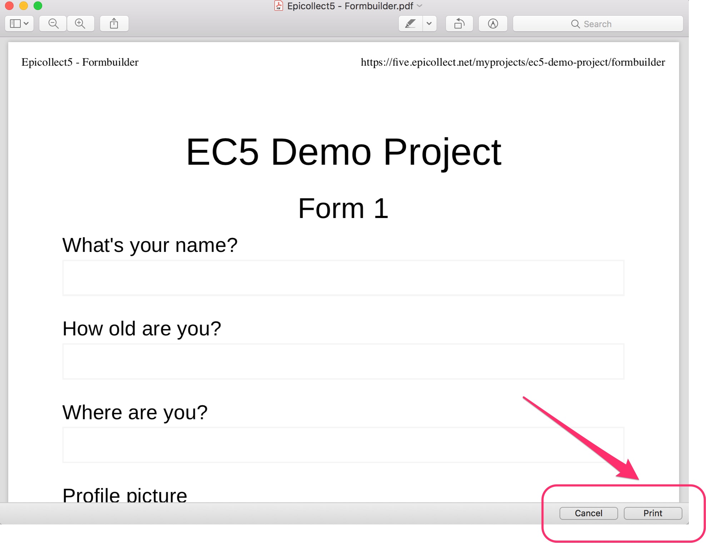
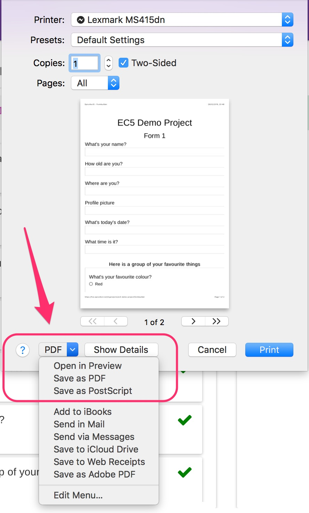

# Print Forms

Epicollect5 forms are printer-friendly. There are some use cases where there is the need to have a paper version of a form as a backup or just as a reference, maybe in PDF format. Let's see how to print a form using the most popular browsers(\*)


(\*) The following examples are from a Mac. If you are using Windows or Linux the procedure might differ.


## Google Chrome

Go to your project and open the formbuilder. Click on the dropdown menu at the top right of the middle column, the one that contains the list of questions.

On the menu, click in print form

The print dialog will open. ****&#x20;


We recommend saving the form as a PDF first and tweak the pagination using something like [**Acrobat Pro**](https://acrobat.adobe.com/us/en/acrobat/acrobat-pro.html). Since each project is different, sometimes page breaks are not where you would like them to be, therefore the need to edit the PDF before printing or distributing.


## Firefox

The same steps apply to Firefox, just the printing dialog is different. If you like to see a preview of the printout, there is a dropdown menu at the bottom right.

If you click on "Open in Preview" you will see the form in a printer friendly format and you can then print it.

## 

## Safari

Safari print dialog is similar to Firefox. The options to save as a pdf are at the bottom right.

