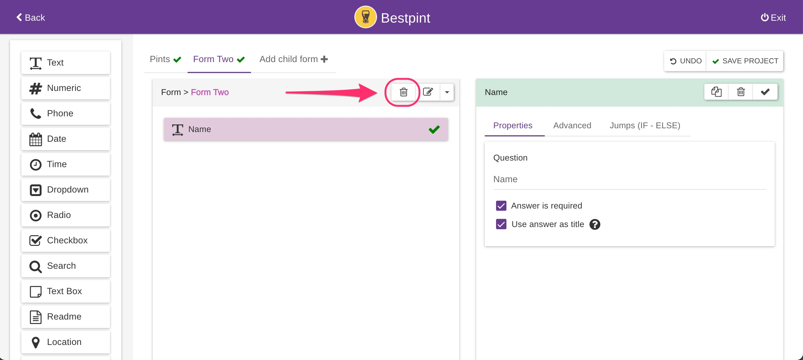

# Remove Forms

By design, a project must have at least one form, so the first form cannot be removed.

A child form can be deleted by selecting it and clicking the trash icon in the form context menu. **However, forms can only be deleted in reverse order, starting from the last one.** This restriction ensures that the hierarchy remains intact, as removing a form in the middle of the structure would disrupt its integrity.

<figure><figcaption></figcaption></figure>
