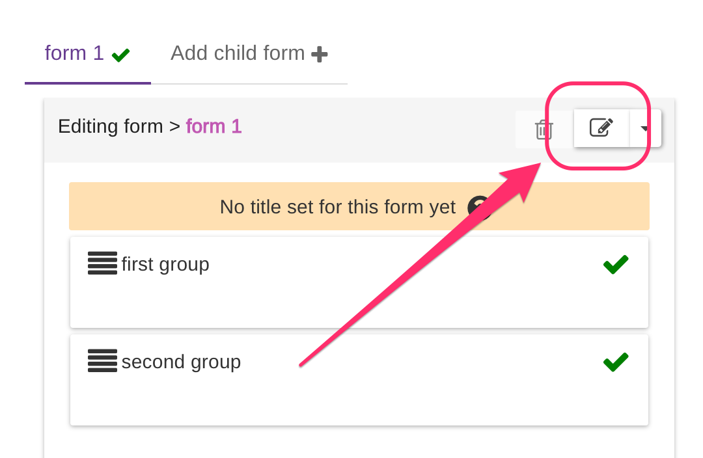
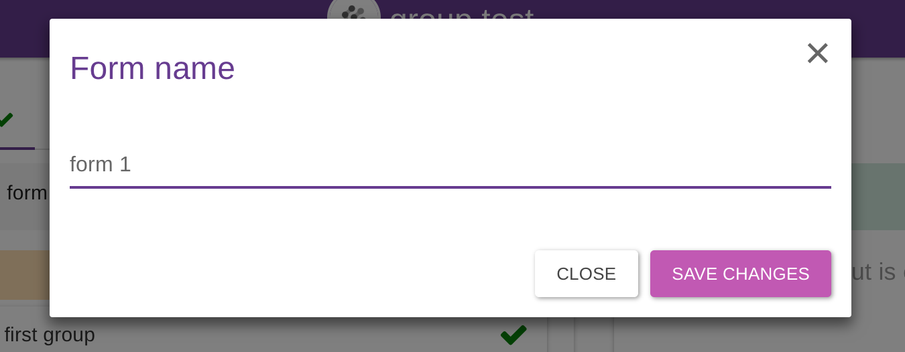
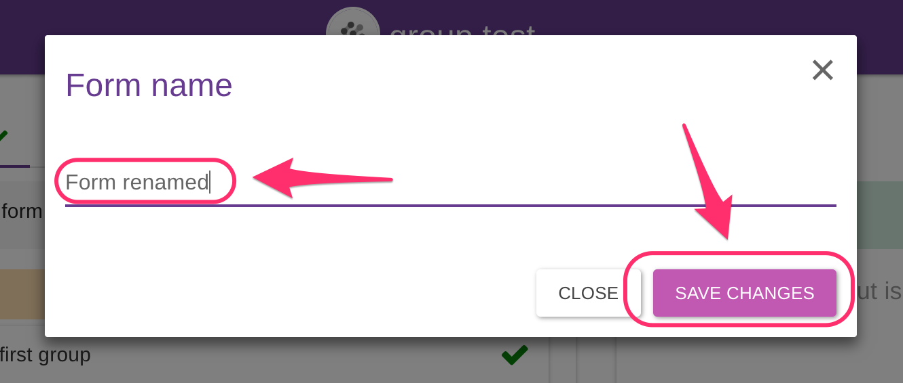
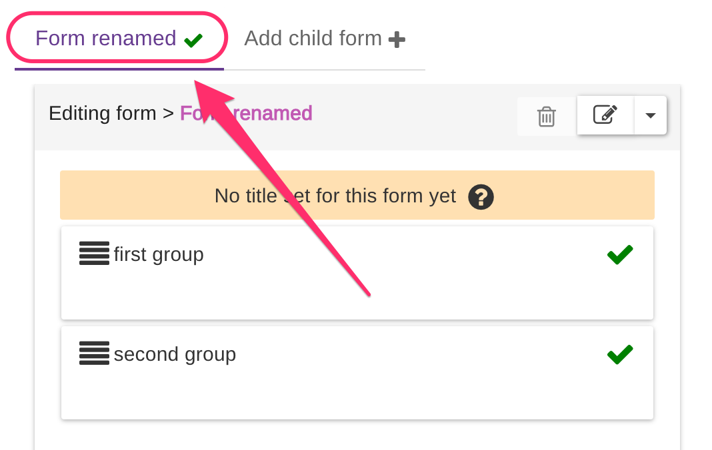

# Rename Forms

Once you created a form, you can rename it at any time. Just click on the "Edit" icon at the top right of your form:

A popup will open:

Just type the new name and click on "Save Changes".

Your form is now renamed.

