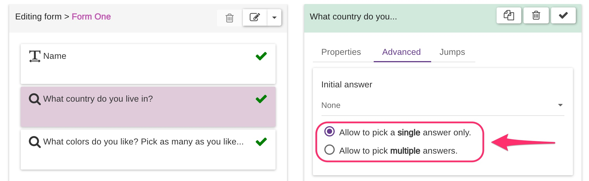

# Search

When using the SEARCH question type, the users filling in the form will get a list of matching possible answers as soon as they start typing.&#x20;


Try our [**EC5 SEARCH QUESTION TYPE**](https://five.epicollect.net/project/ec5-search-question-type) project to see the SEARCH questions in action!


It is possible to accept a single answer only (like RADIO and DROPDOWN) or multiple answers (like CHECKBOX).


SEARCH questions can have up to **1000** possible answers per each question, but there is a limit of **5 SEARCH questions per project.**

This is done to avoid overuse of this question type instead of the more common RADIO, CHECKBOX, and DROPDOWN question types. Common use cases could be a list of world countries, animal or plant species, and so on.


### Mobile app (available from version 2.0.5)


Please update your mobile app if the version is older than 2.0.5.\
Check your current version under Menu > Settings.

Older versions **will not work** with the SEARCH question type causing the app to crash.

