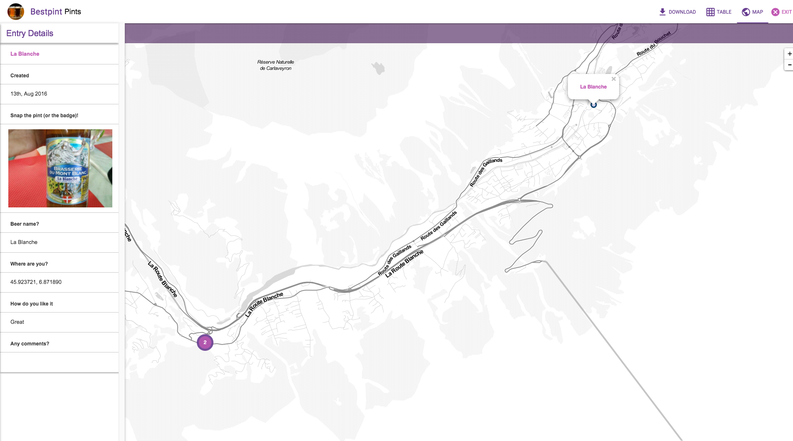
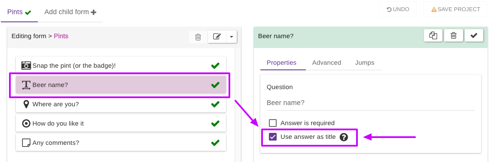

# Title

When adding entries on Epicollect5, it's beneficial to assign a title to each entry.&#x20;

If you omit to set a title, the system generates a unique identifier for the entry, such as `"149da8d4-2807-11e6-b67b-9e71128cae77"`. However, this identifier isn't very informative or user-friendly. To improve readability and organization, it's strongly recommended to designate relevant questions as titles for entries.

To identify each entry, you can set some of your question answers to be part of the entry title (**up to a maximum of 3 for either a form or a branch**)

For example, let's say you have 3 questions:

* What is your name?
* What is your age?
* What is your date of birth?

If you set all these questions to be a title, you will end up with a list of entries like:

* Mirko 30 22/05/1977
* John 18 24/01/1990


Remember, when titles are not set, the entry unique identifier generated by the system will be shown instead:&#x20;

**`149da8d4-2807-11e6-b67b-9e71128cae77`**&#x20;


Titles serve multiple purposes, including enhancing entry visibility when viewing entries on the server.

&#x20;In the provided screenshot, the project "Bestpint" demonstrates how the question "What is the beer name?" has been chosen as the title. For an entry where the answer was "La Blanche" (a renowned French beer), this title appears prominently in the entry popup and in the left sidebar as a header.

To designate a question as the title for your entries, simply select the desired question in the form builder and enable the corresponding option in the right panel. This straightforward process ensures that your entries are easily identifiable and organized, improving the overall user experience when navigating through entries on Epicollect5.

