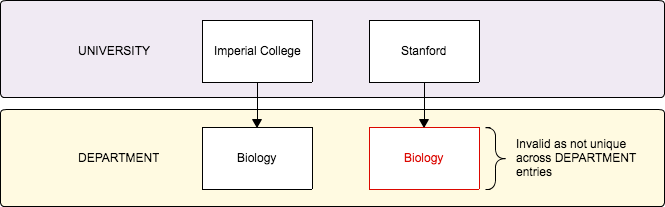
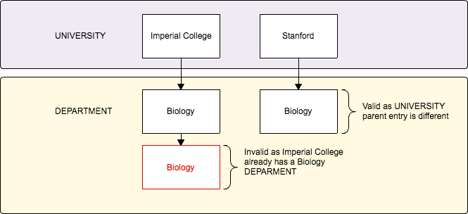

# Uniqueness

In Epicollect5 there are **two** distinct types of uniqueness:

* **Form**: uniqueness is across all the entries of a form
* **Hierarchy**: uniqueness is across all the child entries of a form (the parent entry is considered)

If your project has got a single form only, the uniqueness is always set to **form**. This means if you set a question like "What is your name" as unique, you cannot have the same name more than once.


The comparison is case insensitive i.e. "John" and "john" are the same, despite the capital letter of "John".


If you have multiple forms, for each child form you have the option to decide if you want the answer to the question unique form wide or hierarchy wide. On a project featuring UNIVERSITY as the parent form, and DEPARTMENT as the child form, let's imagine you enter "_Imperial College"_ as a UNIVERSITY entry and then you add DEPARTMENT entries to it, like _Biology_, _History_, _Media_ etc.

If you would like to avoid having the same department entered more than once for a single UNIVERSITY entry, you might set the uniqueness on the DEPARTMENT name. If you set DEPARTMENT name to be unique as **form** though, you could enter "_Biology_" only once, regardless of the UNIVERSITY being Imperial College or another one, like Stanford. This would not work as "_Biology_" is a common department across universities in the world.

**Form uniqueness:**

The solution is to set the uniqueness as **hierarchy**, to have the parent entry considered. This way the "_Biology_" DEPARTMENT can be entered only once but for each UNIVERSITY entry.

**Hierarchy uniqueness:**

To set the uniqueness for a question, select the question and go to the "Advanced" tab:

The first option is the **form** uniqueness, the second option is the **hierarchy** uniqueness as described.


The form(s) names will be different based on your project form names.


**The uniqueness constraint is available for the following question types:**

* TEXT
* NUMERIC
* PHONE
* DATE
* TIME
* TEXTBOX
* BARCODE

### Date & Time uniqueness

The uniqueness of DATE and TIME questions is based on the format selected.&#x20;

DATE answers are saved in ISO 8601 format, without timezone and with the time set to midnight, i.e \``2022-01-15T00:00:00.000`\` therefore the comparison is done only one the date part.

| dd/MM/YYY  | same day, month and year                |   |
| ---------- | --------------------------------------- | - |
| MM/dd/YYYY | same day, month and year                |   |
| YYYY/MM/dd | same day, month and year                |   |
| MM/YYYY    | same month and year, day not considered |   |
| dd/MM      | same day and month, year not considered |   |

TIME answers are saved in ISO 8601 format i.e `2022-05-12T12:34:45.000`but the date part is not considered for the uniqueness.

|          |                                     |   |
| -------- | ----------------------------------- | - |
| HH:mm:ss | same hours, minutes and seconds     |   |
| hh:mm:ss | same hours, minutes and seconds     |   |
| HH:mm    | same hours and minutes, any seconds |   |
| hh:mm    | same hours and minutes, any seconds |   |
| mm:ss    | same minutes and seconds, any hour  |   |

