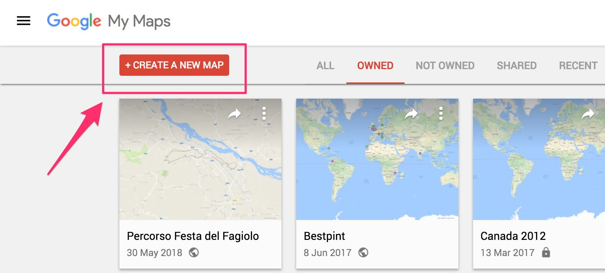
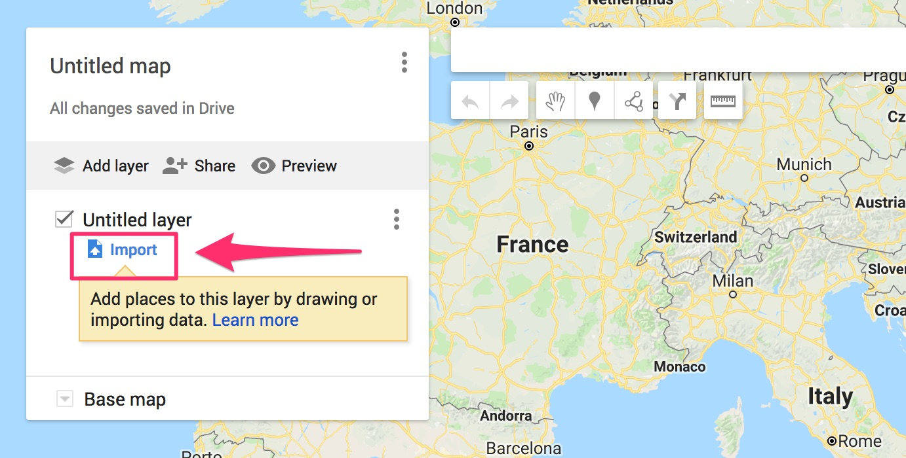
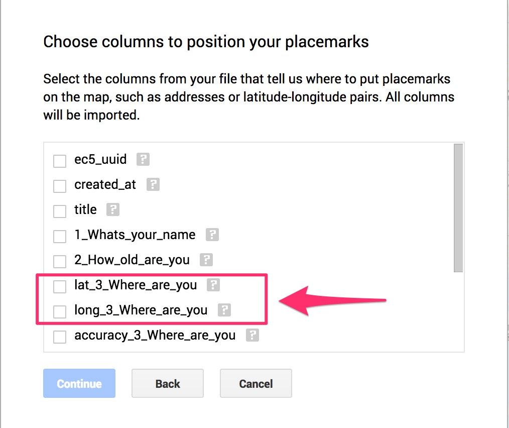
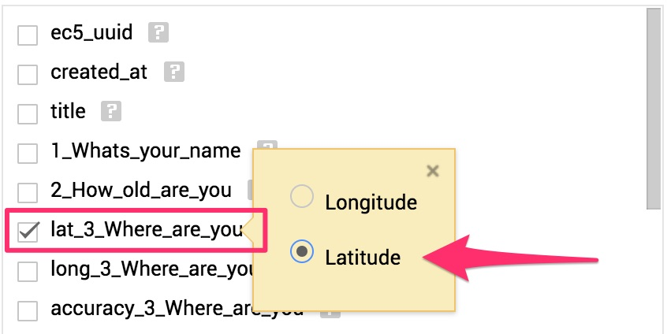
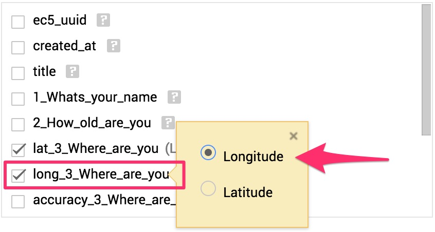
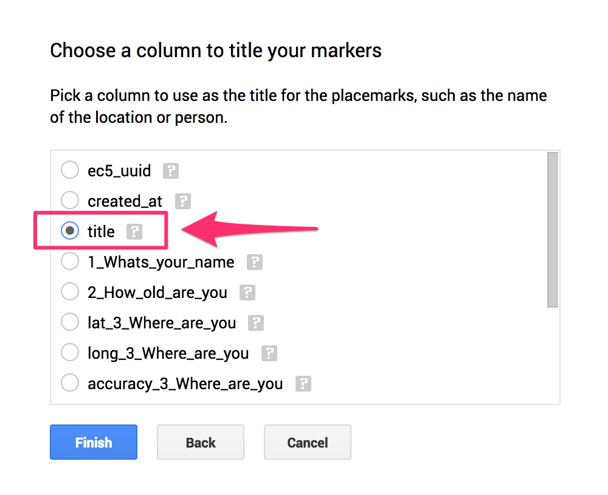
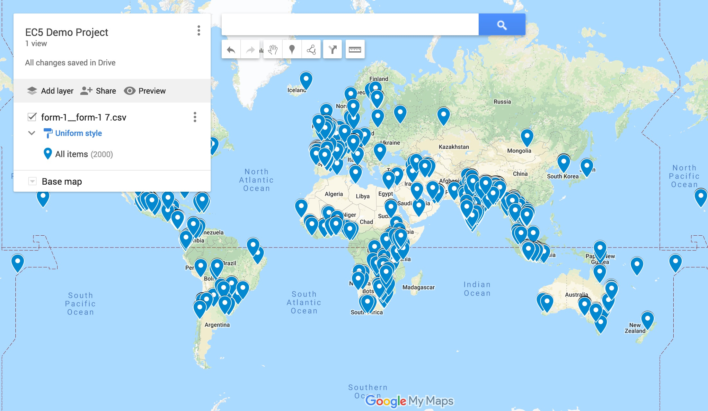

# Google Maps

It is pretty easy to import Epicollect5 data into Google Maps (by using [My Maps](https://www.google.com/mymaps))

Go to [https://www.google.com/mymaps](https://www.google.com/mymaps) and log in with your Google Account.

Click on "+ CREATE A NEW MAP".

<figure><figcaption></figcaption></figure>

On the new map, click on the import button.

Pick the `.csv` file with your downloaded data. ([How to download data?](../web-application/downloading-data.md)). Wait for the upload to complete.

You will be asked to pick the latitude and longitude from your data set. Epicollect5 prepends "**lat\_**" and "**long\_**" to latitude and longitude columns respectively.

We are using the EC5 Demo Project for this example so we will pick "**lat\_3\_Where\_are\_you**" as the latitude and "**long\_3\_Where\_are\_you**" as the longitude.

|                                      |                                      |
| ------------------------------------ | ------------------------------------ |
|  |  |

Now you will be asked to pick a column of your data set to be used as the title for the placemark. Epicollect5 conveniently has a "**title**" column assigned to each of your entries ([learn more about entry title](../formbuilder/title.md)) therefore that is an obvious choice.

After clicking on "Finish" your map will load. Isn't that awesome? [Learn more about My Maps.](https://support.google.com/mymaps/?hl=en#topic=)

