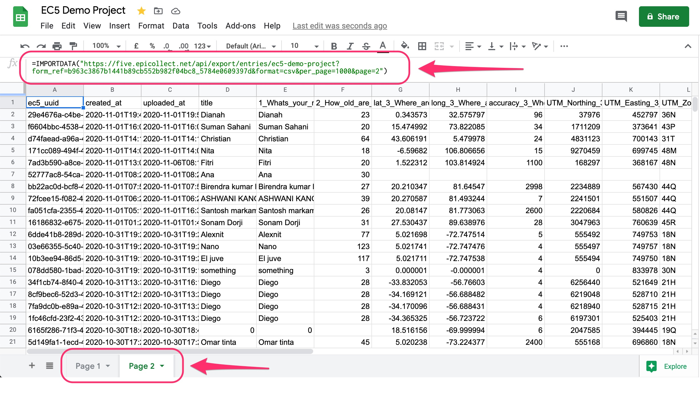
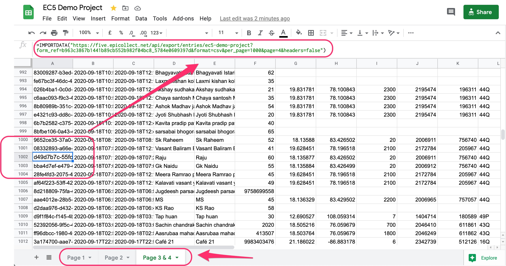
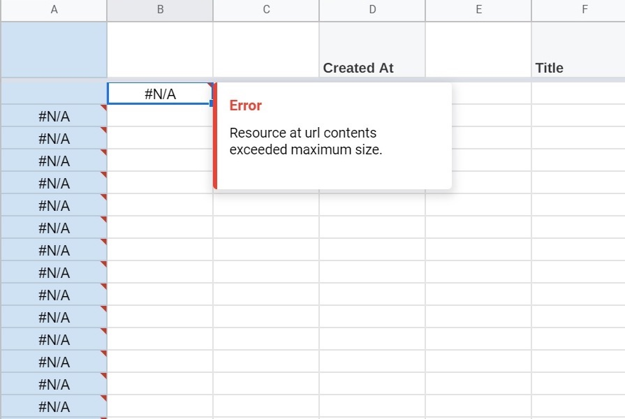

# Google Sheets

Using the Epicollect5 API, it is possible to export entries in `csv` format.


The project must be **public** to work with Google Sheets.

If you have a private project, have a look at the Survey Toolkit code [**here**](https://github.com/EnAccess/Survey-Toolkit/blob/main/Epicollect\_5-Sheets\_Integration.gs)**.**&#x20;


Google Sheets features the `=IMPORTDATA()` function to import data at a given url in .csv (comma-separated value)&#x20;


IMPORTDATA() Official Docs -> [https://support.google.com/docs/answer/3093335?hl=en](https://support.google.com/docs/answer/3093335?hl=en)


Create a new sheet and click on the first cell. Paste the following in:

`=IMPORTDATA("`[`https://five.epicollect.net/api/export/entries/ec5-demo-project?form_ref=b963c3867b1441b89cb552b982f04bc8_5784e0609397d&format=csv&per_page=1000&page=1`](https://five.epicollect.net/api/export/entries/ec5-demo-project?form\_ref=b963c3867b1441b89cb552b982f04bc8\_5784e0609397d\&format=csv\&per\_page=1000\&page=1)`")`

After the entries are loaded, it will look like below.&#x20;


For this example, the public [**EC5 Demo Project**](https://five.epicollect.net/project/ec5-demo-project) was used.


The URL passed in the `IMPORTDATA()` function will load the latest 1000 entries as we passed the parameter `per_page=1000` and `page=1`

To get more entries (if any) we need to add more `IMPORTDATA`() calls and tweak the URL to get a different page ie. 2, 3, 4 and so on.


It is possible to have up to **50** `IMPORTDATA()`calls on a single spreadsheet in Google Sheets.


One way to do that would be to create another sheet on the same file and repeat the procedure above, this time using a parameter`page=2`in the URL.

Another option is to load the first 1000 entries and the headers on the first cell, then on row 1002 load the next 1000 entries omitting the headers in the request by passing the parameter `headers=false.` This way 2000 entries will be loaded on the same sheet.

The spreadsheet in the example can be viewed at [**https://docs.google.com/spreadsheets/d/1XibVZ5RXxT9ZfrDUx403I0ZTS0MHe1h26tlFP0dM-bU/edit?usp=sharing**](https://docs.google.com/spreadsheets/d/1XibVZ5RXxT9ZfrDUx403I0ZTS0MHe1h26tlFP0dM-bU/edit?usp=sharing)

Full API guide at [**https://developers.epicollect.net**](https://developers.epicollect.net/)


_**`Resource at URL content exceeded maximum size`**_&#x20;

This error on Google Sheets means the dataset you are trying to import is too big in size.

Try to lower the number of entries on each`importdata()` call.


