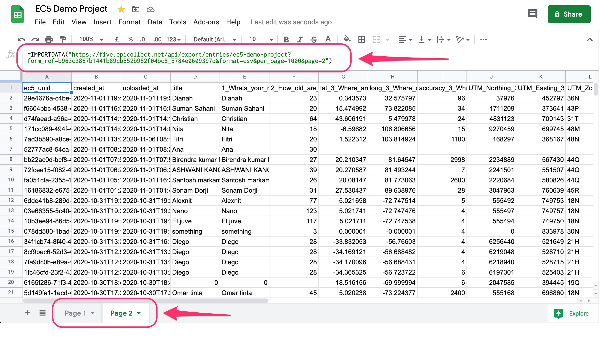
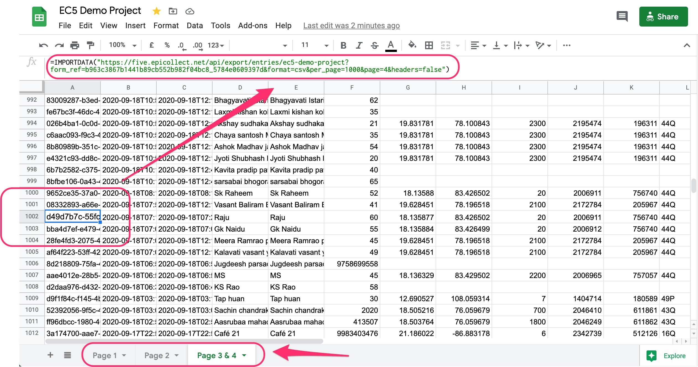
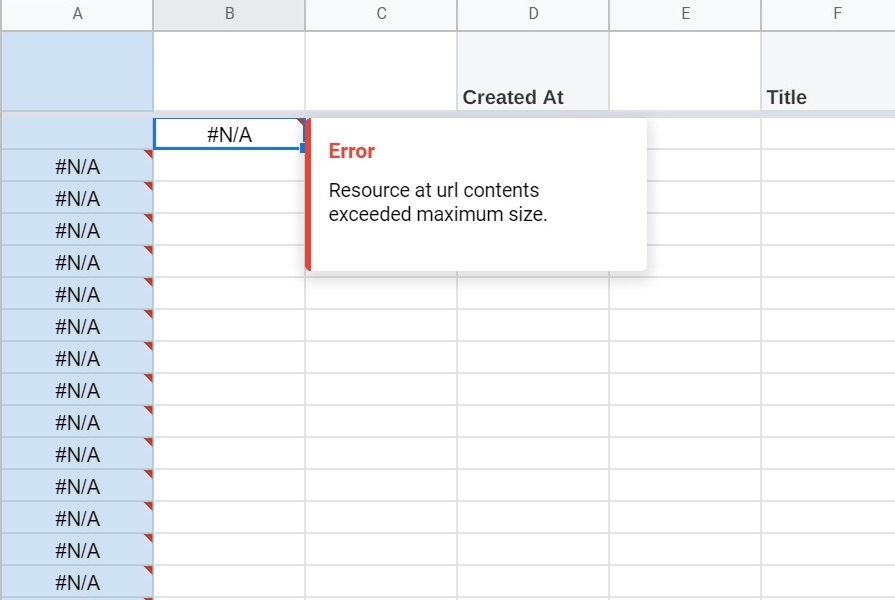

# Google Sheets

Using the Epicollect5 API, it is possible to export entries in `csv` format.


The project must be **public** to work with Google Sheets.

If you have a private project, have a look at the Survey Toolkit code [**here**](https://github.com/EnAccess/Survey-Toolkit/blob/main/Epicollect_5-Sheets_Integration.gs)**.**


### Import Data

Google Sheets features the `=IMPORTDATA()` function to import data from a given URL in .csv (comma-separated value).


IMPORTDATA() Official Docs -> [https://support.google.com/docs/answer/3093335?hl=en](https://support.google.com/docs/answer/3093335?hl=en)


Create a new sheet and click on the first cell. Paste the following in:

`=IMPORTDATA("`[`https://five.epicollect.net/api/export/entries/ec5-demo-project?form_ref=b963c3867b1441b89cb552b982f04bc8_5784e0609397d&format=csv&per_page=500&page=1`](https://five.epicollect.net/api/export/entries/ec5-demo-project?form_ref=b963c3867b1441b89cb552b982f04bc8_5784e0609397d\&format=csv\&per_page=1000\&page=1)`")`

After the entries are loaded, it will look like this.


For this example, the public [**EC5 Demo Project**](https://five.epicollect.net/project/ec5-demo-project) was used.



The URL passed in the `IMPORTDATA()` function will load the latest 1000 entries as we pass the parameter `per_page=500` and `page=1`

To get more entries (if any), we need to add more `IMPORTDATA`() calls and tweak the URL to get a different page, i.e., 2, 3, 4 and so on.


It is possible to have up to **50** `IMPORTDATA()`calls on a single spreadsheet in Google Sheets.


One way to do that would be to create another sheet on the same file and repeat the procedure above, this time using a parameter`page=2`in the URL.



Another option is to load the first 500 entries and the headers on the first cell, then on row 502, load the next 500 entries, omitting the headers in the request by passing the parameter `headers=false.` This way 1000 entries will be loaded on the same sheet.



### Lazy Load Images

Google Sheets `=IMAGE()` formulas can request many images at once.&#x20;

For large Epicollect5 exports, this may trigger rate limiting, resulting in broken images.

To avoid this, keep media URLs as plain text and use Apps Script to insert `=IMAGE()` formulas gradually.

Import your entries first:

```excel
=IMPORTDATA("https://five.epicollect.net/api/export/entries/YOUR_PROJECT?format=csv&per_page=250&page=1")
```

Then open:

```
Extensions → Apps Script
```

Paste this script:

```javascript
const CONFIG = {
  spreadsheetId: 'PASTE_YOUR_SPREADSHEET_ID',
  sheetName: 'Sheet1',
  firstDataRow: 2,

  // Columns containing image URLs.
  // Example: [8] = column H
  // Example: [8, 9] = columns H and I
  urlColumns: [8],

  // Column where images will be rendered.
  // Example: 20 = column T
  firstImageColumn: 20,

  // Number of rows loaded every minute.
  batchSize: 10
};

function onOpen() {
  SpreadsheetApp.getUi()
    .createMenu('Images')
    .addItem('Start automatic image loading', 'startAutomaticImageLoading')
    .addItem('Stop automatic image loading', 'stopAutomaticImageLoading')
    .addItem('Load next batch now', 'loadNextImageBatch')
    .addItem('Clear loaded images', 'clearLoadedImages')
    .addItem('Reset progress', 'resetProgress')
    .addToUi();
}

function startAutomaticImageLoading() {
  stopAutomaticImageLoading();

  ScriptApp.newTrigger('loadNextImageBatch')
    .timeBased()
    .everyMinutes(1)
    .create();

  console.log('Automatic image loading started.');

  loadNextImageBatch();
}

function stopAutomaticImageLoading() {
  ScriptApp.getProjectTriggers().forEach(trigger => {
    if (trigger.getHandlerFunction() === 'loadNextImageBatch') {
      ScriptApp.deleteTrigger(trigger);
    }
  });

  console.log('Automatic image loading stopped.');
}

function loadNextImageBatch() {
  const sheet = SpreadsheetApp
    .openById(CONFIG.spreadsheetId)
    .getSheetByName(CONFIG.sheetName);

  if (!sheet) {
    console.log(`Sheet not found: ${CONFIG.sheetName}`);
    stopAutomaticImageLoading();
    return;
  }

  const props = PropertiesService.getScriptProperties();
  let startRow = Number(props.getProperty('lastLoadedRow')) || CONFIG.firstDataRow;

  const lastRow = getLastRowWithAnyUrl(sheet);

  console.log(`startRow=${startRow}, lastRow=${lastRow}`);

  if (startRow > lastRow) {
    console.log('All image rows loaded.');
    stopAutomaticImageLoading();
    return;
  }

  const rowsToLoad = Math.min(CONFIG.batchSize, lastRow - startRow + 1);

  console.log(`Loading rows ${startRow} to ${startRow + rowsToLoad - 1}`);

  loadImageBatch(sheet, startRow, rowsToLoad);

  SpreadsheetApp.flush();

  startRow += rowsToLoad;
  props.setProperty('lastLoadedRow', String(startRow));

  console.log(`Next batch will start from row ${startRow}`);
}

function loadImageBatch(sheet, startRow, rowsToLoad) {
  CONFIG.urlColumns.forEach((urlColumn, index) => {
    const imageColumn = CONFIG.firstImageColumn + index;

    const urls = sheet
      .getRange(startRow, urlColumn, rowsToLoad, 1)
      .getValues();

    const formulas = urls.map(([url], rowIndex) => {
      const row = startRow + rowIndex;
      const value = String(url || '').trim();

      if (!value) {
        return [''];
      }

      if (!value.startsWith('https://')) {
        console.log(`Row ${row}: invalid image URL in ${columnLetter(urlColumn)}${row}`);
        return [`Invalid image URL`];
      }

      return [`=IMAGE(${columnLetter(urlColumn)}${row})`];
    });

    sheet
      .getRange(startRow, imageColumn, formulas.length, 1)
      .setValues(formulas);
  });
}

function clearLoadedImages() {
  const sheet = SpreadsheetApp
    .openById(CONFIG.spreadsheetId)
    .getSheetByName(CONFIG.sheetName);

  const lastRow = getLastRowWithAnyUrl(sheet);

  if (lastRow < CONFIG.firstDataRow) {
    return;
  }

  const rows = lastRow - CONFIG.firstDataRow + 1;

  sheet
    .getRange(CONFIG.firstDataRow, CONFIG.firstImageColumn, rows, CONFIG.urlColumns.length)
    .clearContent();

  console.log('Loaded image formulas cleared.');
}

function resetProgress() {
  PropertiesService
    .getScriptProperties()
    .deleteProperty('lastLoadedRow');

  clearLoadedImages();

  console.log('Progress reset.');
}

function getLastRowWithAnyUrl(sheet) {
  const sheetLastRow = sheet.getLastRow();

  if (sheetLastRow < CONFIG.firstDataRow) {
    return CONFIG.firstDataRow - 1;
  }

  const rows = sheetLastRow - CONFIG.firstDataRow + 1;

  const valuesByColumn = CONFIG.urlColumns.map(column => {
    return sheet
      .getRange(CONFIG.firstDataRow, column, rows, 1)
      .getValues();
  });

  for (let i = rows - 1; i >= 0; i--) {
    const hasUrl = valuesByColumn.some(values => {
      const value = String(values[i][0] || '').trim();
      return value.startsWith('https://');
    });

    if (hasUrl) {
      return CONFIG.firstDataRow + i;
    }
  }

  return CONFIG.firstDataRow - 1;
}

function columnLetter(columnNumber) {
  let letter = '';

  while (columnNumber > 0) {
    const remainder = (columnNumber - 1) % 26;
    letter = String.fromCharCode(65 + remainder) + letter;
    columnNumber = Math.floor((columnNumber - 1) / 26);
  }

  return letter;
}
```

#### Configure the script

Update these values:

```javascript
spreadsheetId: 'PASTE_YOUR_SPREADSHEET_ID'
urlColumns: [8]
firstImageColumn: 20
batchSize: 10
```

The spreadsheet ID is in the URL:

```
https://docs.google.com/spreadsheets/d/SPREADSHEET_ID/edit
```

Column numbers:

```
A = 1
B = 2
H = 8
T = 20
```

#### Usage

Reload the spreadsheet, then use:

```
Images → Start automatic image loading
```

The script will:

```
1. Load the first batch immediately
2. Continue loading another batch every minute
3. Stop automatically when all image URLs have been processed
```

You can also use:

```
Images → Load next batch now
```

to test one batch manually.

#### Notes

* `batchSize` controls how many rows are loaded per minute.
* `urlColumns` controls which CSV columns contain media URLs.
* `firstImageColumn` controls where rendered images are written.
* Invalid or non-HTTPS URLs are skipped and marked as `Invalid image URL`.
* If you want to restart from the beginning, use `Images → Reset progress`.

Epicollect5 images are cached for 24 hours, so once an image has loaded, it is normally served from cache on later spreadsheet reloads.

### IMPORTDATA() Errors&#x20;


If IMPORTDATA() throws an error, reduce the number of entries using a lower `per_page` value.



