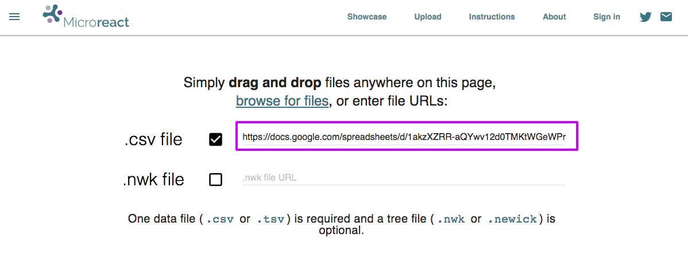

# Microreact

[Microreact](https://microreact.org) is a tool for open data visualization and sharing for genomic epidemiology.

It is possible to integrate Epicollect5 with Microreact using [Google Spreadsheet](https://www.google.co.uk/sheets/about/) as a bridge between the two platforms.

We are going to use the [EC5 Demo Project](https://five.epicollect.net/project/ec5-demo-project) as an example. **The project must be public.**

Using the Epicollect5 API endpoints, we can get all the entries (1000 at a time) for that project using the following URL: ([Open in browser](https://five.epicollect.net/api/export/entries/ec5-demo-project?format=csv\&headers=false\&per\_page=1000))

`https://five.epicollect.net/api/export/entries/ec5-demo-project?format=csv&headers=false&per_page=1000`

We are passing a few parameters:

`format=csv`as we need the entries in csv format.

`headers=false` as we do not want the column headers. We are going to use custom headers to fit [Microreact requirements](https://microreact.org/instructions).

`per_page=1000` to get the maximum number of entries on a single request (1000)as export responses are paginated. Google Sheets could give an error if requesting too many entries though.


If your project has more than 1000 entries, multiple requests need to be made adding an incremental `page` parameter specifying the next page on each request (`page=1`, `page=2`, `page=3` and so on).

A single Google Sheets spreadsheet can have up to 50 `IMPORTDATA()` calls ([**more info**](https://support.google.com/docs/answer/3093335?hl=en)) therefore the integration will work with projects up to 50.000 entries.&#x20;


We created a public viewable spreadsheet [here](https://docs.google.com/spreadsheets/d/1akzXZRR-aQYwv12d0TMKtWGeWPrOajFGp3QzLQttZwE/edit#gid=0).

[Learn more about how to create a Google Sheet to use with Microreact.](https://microreact.org/tutorials/google-sheets)

The first thing to do is to leave the first row empty for the time being, and click on cell A2.

We are going to use the following formula in that cell:

`=IMPORTDATA("https://five.epicollect.net/api/export/entries/ec5-demo-project?format=csv&headers=false&per_page=1000")`

passing the URL described above. \

The URL to get the entries for a public project is always the same, just the project slug will be different. For another project, we would just need to replace the`ec5-demo-project`slug with the new one. You can find each project slug in the [API section](../developers/api.md) of your project details page, or by just looking at the URL in your browser on your project home page.

Now it is time to add the custom headers. Microreact requires a column `id` to uniquely identify each row. With data coming from Epicollect5, that will always be the most left column.

We also need to specify `latitude` and `longitude` columns if we want to view the data on a map. [More info on Microreact headers](https://microreact.org/instructions)

You can use a downloaded csv from Epicollect5 as a reference if you do not remember your headers. After adding them manually, we have:

**Important: if you have Date or Time questions, you have to set the format for those columns, otherwise by default they get converted to numbers (Google trying to be smart here).**

To do that, select the Date or Time columns, click on Format > Number and pick Date or Time.

Now the sheet is ready to be published. Go to File > Publish to the web...

It needs to be published as comma-separated values (csv) and we need to grab the generated link to use on Microreact

To refresh the data set automatically (so when new entries are added to Epicollect5, they appear on the sheet) we can set an auto refresh to one minute or one hour. Go to File > Spreadsheet settings

On the calculation tab, select "On change and every minute" (or hour)

We are ready to head off to Microreact with the url we just generated:

`https://docs.google.com/spreadsheets/d/1akzXZRR-aQYwv12d0TMKtWGeWPrOajFGp3QzLQttZwE/pub?output=csv`

Please notice the "output=csv". If your url does not have that, check your publish settings.

On the [Microreact home page](https://microreact.org/showcase), click Upload:

Paste the project url where it says CSV file and click on "Continue (without tree)"

Enter some basic project details and click on "Create Project"

The project is generated!

The project is currently hosted at [https://microreact.org/project/rJTVCyTE-](https://microreact.org/project/rJTVCyTE-)
