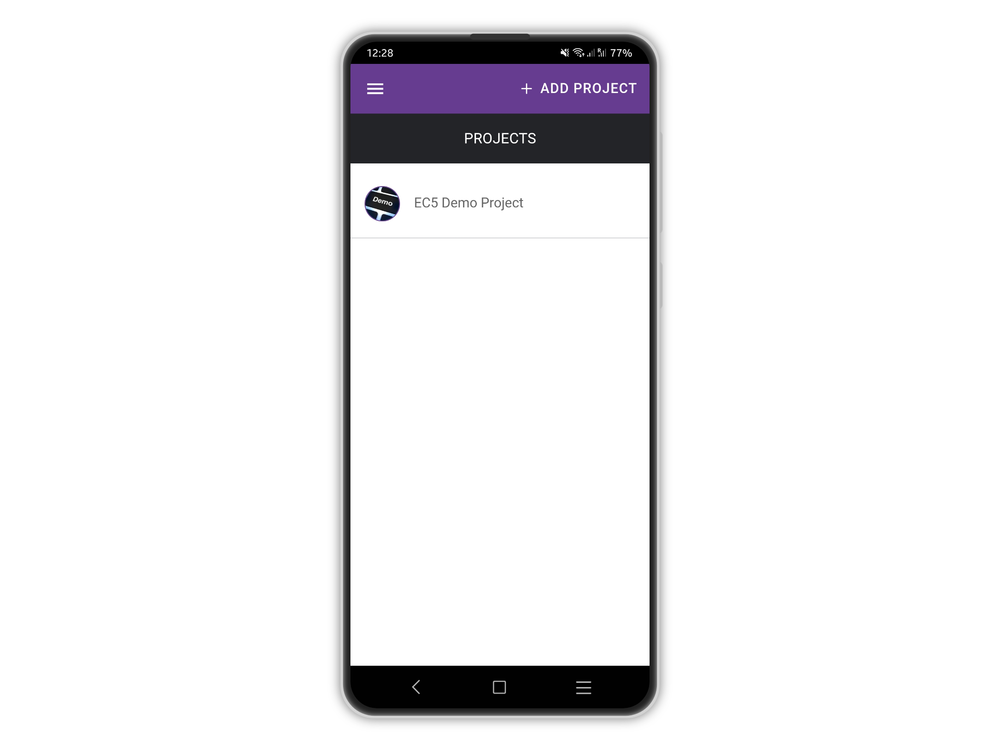
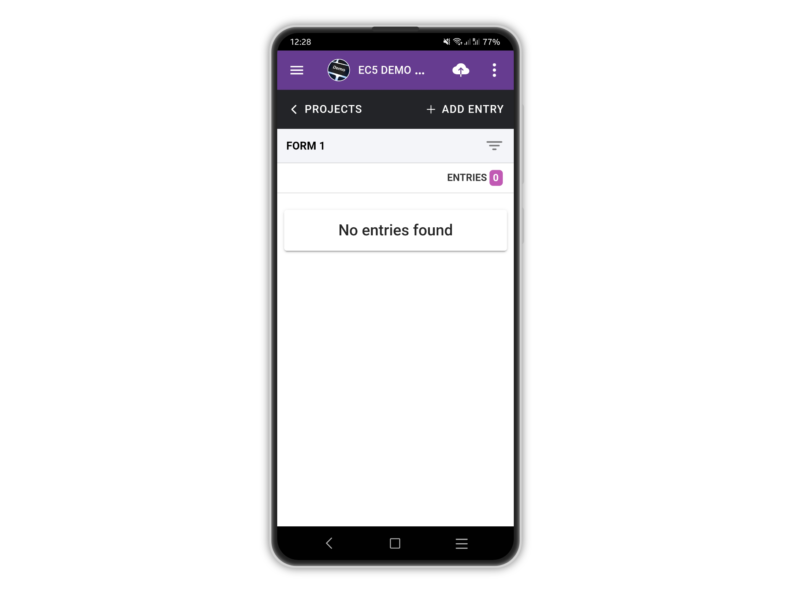
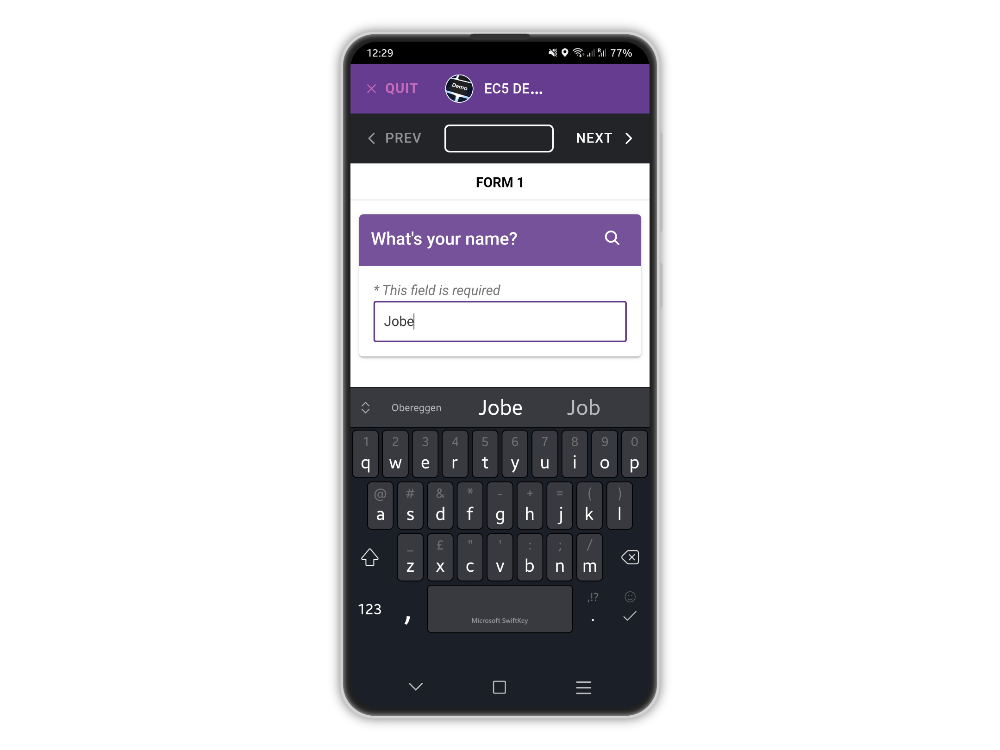
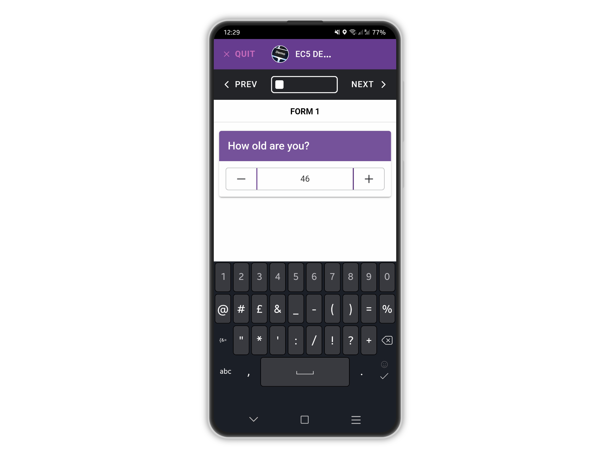
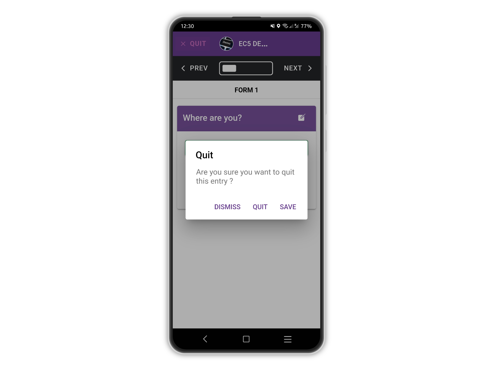
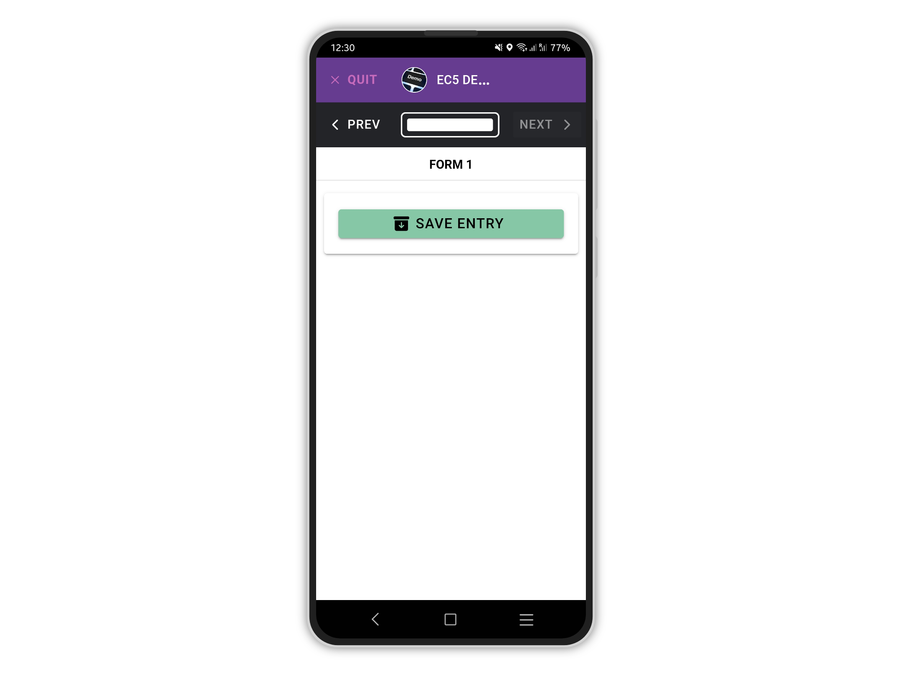
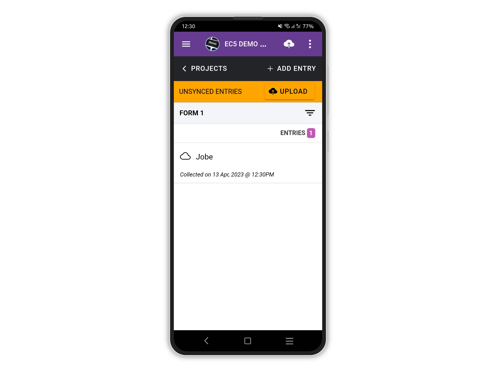

# Add Entries - Mobile (Single Form)

To begin adding entries, tap on your project on the **PROJECTS** list home page.

<figure><figcaption></figcaption></figure>

Next, tap the **+ADD ENTRY** button at the top right to start adding an entry to the first form.

In this example, the form is called simply _'FORM 1'_.

<figure><figcaption></figcaption></figure>

This will begin the process of adding an entry, by answering each question on the form.

<figure><figcaption></figcaption></figure>

A progress indicator at the top show you how far through each form you are.

You can use the **NEXT** and **PREVIOUS** buttons to navigate back and forth.

<figure><figcaption></figcaption></figure>

If you decide to quit your entry early, you can choose to save your incomplete entry.

<figure><figcaption></figcaption></figure>


Incomplete entries cannot be uploaded.

Only fully completed entries can be synced with the server.

In order to complete an entry, you must reach the end of the form.


Once you have reached the end of the form, you can save your entry.

<figure><figcaption></figcaption></figure>

After the entry is saved locally, you will be taken back to the form home page where you can add more entries, view your entries or upload your entries to the server.

<figure><figcaption></figcaption></figure>


