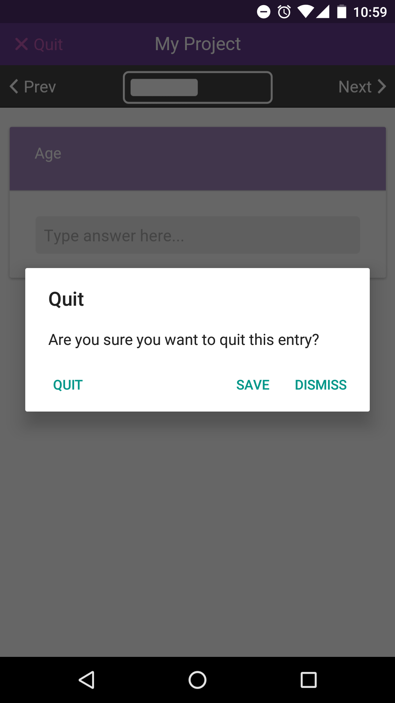

# Add Entries (Single Form)

|                                                 |                                                                                           |
| ----------------------------------------------- | ----------------------------------------------------------------------------------------- |
| .png>) | To begin adding an entry, first click on your project from the 'Projects' list home page. |

|                                              |                                                                             |
| -------------------------------------------- | --------------------------------------------------------------------------- |
|  | Next, click the '+ Add Entry' button to start adding an entry to your form. |

In this example, the form is called simply 'Form 1'.

|                                      |                                                                                                 |
| ------------------------------------ | ----------------------------------------------------------------------------------------------- |
|  | This will begin the process of adding an entry, where you can answer each question in the form. |

|                                      |                                                                                                                                |
| ------------------------------------ | ------------------------------------------------------------------------------------------------------------------------------ |
|  | A progress indicator tells you how far through each form you are and you can use the 'Next'and 'Previous' buttons to navigate. |

|                                        |                                                                                       |
| -------------------------------------- | ------------------------------------------------------------------------------------- |
|  | If you decide to quit your entry early, you can choose to save your incomplete entry. |


Incomplete  entries cannot be uploaded.&#x20;

Only complete entries may be synced with the server.&#x20;

In order to complete an entry, you must reach the end of the form.


|                                        |                                                                     |
| -------------------------------------- | ------------------------------------------------------------------- |
|  | Once you have reached the end of the form, you can save your entry. |

|                                                      |                                                                                                                                       |
| ---------------------------------------------------- | ------------------------------------------------------------------------------------------------------------------------------------- |
| .png>) | You will then be taken back to the form home page where you can add more entries, view your entry or upload your entry to the server. |
