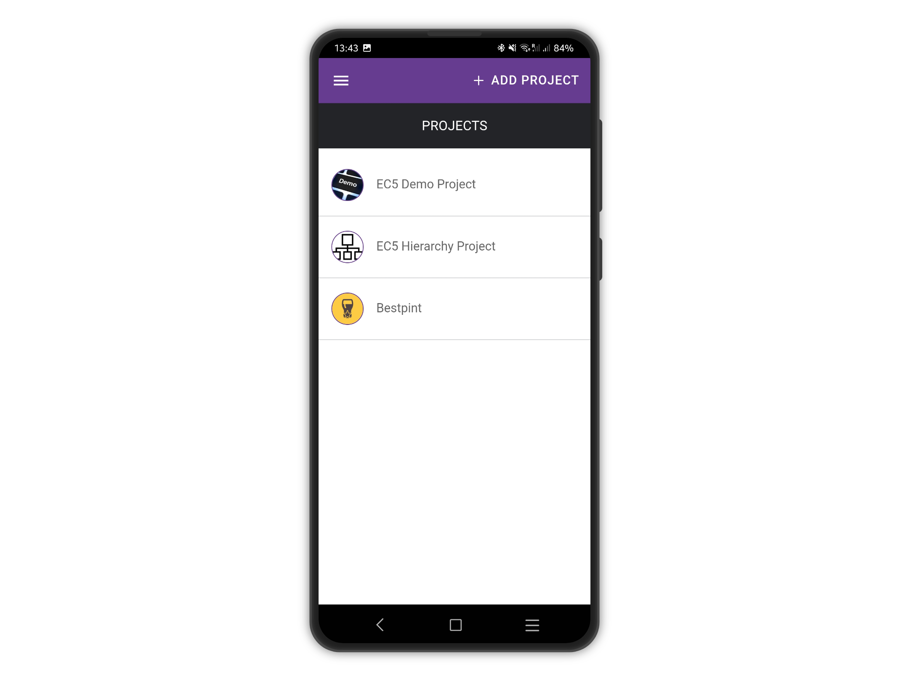
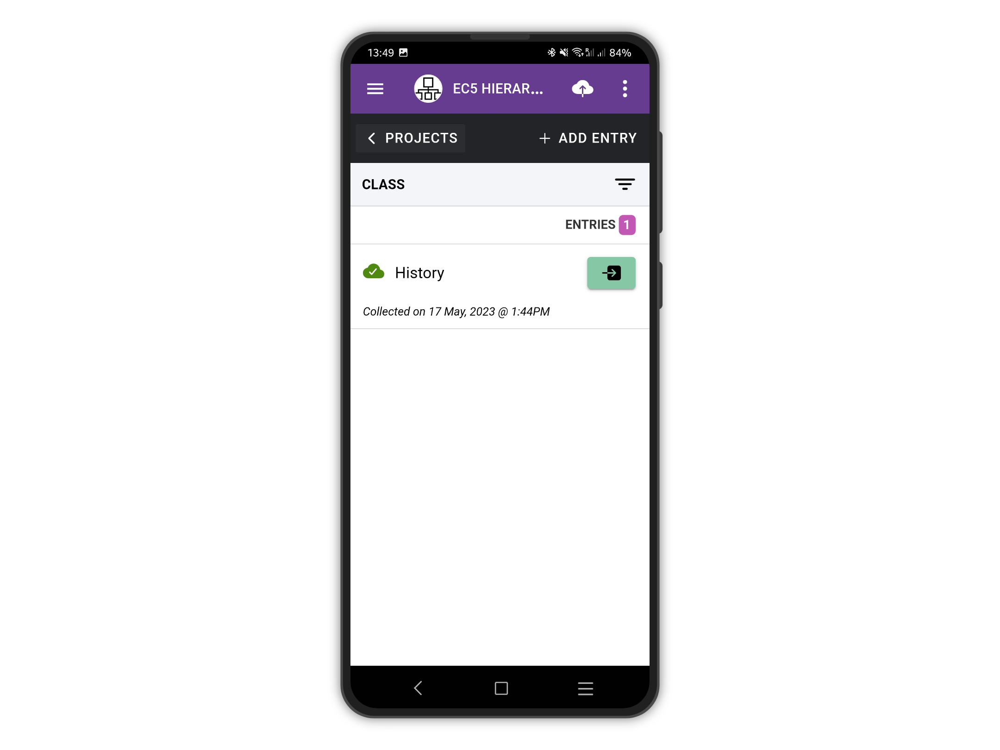
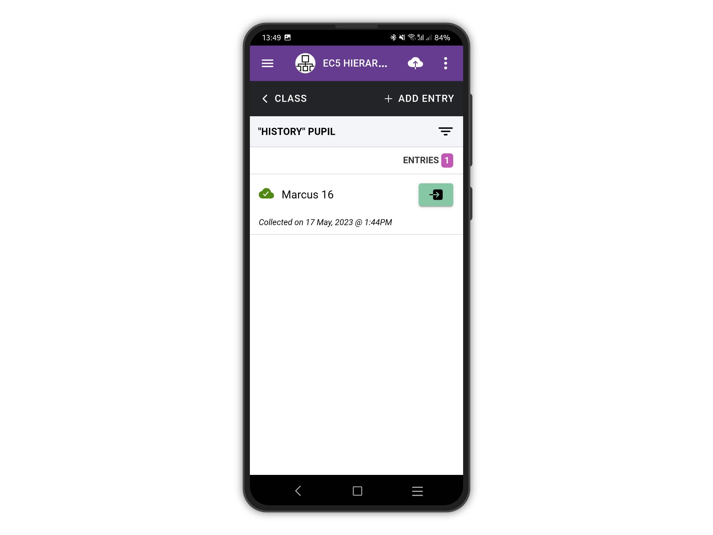
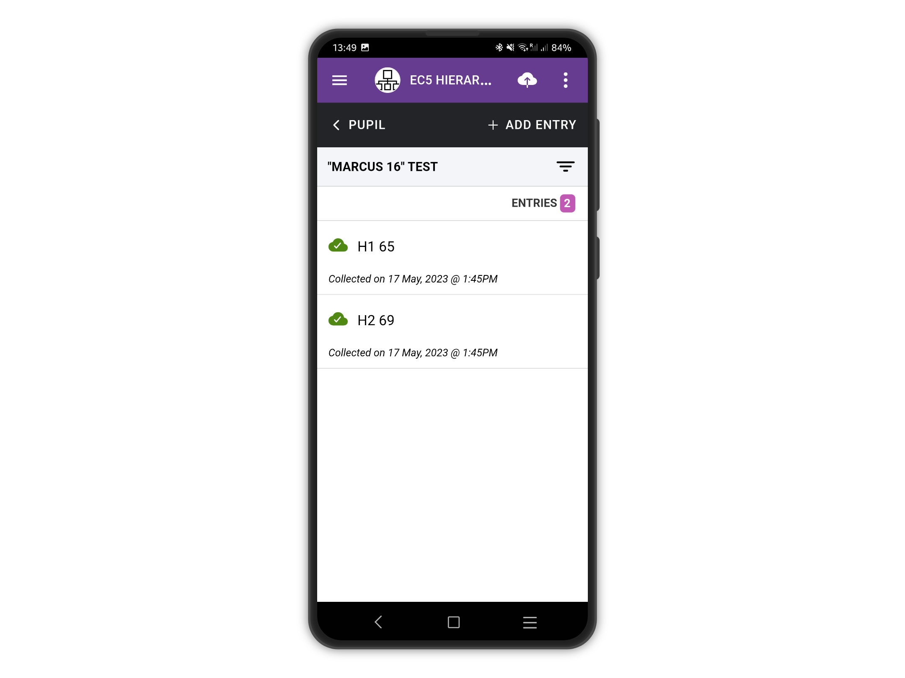
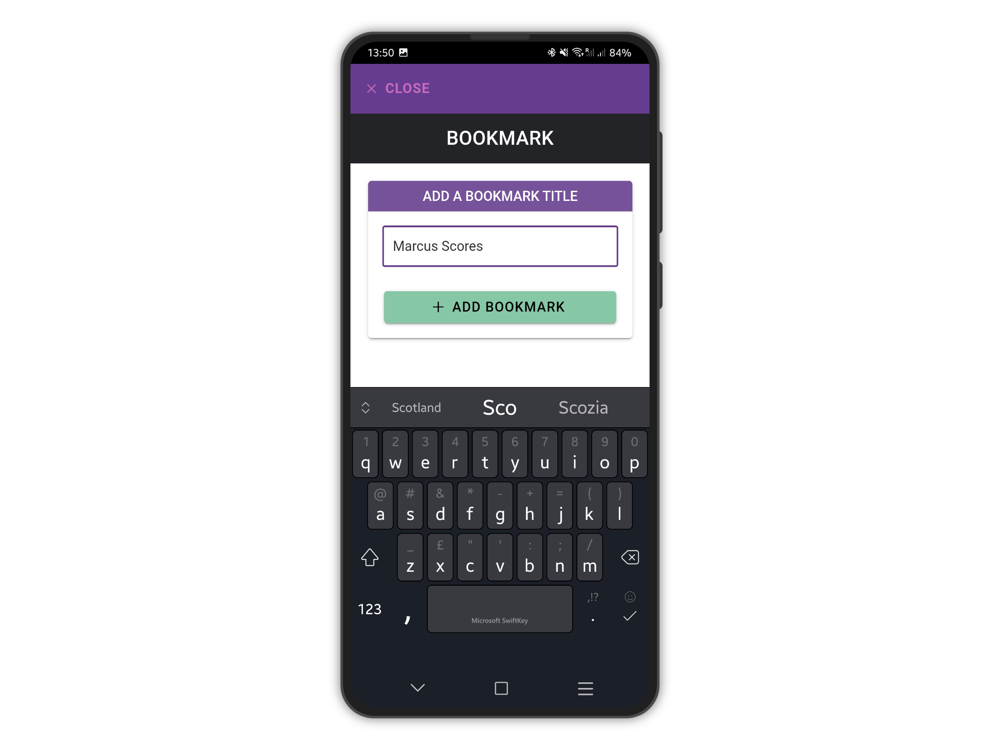
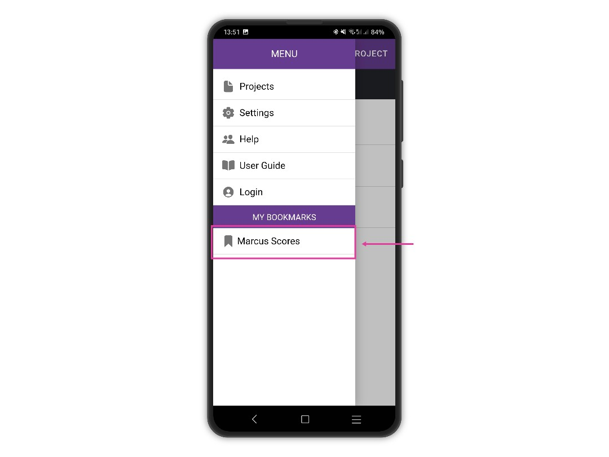
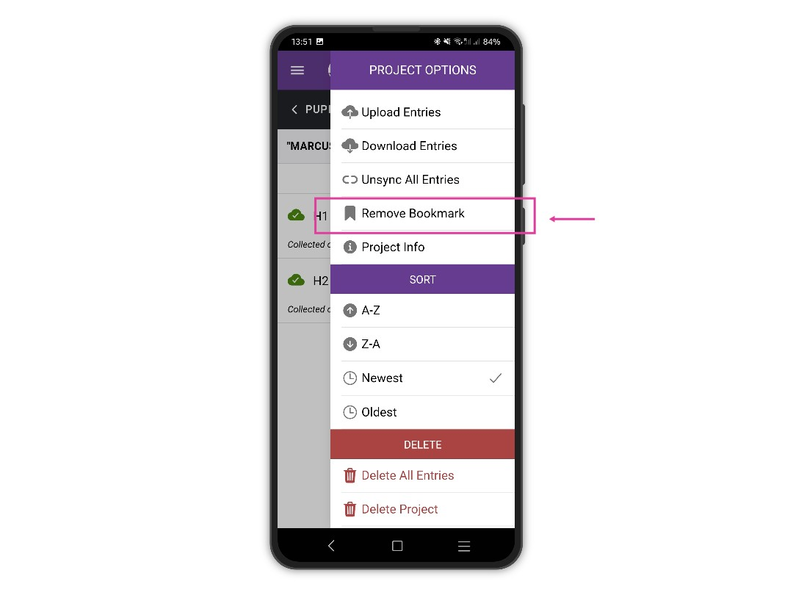

# Add Bookmarks

Bookmarks are shortcuts to a specific form of a project. It is beneficial when the project has multiple linked forms and the user task is to always collect data for a form/entry deep down the hierarchy structure.

It can be tedious to select the project > select the first form entry > then the second form entry and so on to reach the form you are interested in.&#x20;

With bookmarks, you can get there with two (two!) taps.

For example, on our EC5 Hierarchy Projects, we set a three-forms hierarchy like CLASS > PUPIL > TEST.

We added a **History** entry to CLASS, then **Marcus** as PUPIL for that CLASS. We would like to quickly add SCORE entry for **History** > **Marcus** but we would like to avoid having to select **History>Marcus** each time. **Marcus** could be our favourite History student and we want a quick way to add SCORE entries to him.

Start with selecting the project from the home page projects list.

<figure><figcaption></figcaption></figure>

On the History CLASS entry from the list, tap on the green right arrow button

<figure><figcaption></figcaption></figure>

On the "History" PUPIL entries list, for the "Marcus" entry, tap on the green right arrow button.

<figure><figcaption></figcaption></figure>

Now we are on "Marcus" TEST entries. We would like to bookmark this screen to get back here quickly to add SCORE entries for "Marcus".&#x20;

Tap the top right menu button (the three vertical dots).

<figure><figcaption></figcaption></figure>

From the right drawer menu,  tap on "Bookmark Page".

<figure><figcaption></figcaption></figure>

Give a meaningful name to the bookmark and tap on "Add bookmark".

<figure><figcaption></figcaption></figure>

From now on, your bookmark is available by opening the left drawer menu (tap the hamburger icon at the top left to open it).&#x20;

Tap on the bookmark to navigate to the page you just bookmarked.

<figure><figcaption></figcaption></figure>

To remove a bookmark, go to the bookmarked page and tap the top right menu button (the three vertical dots) to open the right drawer menu. Tap on "Remove bookmark".

<figure><figcaption></figcaption></figure>
