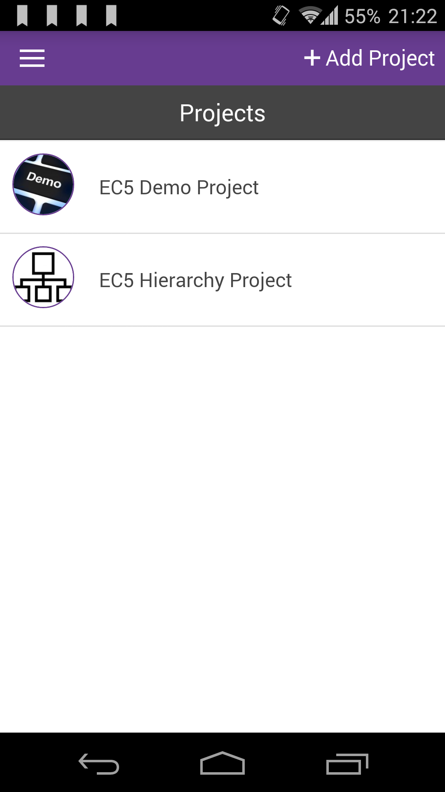

# Add Bookmarks

Bookmarks are shortcut to a specific form of a project. It is very useful when the project has got multiple linked forms and the user task is to collect data always for a fom/entry which is deep down the hierarchy structure.

Ii can be tedious to select the project, select the first form entry, then the second for entry and so on to reach the form you are interested in. With bookmarks, you can get there with two (two!) taps.

For example, on our EC5 Hierarchy Projects, we set a three forms hierarchy like CLASS > PUPIL > TEST.

We added a History entry to CLASS, then Marcus as PUPIL for that CLASS. We would like to quickly add SCORE entry for

History > Marcus but we would like to avoid having to select History>Marcus each time. Marcus could be our favorite History student and we want a quick way to add SCORE entries to him.

|                                        |                                                                   |
| -------------------------------------- | ----------------------------------------------------------------- |
|  | Start with selecting the project from the home page projects list |

|                                        |                                                                               |
| -------------------------------------- | ----------------------------------------------------------------------------- |
|  | On the History CLASS entry from the list, tap on the green right arrow button |

|                                        |                                                                                                   |
| -------------------------------------- | ------------------------------------------------------------------------------------------------- |
|  | On the "History" PUPIL entries list, for the "Marcus" entry, tap on the green right arrow button. |

|                                        |                                                                                                                                                                                                |
| -------------------------------------- | ---------------------------------------------------------------------------------------------------------------------------------------------------------------------------------------------- |
|  | Now we are on "Marcus" TEST entries. We would like to bookmark this screen to get back here quickly to add SCORE entries for "Marcus". Tap the top right menu button (the three vertical dots) |

|                                        |                                                    |
| -------------------------------------- | -------------------------------------------------- |
|  | From the right drawer menu,  tap on "Boomark page" |

|                                        |                                                                  |
| -------------------------------------- | ---------------------------------------------------------------- |
|  | Give a meaningful name to the bookmark and tap on "Add bookmark" |

|                                        |                                                                                                                                                                                            |
| -------------------------------------- | ------------------------------------------------------------------------------------------------------------------------------------------------------------------------------------------ |
|  | From now on, your bookmark is available opening the left drawer menu (tap the hamburger icon at the top left to open it). Tap on the bookmark to navigate to the page you just bookmarked. |

|                                        |                                                                                                                                                                   |
| -------------------------------------- | ----------------------------------------------------------------------------------------------------------------------------------------------------------------- |
|  | To remove a bookmark, go the bookmarked page and tap the top right menu button (the three vertical dots) to open the right drawer menu. Tap on "Remove bookmark". |
