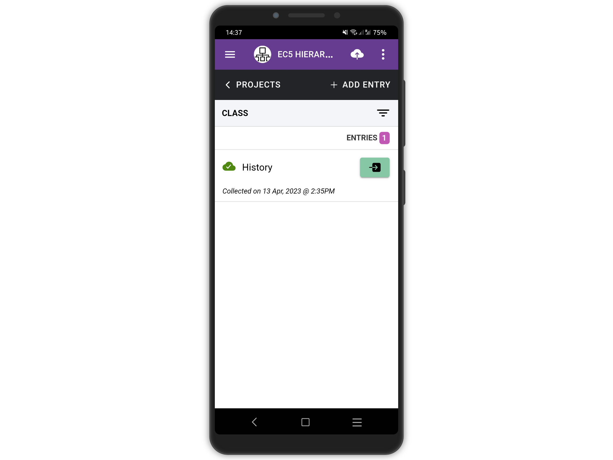
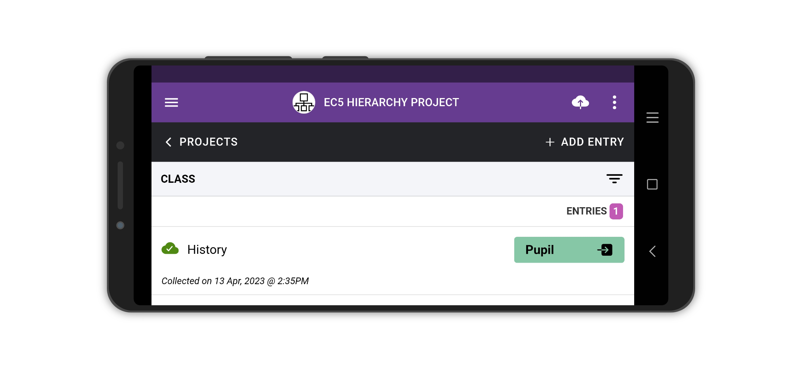
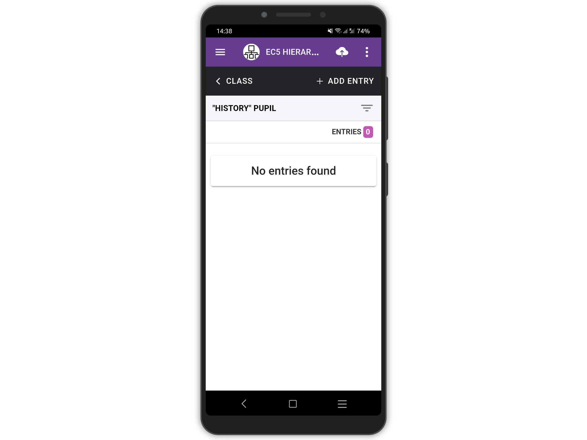
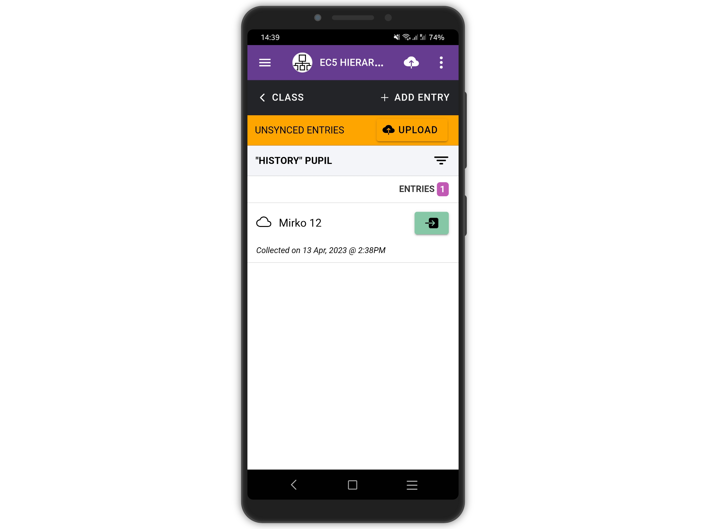
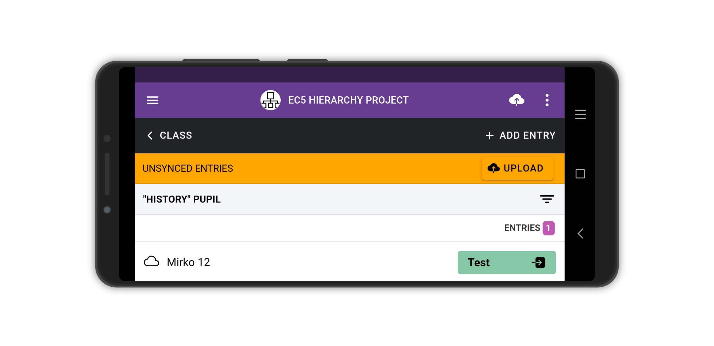

# Add Entries - Mobile (Multiple Forms)

On multiple forms projects, like our [**EC5 HIERARCHY PROJECT**](https://five.epicollect.net/project/ec5-hierarchy-project), the data collection follows a hierarchy structure. It is exactly like using folders on your computer. We usually create a parent folder and inside it one or more subfolders and so on. A parent folder can contain multiple subfolders. It is not possible to create a subfolder without a parent folder.

In the sample project, we set up three linked forms: **CLASS > PUPIL > TEST**.

**(**[**See linking forms**](../formbuilder/multiple-forms.md)**).**

The main idea is to add a list of **CLASS** entries and add **PUPIL** entries to each **CLASS** entry. Afterwards\*\*,\*\* we want to add **TEST** entries to each **PUPIL** entry.

Look below, we added a **CLASS** entry named "_History_" to the **EC5 HIERARCHY PROJECT**.

**(**[**More on adding an entry**](add-an-entry.md)**).**

When an entry for a form is added, and there is a linked form, an arrow button appears next to the entry when viewing the list of entries. We added a CLASS entry named "History".

<figure><figcaption></figcaption></figure>

On larger screens like a tablet, or when the device is in landscape mode, the name of the linked form also appears. Our child/linked form is named PUPIL.

<figure><figcaption></figcaption></figure>

Tapping the PUPIL button takes you to the PUPIL form, where we can add child entries to the "History" CLASS entry. Tap the **+ADD ENTRY** button on the top right to add an entry.

<figure><figcaption></figcaption></figure>

We added a PUPIL entry named "Mirko" and that appears as a child entry of "History". At this point, following the same steps, we can either add another PUPIL entry or go a level further down the forms hierarchy to add a TEST entry to a PUPIL. The back button at the top left indicates "CLASS", our starting form.

<figure><figcaption></figcaption></figure>

On larger screens or in landscape mode, the name of the linked TEST form appears.

<figure><figcaption></figcaption></figure>
