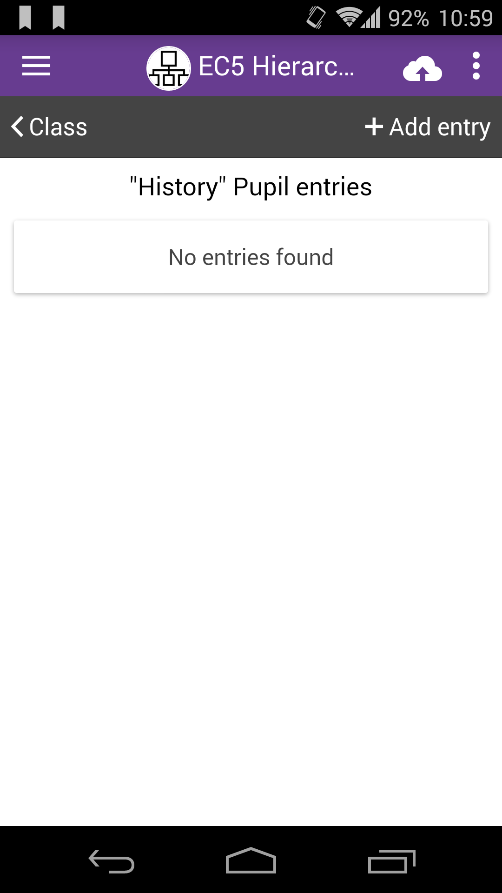

# Add Entries (Multiple Forms)

On multiple forms projects, like our [**EC5 HIERARCHY PROJECT**](https://five.epicollect.net/project/ec5-hierarchy-project), the data collection follow a hierarchy structure. It is exactly like using folders on your computer. You usually create a parent folder and inside it one or more subfolders and so on. A parent folder can contain multiple subfolders. It is not possible to create a subfolder without a parent folder.

In the sample project, we set up three linked forms: **CLASS > PUPIL > TEST**. ([**See linking forms**](../formbuilder/multiple-forms.md)).

The main idea is to add a list of **CLASS** entries, then add **PUPIL** entries to each **CLASS** entry. Afterwards**,** we want to add **TEST** entries to each **PUPIL** entry.

Look below, we added a **CLASS** entry named "_History_" to the **EC5 HIERARCHY PROJECT**. ****&#x20;

****[**More on add an entry**](add-an-entry.md)**.**

|                                               |                                                                                                                                                                                    |
| --------------------------------------------- | ---------------------------------------------------------------------------------------------------------------------------------------------------------------------------------- |
|  | When an entry for a form is added, and there is a linked form, an arrow button appears next to the entry when viewing the list of entries. We added a CLASS entry named "History". |
|                                               |                                                                                                                                                                                    |

|                                               |                                                                                                                                                           |
| --------------------------------------------- | --------------------------------------------------------------------------------------------------------------------------------------------------------- |
|  | On larger screens like a tablet, or when the device is in landscape mode, the name of the linked form also appears. Our child/linked form is named PUPIL. |

|                                               |                                                                                                                                                                                                                                                       |
| --------------------------------------------- | ----------------------------------------------------------------------------------------------------------------------------------------------------------------------------------------------------------------------------------------------------- |
|  | Tapping the PUPIL button takes you to the PUPIL form, where you can add child entries to the "History" CLASS entry. I might have many PUPILs for that class, as "History" is popular! Tap the "Add Entry" button on the top right and add your entry. |

|                                               |                                                                                                                                                                                                                                                |
| --------------------------------------------- | ---------------------------------------------------------------------------------------------------------------------------------------------------------------------------------------------------------------------------------------------- |
|  | We added a PUPIL entry named "Mirko" and it appears as a child entry of "History". At this point, following the same steps, I can either add another PUPIL entry or go a level furtherdown my forms hierarchy to add a TEST entry for a PUPIL. |

|                                               |                                                                           |
| --------------------------------------------- | ------------------------------------------------------------------------- |
|  | On larger screens or landscape mode, the name of the linked form appears. |
