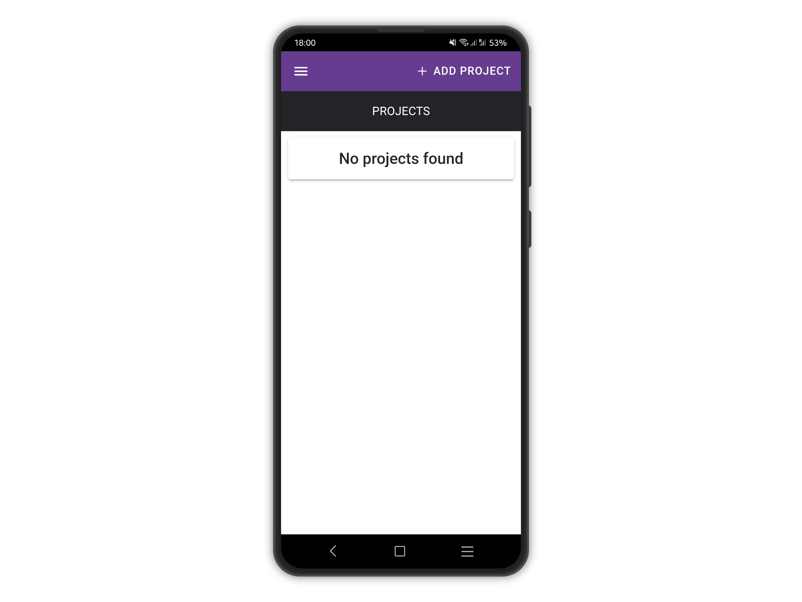
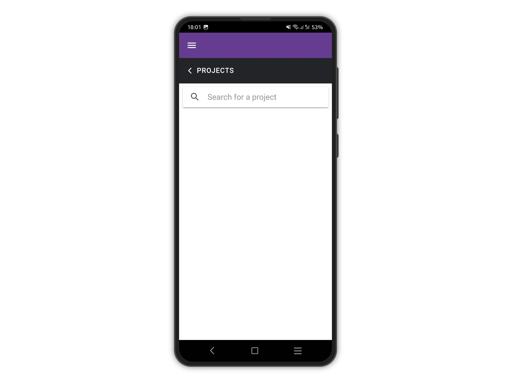
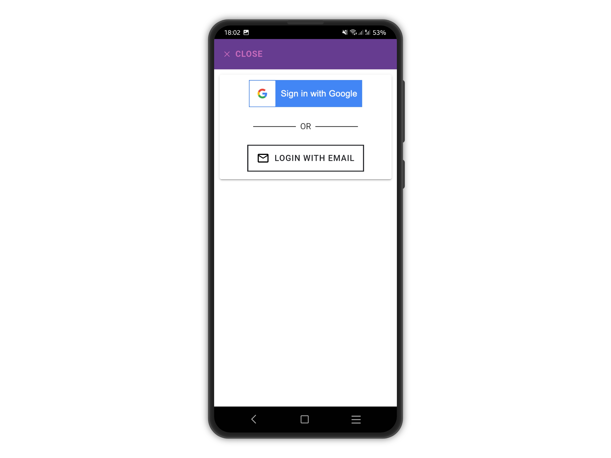
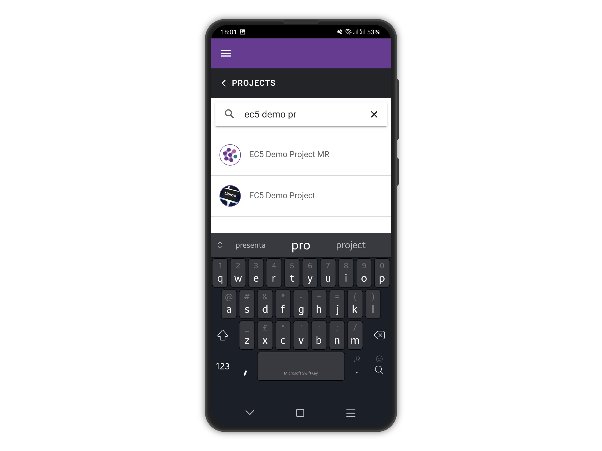
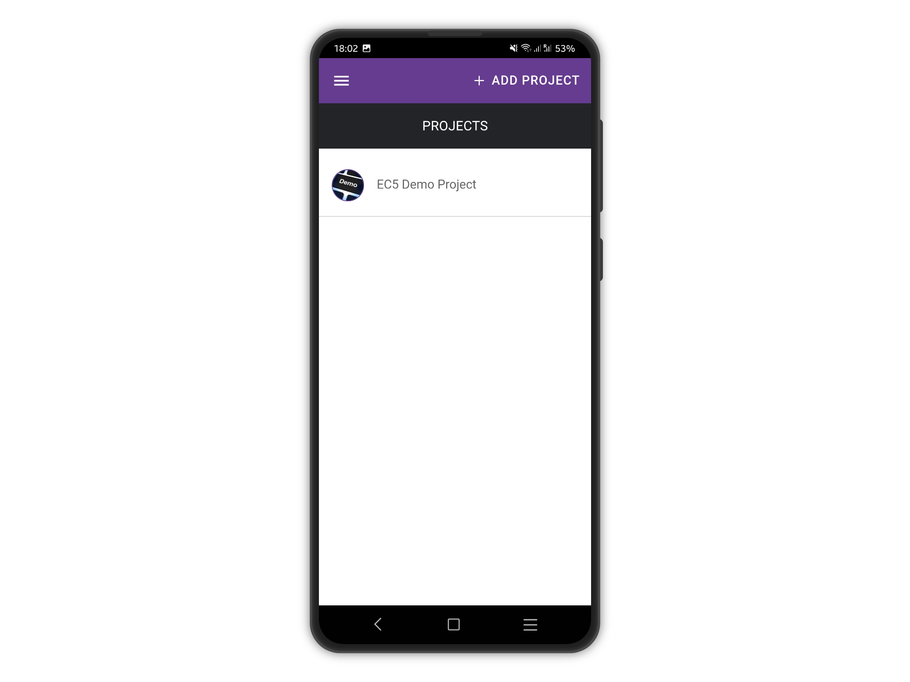

# Add Projects

To add a project, tap the **+ ADD PROJECT** button at the top right corner of the **PROJECTS** page.&#x20;


&#x20;An internet connection is required to be able to search and add projects.


<figure><figcaption></figcaption></figure>

You will be presented with the **ADD PROJECT** page, where you can search for a project by typing its name.

<figure><figcaption></figcaption></figure>

The search will begin once you enter 3 or more characters.

You will be presented with a list of matches.

Tap the desired project to download it.

<figure><figcaption></figcaption></figure>

If the project is private, you will be prompted to log in.


**You must be a member of a private project to download it.**


<figure><figcaption></figcaption></figure>

Once successfully authenticated, just tap the project you wish to add and it will be downloaded to the device.

<figure><figcaption></figcaption></figure>

The project will be added to your **PROJECTS** home page.

<figure><figcaption></figcaption></figure>


