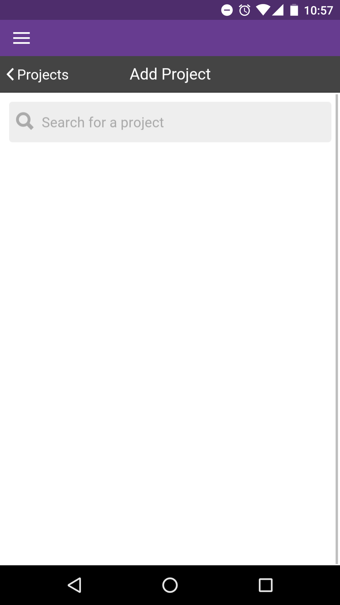

# Add Projects

|                                            |                                                                                                                                                                                                                    |
| ------------------------------------------ | ------------------------------------------------------------------------------------------------------------------------------------------------------------------------------------------------------------------ |
|  | 
To add a project, click on the '+ Add Project' button from the top right corner of the 'Projects' page.   <em>NOTE: you must have an internet connection to be able to search for and add projects.</em>
 |

|                                         |                                                                                                          |
| --------------------------------------- | -------------------------------------------------------------------------------------------------------- |
|  | You will be presented with the 'Add Project' page, where you can search for the project you want to add. |

|                                                |                                                                                                                                                                |
| ---------------------------------------------- | -------------------------------------------------------------------------------------------------------------------------------------------------------------- |
|  | 
The search will begin once you enter 3 or more characters and you will be presented with a list of matches. Click on the project name to download it
 |

|                                                                 |                                                                                                                                                        |
| --------------------------------------------------------------- | ------------------------------------------------------------------------------------------------------------------------------------------------------ |
|  | If the project is private, you will be prompted to login._NOTE: you must also have permission from the project manager to download a private project._ |

|                                                          |                                                                                                                                |
| -------------------------------------------------------- | ------------------------------------------------------------------------------------------------------------------------------ |
|  | Once successfully authenticated, you can then click on the project you wish to add and the project will be downloaded for you. |

|                                                 |                                                                   |
| ----------------------------------------------- | ----------------------------------------------------------------- |
| .png>) | The project will then be added to your 'Projects' list home page. |



