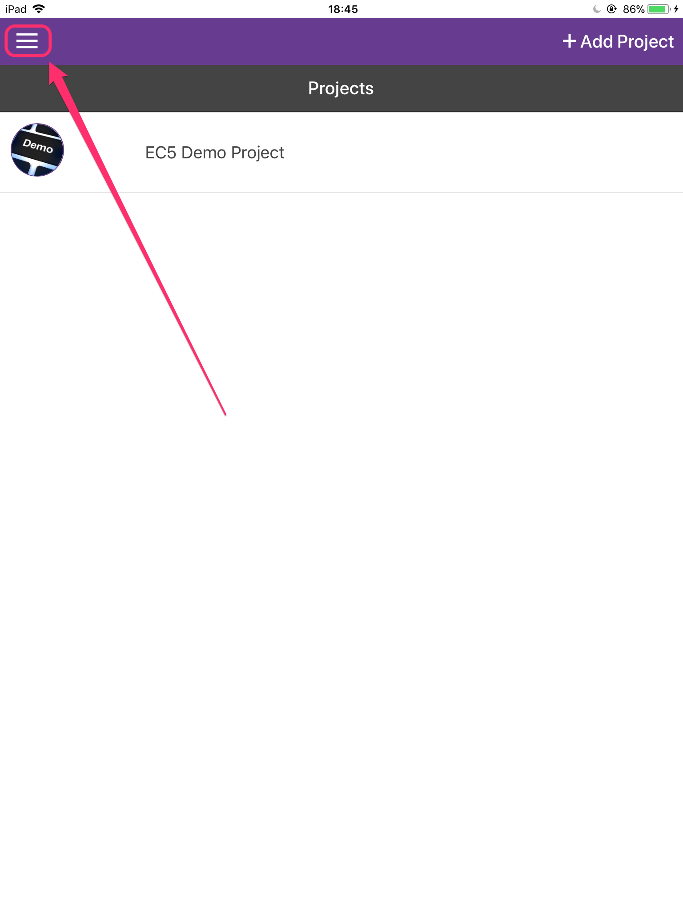
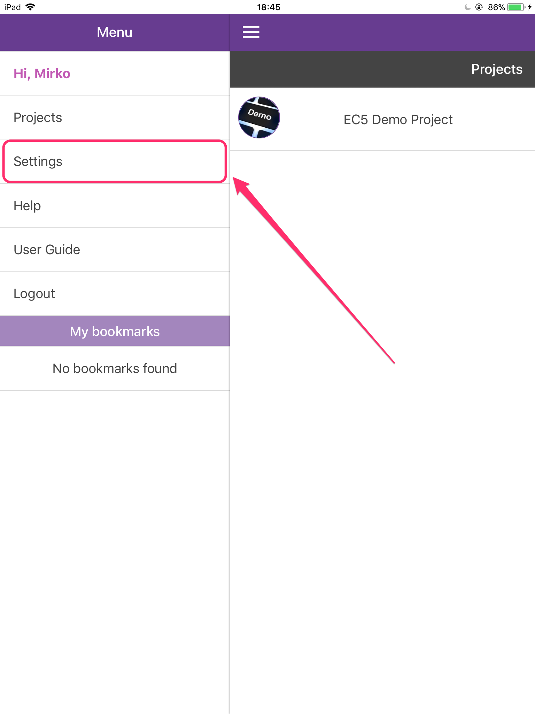
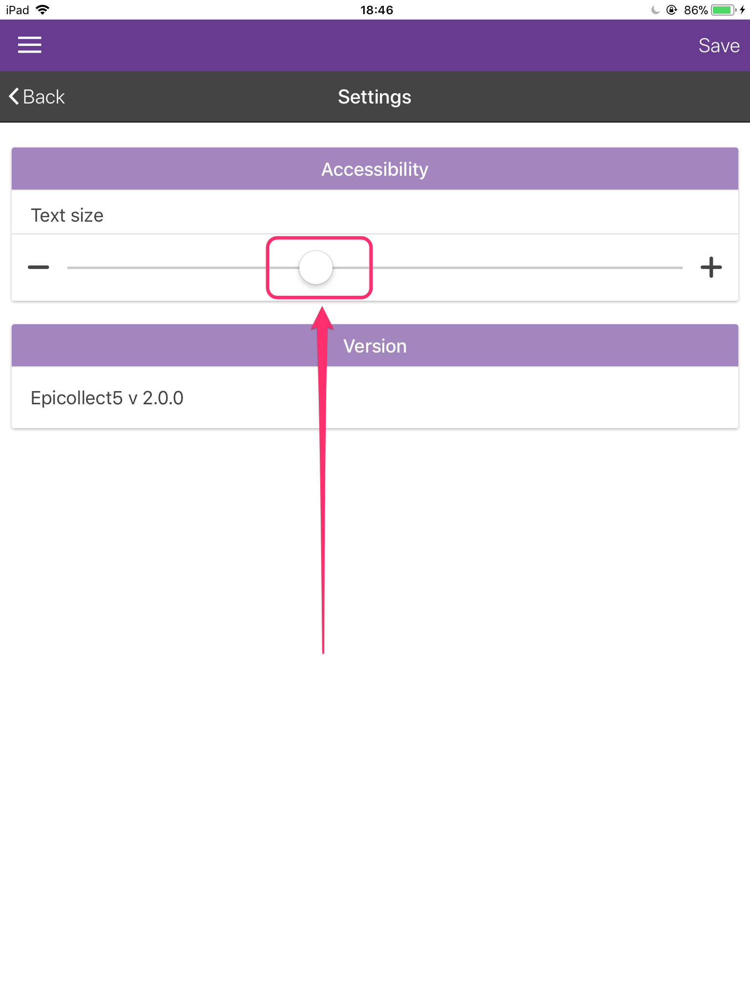
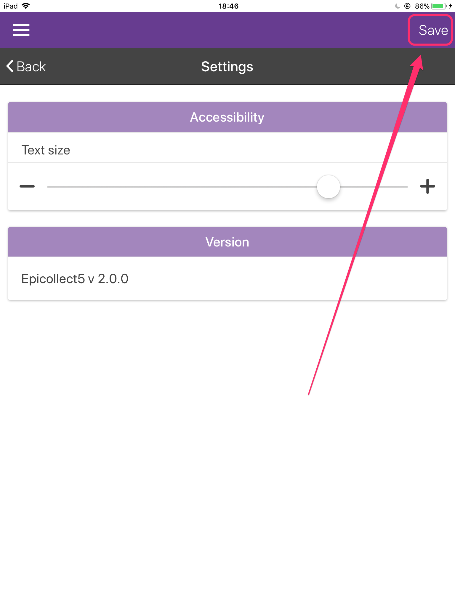
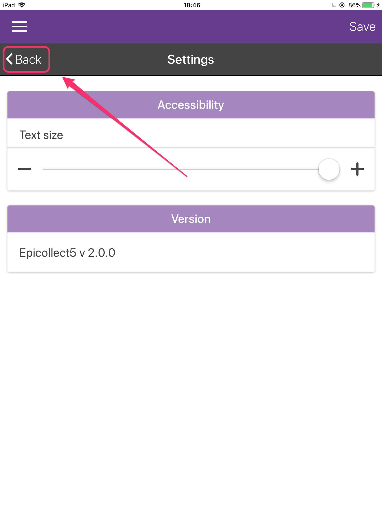

# Adjust Font Size

When using Epicollect5 on a tablet or on phones with a really high screen resolution, you might find the font size to be a little too small and therefore difficult to read. It is very easy to adjust the font size to your likings:

|                                                |                                                                                                               |
| ---------------------------------------------- | ------------------------------------------------------------------------------------------------------------- |
|  | From the home screen (your list of projects), tap on the menu button at the top left to open the drawer menu. |

|                                                |                                                  |
| ---------------------------------------------- | ------------------------------------------------ |
|  | From the drawer menu options, tap on "Settings". |

|                                                |                                                                                                               |
| ---------------------------------------------- | ------------------------------------------------------------------------------------------------------------- |
|  | On the settings screen, drag the slider to the right to increase the font size or to the left to decrease it. |

|                                                |                                                                  |
| ---------------------------------------------- | ---------------------------------------------------------------- |
|  | Tap on the save button at the top right to confirm your changes. |

|                                                |                                                                                                                     |
| ---------------------------------------------- | ------------------------------------------------------------------------------------------------------------------- |
|  | The font size and the whole UI get bigger/smaller as desidered. Tap on the back button to exit the settings screen. |
|                                                |                                                                                                                     |
