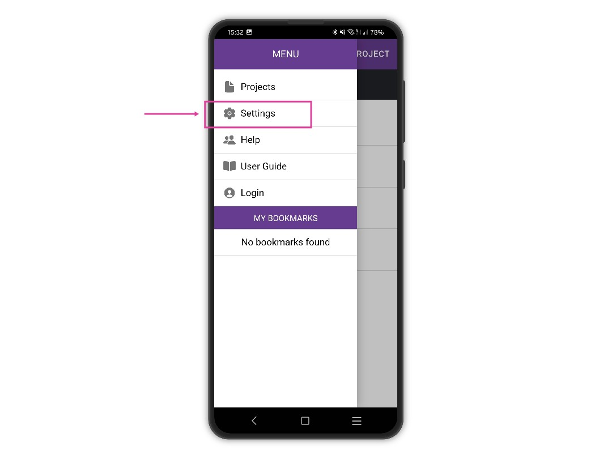

# Adjust Font Size

When using Epicollect5 on a tablet or on phones with a really high screen resolution, you might find the font size to be a little too small and therefore difficult to read.

&#x20;It is very easy to adjust the font size to your liking. From the home screen (your list of projects), tap on the menu button at the top left to open the drawer menu.

<figure><figcaption></figcaption></figure>

<figure><figcaption></figcaption></figure>

On the settings screen, drag the slider to the right to increase the font size or to the left to decrease it. Tap **SAVE** to apply the changes.

<figure><figcaption></figcaption></figure>
