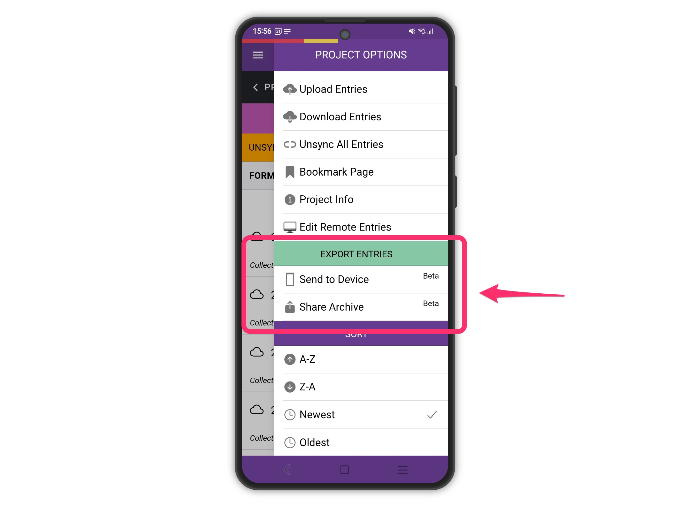

# Beta Updates

We’ve added **two new options** to the Epicollect5 mobile app, currently available in **public beta releases** for both Android and iOS. These features give you more flexibility in managing and exporting your project data and media.&#x20;

App version is currently **88.9.6**

### Joining the Beta

#### Android

1. Open the [Google Play Store](https://play.google.com/) on your device.
2. Search for **Epicollect5**.
3. Scroll down to the **“Join the Beta”** section and tap **Join**.
4. Wait a few minutes for your device to update to the beta version.

#### iOS

1. Install the **TestFlight** app from the App Store.
2. Use the [beta invitation link](https://testflight.apple.com/join/6gW71eIy) provided to join the beta program.
3. Open TestFlight and update the app to the beta version.

> Note: Beta versions are periodically updated with new features and fixes. You can leave the beta program at any time to return to the stable release.

### New Features

#### 1. Send to Device

This option allows you to **export your project entries and media directly to your device**.

* On **Android**, exported files are saved to the **Documents** folder.
* On **iOS**, exported files are saved to **My Phone**.
* The export includes:
  * CSV files of all your entries
  * Copies of all associated media (images, audio, video)

**Use case:** Ideal if you want to **set up a third-party app** (like [FolderSync](https://foldersync.io/)) to automatically sync your exported data to your cloud service of choice.

#### 2. Share Archive

This option creates an **archive of your entries and media**, packaged as a **ZIP file**, and opens the **share panel** so you can send it wherever you like.

* Includes the same CSV files and media as **Send to Device**.

**Use case:** Best for a **one-off export** when you want a single package of your data to share, backup, or send via email, cloud storage, or other apps.

#### Why Two Options?

Having both options lets you choose the workflow that fits your needs:

* **Send to Device** → For ongoing syncing with cloud services or automated workflows.
* **Share Archive** → For one-time exports or sharing with others in a single ZIP file.

<figure><figcaption></figcaption></figure>

### How to Use

1. Open the project in the Epicollect5 mobile app.
2. Tap the **menu** (⋮) and select **Send to Device** or **Share Archive**.
3. Wait for the export process to complete.
4. Check the target folder (Documents/My Phone) or use the share panel to access your ZIP file.

<figure><figcaption></figcaption></figure>
