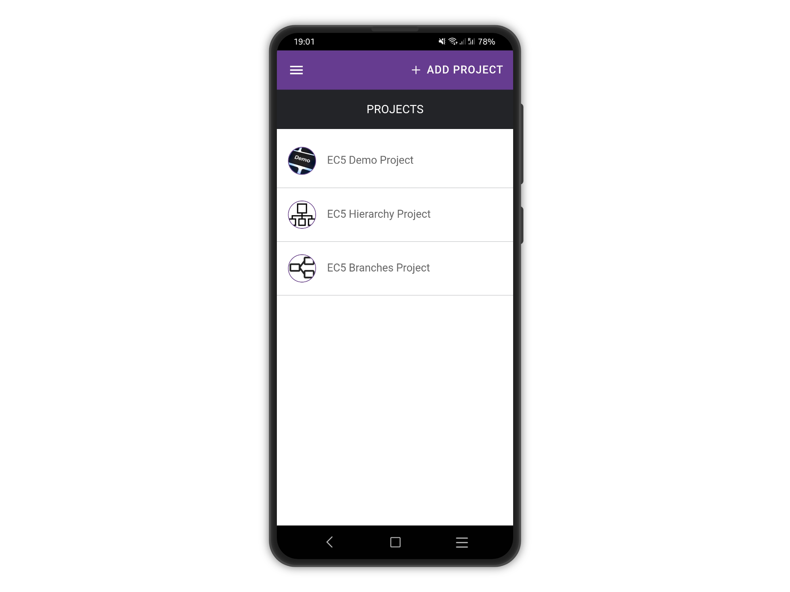
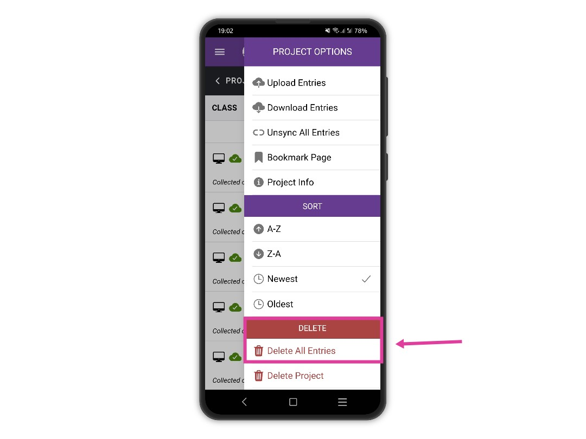
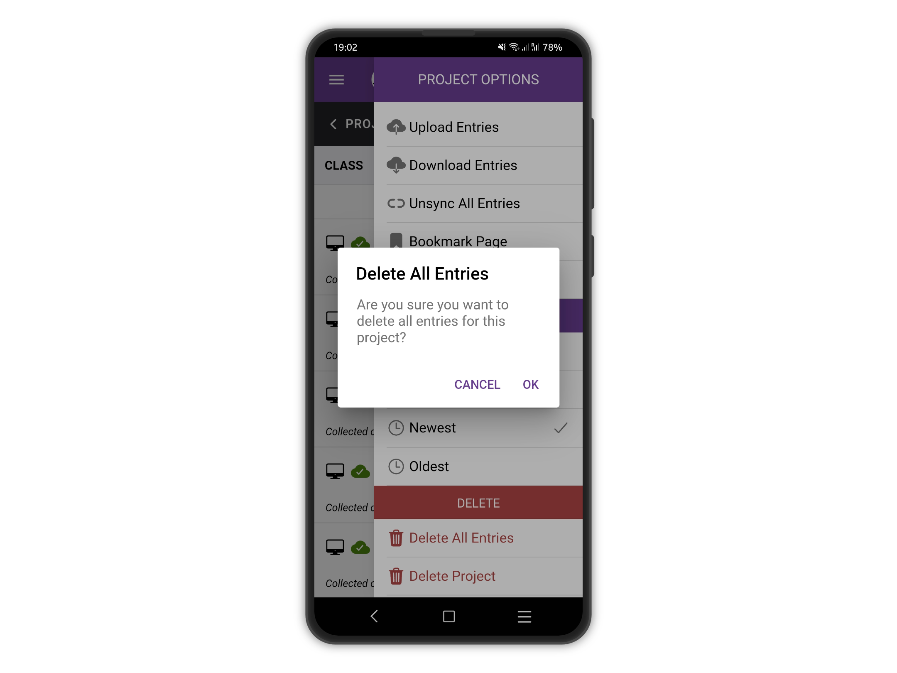
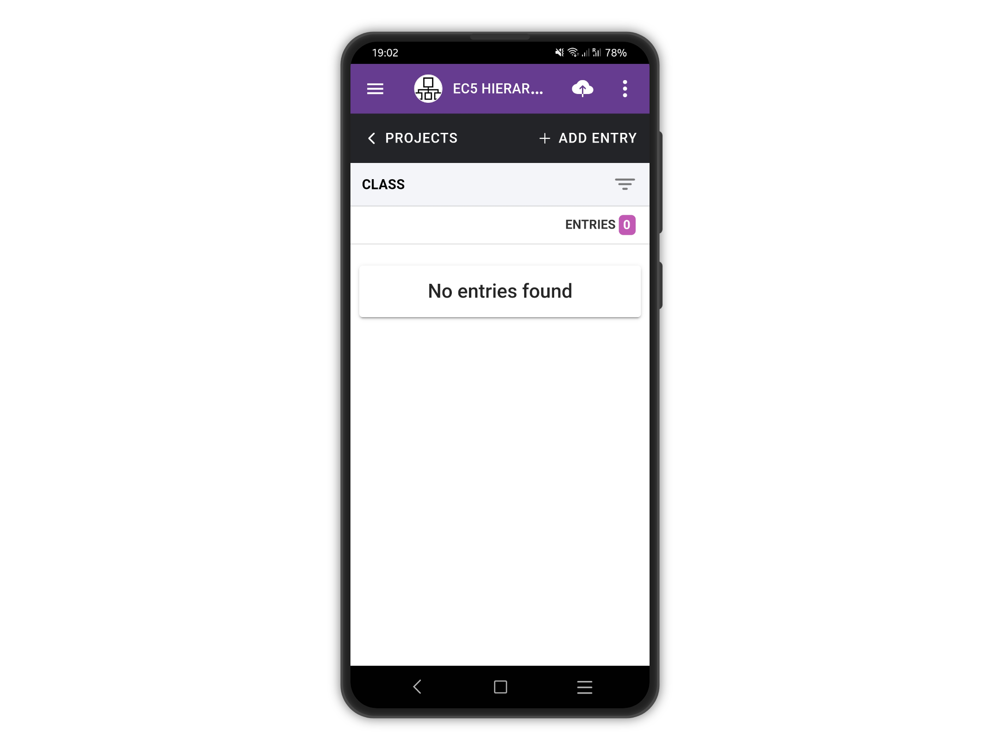
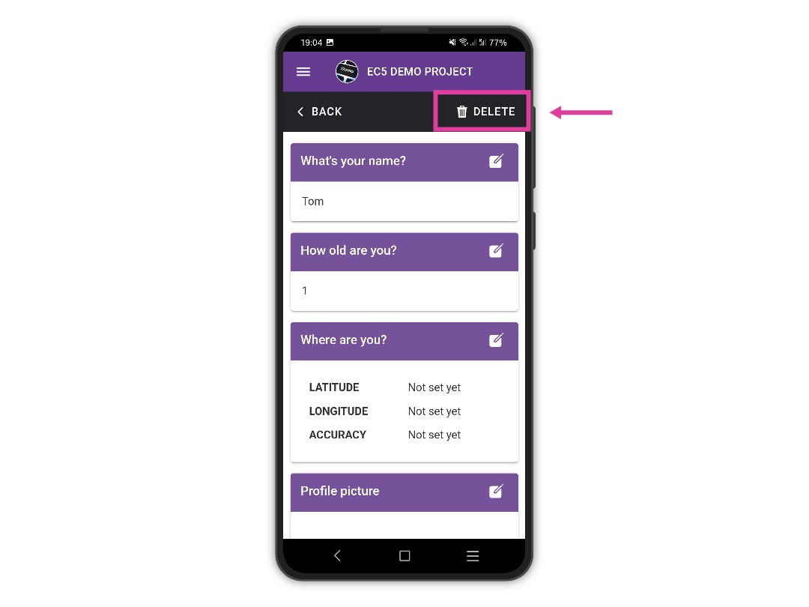

# Delete Entries

Select the project you would like to delete entries for on the project list.

<figure><figcaption></figcaption></figure>

Open the right drawer menu by tapping on the "Menu" button, the three vertical dots at the top right. From the list of options tap on "Delete entries" to delete all the entries for a project.

<figure><figcaption></figcaption></figure>

A confirmation prompt is shown. Tap **OK** to confirm or **CANCEL** to dismiss the popup.&#x20;


Be careful to sync your entries first!


<figure><figcaption></figcaption></figure>

All the entries get deleted and a "**No Entries Found**" message is displayed.

<figure><figcaption></figcaption></figure>

To delete a single entry, tap on the entry to view it and use the **DELETE** button at the top right.

<figure><figcaption></figcaption></figure>

