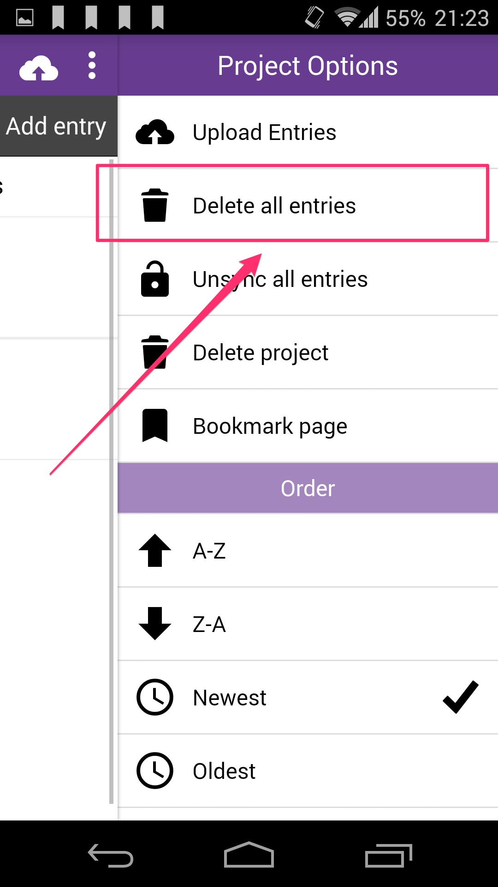
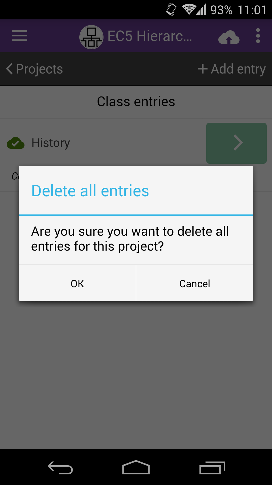
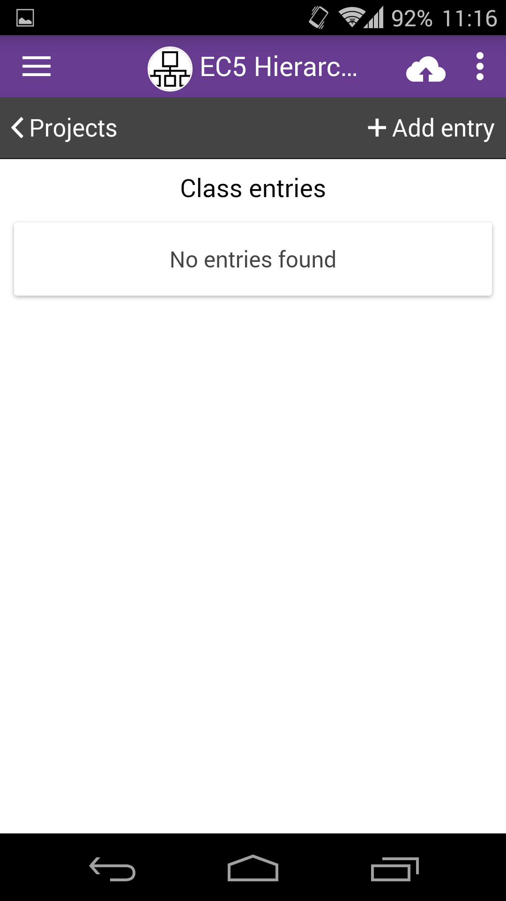

# Delete Entries

|                                        |                                                                              |
| -------------------------------------- | ---------------------------------------------------------------------------- |
|  | Select the project you would like to delete entries for on the project list. |

|                                              |                                                                                                                                                                                      |
| -------------------------------------------- | ------------------------------------------------------------------------------------------------------------------------------------------------------------------------------------ |
|  | Open the right drawer menu  tapping on the "Menu" button, the three dots at the top right. From the list of options tap on "Delete entries" to delete all the entries for a project. |
|                                              |                                                                                                                                                                                      |

|                                              |                                                                                                                            |
| -------------------------------------------- | -------------------------------------------------------------------------------------------------------------------------- |
|  | A confirmation prompt is shown. Press OK to confirm or cancel to dismiss the popup. Be careful to sync your entries first! |

|                                              |                                                                              |
| -------------------------------------------- | ---------------------------------------------------------------------------- |
|  | All the entries get deleted and the "No entries found" message is displayed. |
