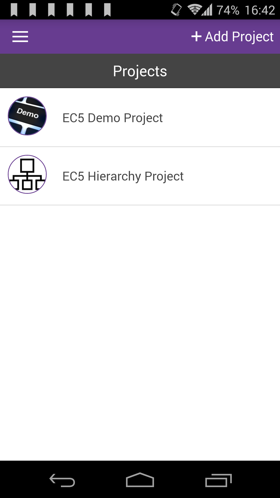

# Delete Projects

|                                                |                                                                        |
| ---------------------------------------------- | ---------------------------------------------------------------------- |
|  | Select the project you would like to delete from the list of projects. |

|                                                  |                                                                                                |
| ------------------------------------------------ | ---------------------------------------------------------------------------------------------- |
|  | Open the right menu by tapping on the 3 dots icon at the top right and tap on "Delete Project" |

|                                                  |                                                                                                                                        |
| ------------------------------------------------ | -------------------------------------------------------------------------------------------------------------------------------------- |
|  | When the confirmation dialog appears, tap on "Ok" to confirm. Please be aware all the entries and related media files will be deleted! |
