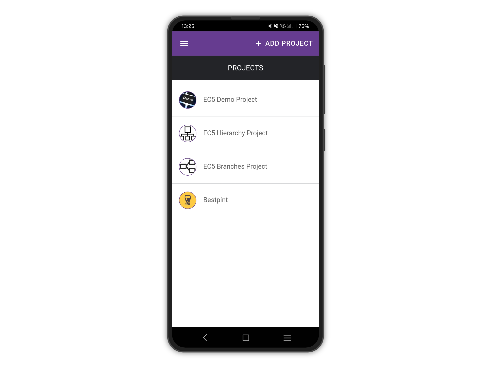

# Delete Projects

Select the project you would like to delete from the list of projects.

<figure><figcaption></figcaption></figure>

Open the right menu by tapping on the 3 dots icon at the top right and tap on "Delete Project"

<figure><figcaption></figcaption></figure>

When the confirmation dialogue appears, tap on "Ok" to confirm.&#x20;


Please be aware all the entries and related media files will be deleted!


<figure><figcaption></figcaption></figure>
