# Download Entries

On Epicollect5 it is possible to download remote entries for each form to the device.

This means it is possible to add entries from a device and later on download those entries on another one.

When downloading entries, you will download all the entries present at that moment on the server, so basically you get a snapshot of the current state of your data collection. Only forms entries are downloaded, branch entries are not. Moreover, media files are **NOT** downloaded.


**On the device**, **by design, it is NOT possible to edit downloaded remote entries directly and re-upload them**.


You can only add _child_ entries or _branches_ to the remote entries you downloaded. The entries on the servers always "win" over your local entries, so if there is a matching entry on your device (i.e. the entry was originally uploaded from your device) and that entry is synced already, it will get replaced by the remote entry and you will not be able to edit it again from the device.

**Why does it work this way? To always have the data synced and consistent across devices. The server is the single source of truth.**

Entries can be edited on the server by CREATOR, MANAGER and CURATOR type of user via the web application. ([**See how**](../web-application/adding-data.md))

The web application is responsive and it will work on a mobile device or a tablet as well as long as there is an internet connection. **If you need to edit entries from your mobile device, the only way is to use the web application instead of the mobile app.**

## Add child entries to downloaded entries

|                                                |                                                                                                                                                                                       |
| ---------------------------------------------- | ------------------------------------------------------------------------------------------------------------------------------------------------------------------------------------- |
| 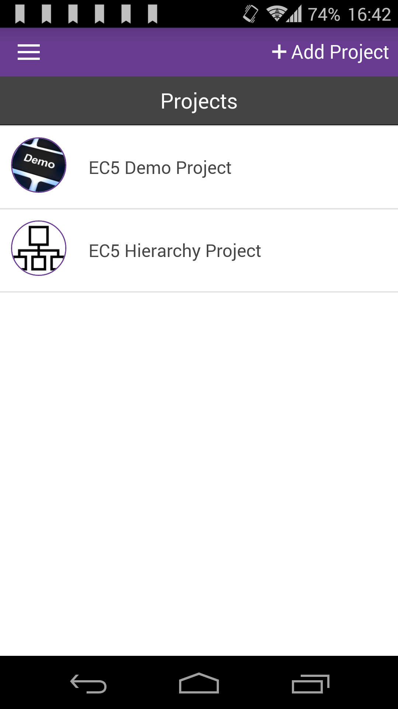 | Let's use out [EC5 Hierarchy project ](https://five.epicollect.net/project/ec5-hierarchy-project)to show how everything works. Load that project and select it from the project list. |

|                                                |                                                                        |
| ---------------------------------------------- | ---------------------------------------------------------------------- |
| 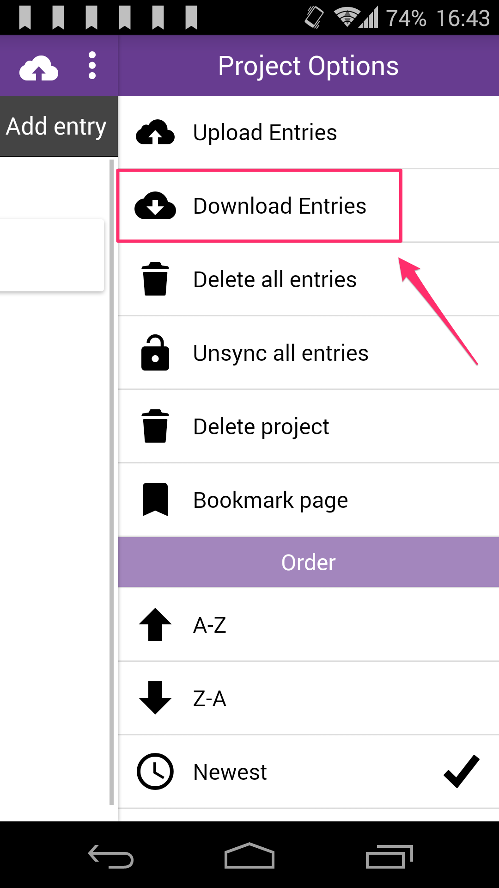 | On the entries list page, open the menu and tap on "Download Entries". |

|                                                |                                                                                                                                                                                                                                                                                                                                                                                                                    |
| ---------------------------------------------- | ------------------------------------------------------------------------------------------------------------------------------------------------------------------------------------------------------------------------------------------------------------------------------------------------------------------------------------------------------------------------------------------------------------------ |
| 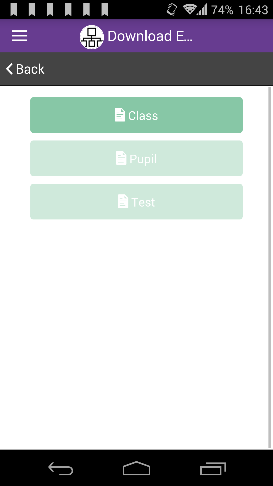 | On the next screen you see the list of your form buttons, from top to bottom following your hierarchy structure ([More on linking forms](../formbuilder/multiple-forms.md)). Only the form at the top is enabled, as you need to download entries following the project hierarchy structure, in this case it is CLASS > PUPIL >TEST. Tap the "CLASS" button to download **ALL** the class entries from the server. |
|                                                |                                                                                                                                                                                                                                                                                                                                                                                                                    |

|                                                |                                                                                                                                                                                                        |
| ---------------------------------------------- | ------------------------------------------------------------------------------------------------------------------------------------------------------------------------------------------------------ |
| 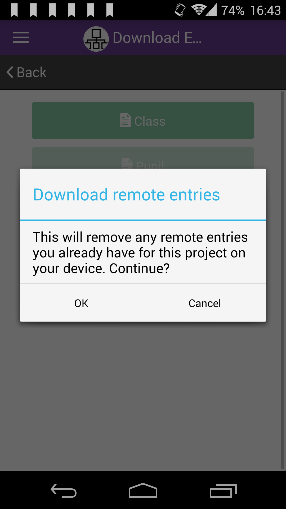 | You will be prompt to confirm the download. This is to remove any remote entries you already have on the device, as you always get the latest entries snapshot from the server. Press "OK" to proceed. |

|                                                 |                                                                                                                                           |
| ----------------------------------------------- | ----------------------------------------------------------------------------------------------------------------------------------------- |
| 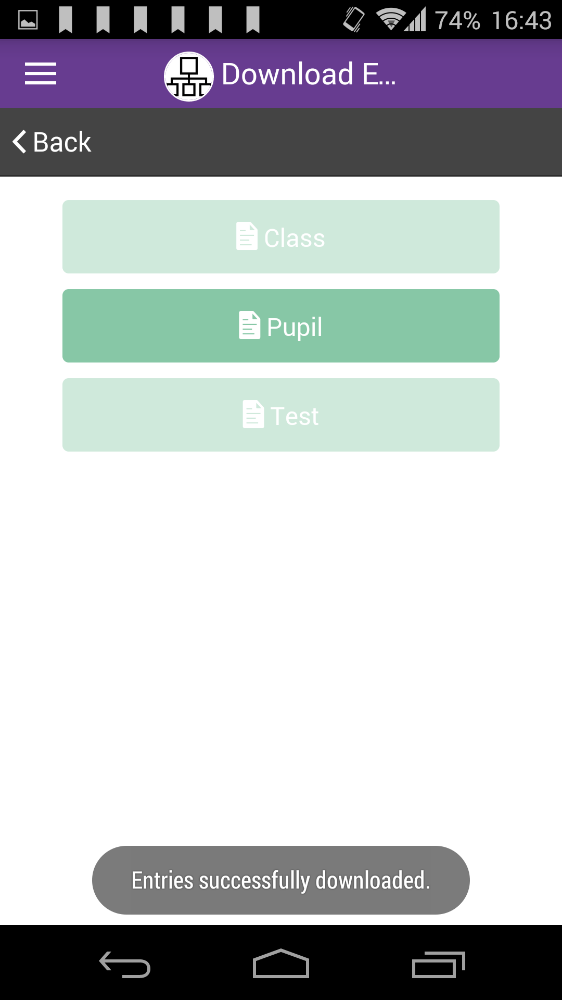 | After all the CLASS entries are downloaded, the PUPIL button is then enabled. Press PUPIL to download all the entries for the PUPIL form. |

|                                                |                                                  |
| ---------------------------------------------- | ------------------------------------------------ |
| 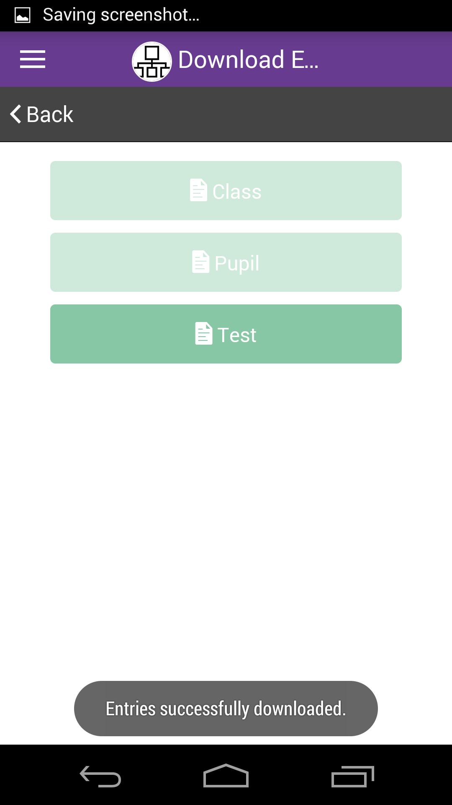 | Now press TEST to download all the TEST entries. |

|                                                |                                                                                                                                    |
| ---------------------------------------------- | ---------------------------------------------------------------------------------------------------------------------------------- |
| 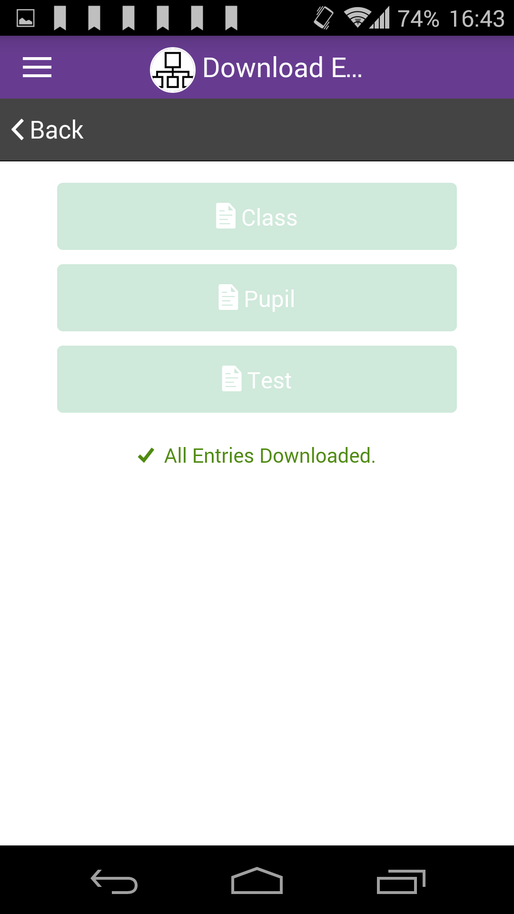 | When all the entries for all the forms are downloaded, the forms buttons are all disabled and you can go back to the entries list. |

|                                                |                                                                                                                                                                                                                                                                                               |
| ---------------------------------------------- | --------------------------------------------------------------------------------------------------------------------------------------------------------------------------------------------------------------------------------------------------------------------------------------------- |
| 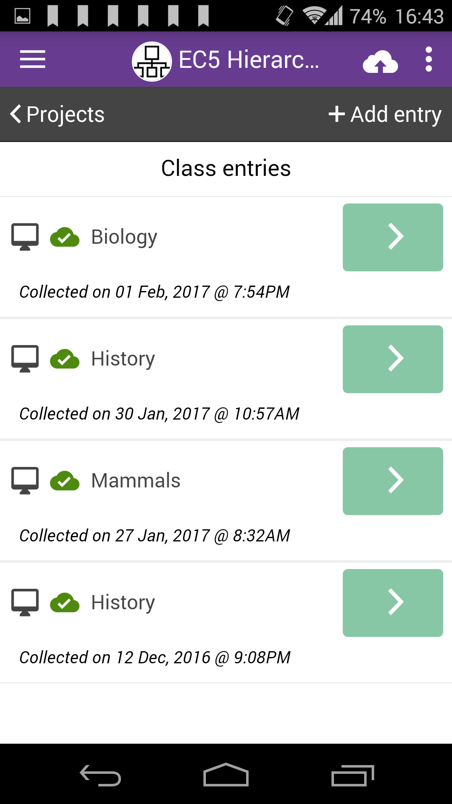 | Your remote entries are now all listed, with a desktop icon next to each of them to indicate they are "remote" i.e. not directly editable. Now you can add child entries or branches to existing entries (See [Add an entry](add-an-entry.md) and [Add a child entry](add-child-entries.md)). |

## Add branch entries to downloaded entries

|                                                |                                                                                                                                                                                |
| ---------------------------------------------- | ------------------------------------------------------------------------------------------------------------------------------------------------------------------------------ |
| 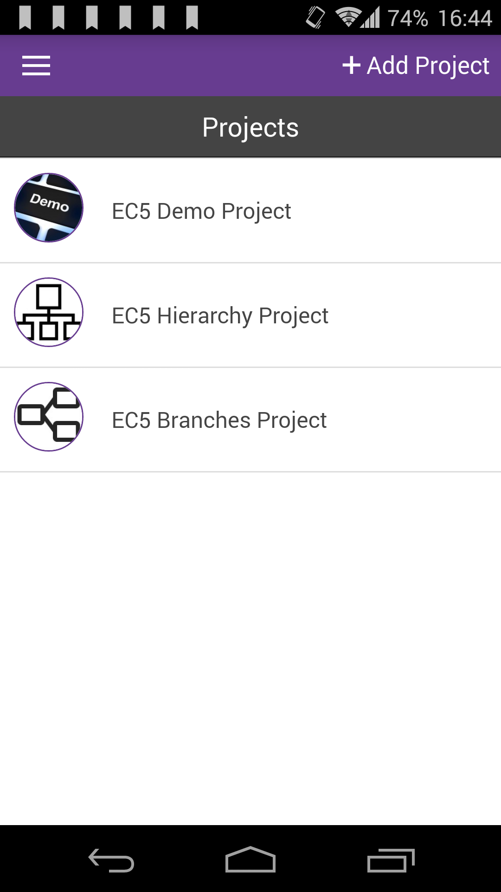 | Let's download soome entries and add brach entries to them. For this example we will use the [EC5 Branches Project.](https://five.epicollect.net/project/ec5-branches-project) |

|                                                 |                                                            |
| ----------------------------------------------- | ---------------------------------------------------------- |
| 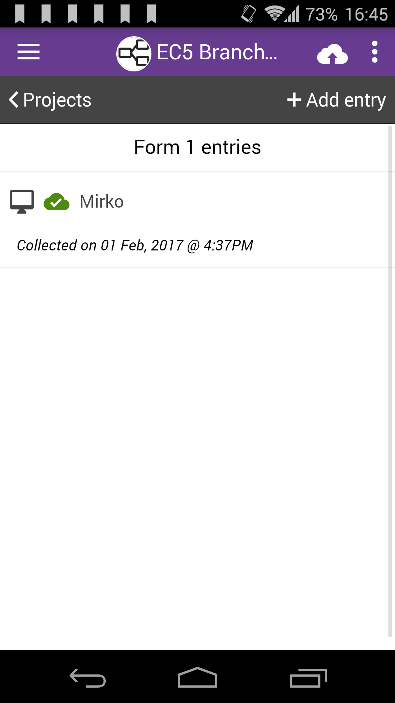 | Select one of the entries downloaded, in this case "Mirko" |

|                                                 |                                                                                                                                                       |
| ----------------------------------------------- | ----------------------------------------------------------------------------------------------------------------------------------------------------- |
| 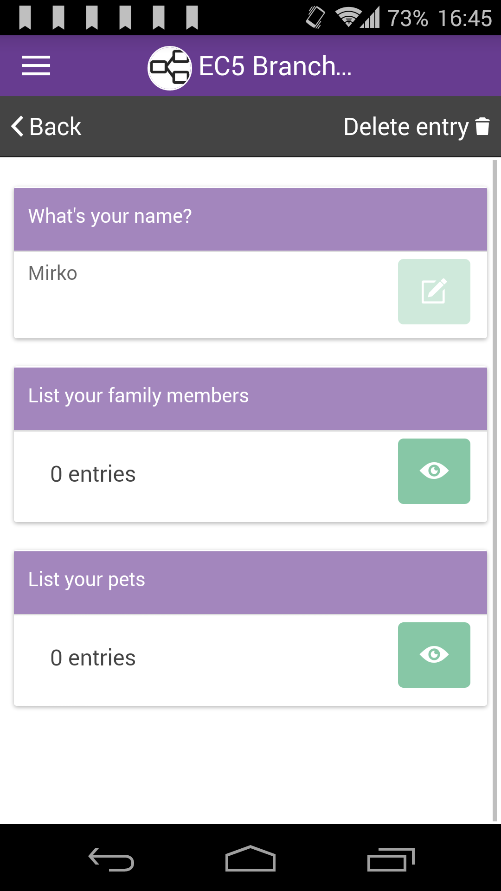 | As you can see the edit buttons are disable, but next to the branc question the view button is enabled. Press it once to go to the add branch screen. |

|                                                 |                                                   |
| ----------------------------------------------- | ------------------------------------------------- |
| 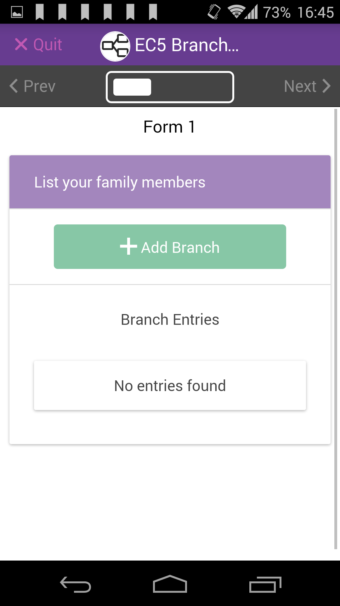 | Click the add branch button to add a branch entry |

|                                                 |                                                                                                                                                            |
| ----------------------------------------------- | ---------------------------------------------------------------------------------------------------------------------------------------------------------- |
| 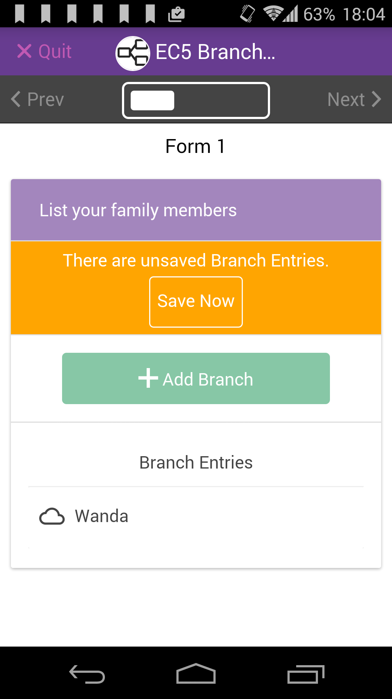 | After you add a branch entry, you need to SAVE it before you can upload it. Obviously you might add more branch entries and then save all of them at once. |

|                                                 |                                                                                                              |
| ----------------------------------------------- | ------------------------------------------------------------------------------------------------------------ |
| 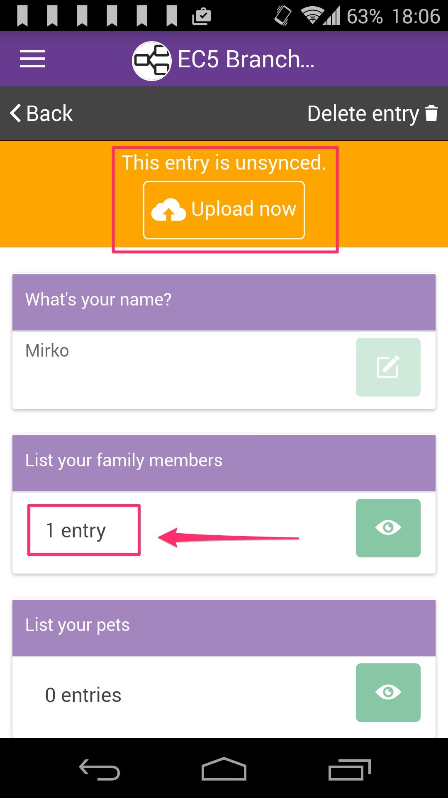 | After you save the branch entry, you can upload it. You can also notice the total of branch entries changed. |
