# Download Entries

Within Epicollect5, users have the capability to download remote entries for each form onto their device.

This functionality enables the addition of entries from one device and later retrieval on another.

When downloading entries, users obtain a snapshot of the current data collection status, encompassing form entries exclusively, but **excluding branch entries, and media files.**


**Please note that when utilizing the mobile native apps, it's intentionally not feasible to directly edit downloaded remote entries and subsequently re-upload them.**


By design, direct editing of downloaded remote entries on the device is not possible. However, users can augment these entries by adding **child entries or branches.** This restriction ensures that server-side entries consistently supersede local modifications, **upholding the server as the definitive data source**.


**This approach serves to maintain data synchronization and integrity across devices, with the server serving as the singular source of truth.**


Entries can be edited on the server by CREATOR, MANAGER and CURATOR roles via the web application. ([**See how**](../web-application/adding-data.md))

The responsive nature of the web application facilitates seamless access from mobile devices and tablets, contingent upon an internet connection.


**For editing entries on mobile devices, utilizing the web application stands as the sole viable option instead of the mobile app.**


## Add child entries to downloaded entries

Let's use our [EC5 Hierarchy project ](https://five.epicollect.net/project/ec5-hierarchy-project)to show how everything works. Load that project and select it from the project list.

<figure><figcaption></figcaption></figure>

On the entries page, open the menu and tap "**Download Entries".**

<figure>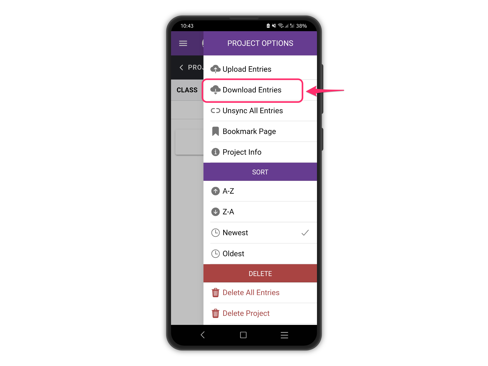<figcaption></figcaption></figure>

On the next screen, you see the list of your form buttons, from top to bottom following your hierarchy structure ([More on linking forms](../formbuilder/multiple-forms.md)). Only the form at the top is enabled, as you need to download entries following the project hierarchy structure, in this case, it is CLASS > PUPIL >TEST. Tap the "**CLASS**" button to download **ALL** the class entries from the server.

<figure>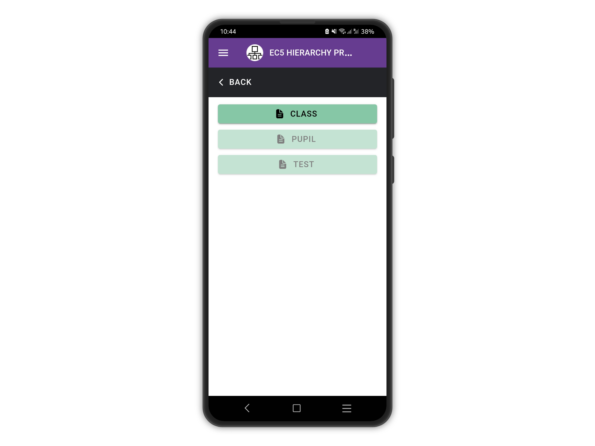<figcaption></figcaption></figure>

You will be prompted to confirm the download. This is to remove any remote entries you already have on the device, as you always get the latest entries snapshot from the server. Press "**OK**" to proceed.

<figure>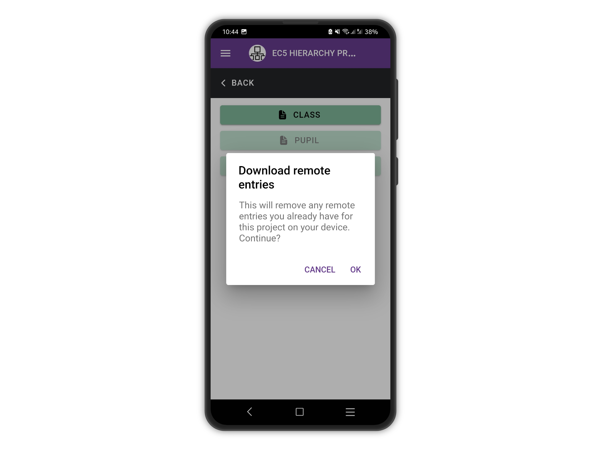<figcaption></figcaption></figure>

After all the CLASS entries are downloaded, the PUPIL button is then enabled.

Tap PUPIL to download all the entries for the PUPIL form.

<figure>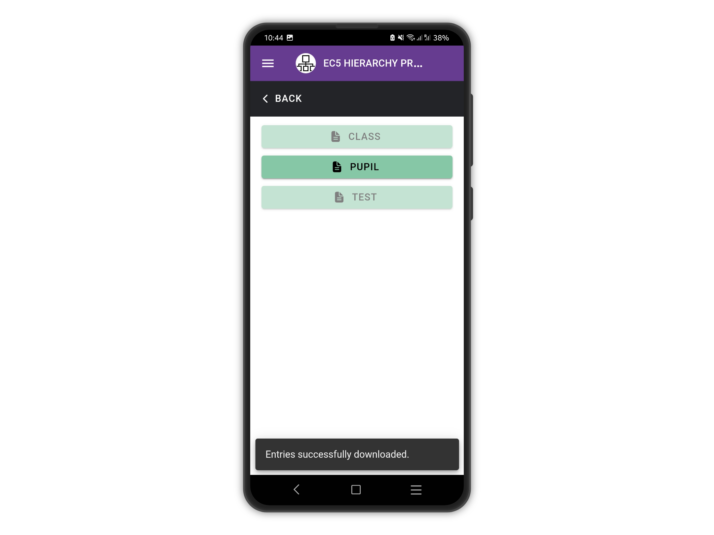<figcaption></figcaption></figure>

Finally, tap TEST to download all the TEST entries.

<figure><figcaption></figcaption></figure>

When all the entries for all the forms are downloaded, the forms buttons are all disabled and you can go back to the entries list.

<figure>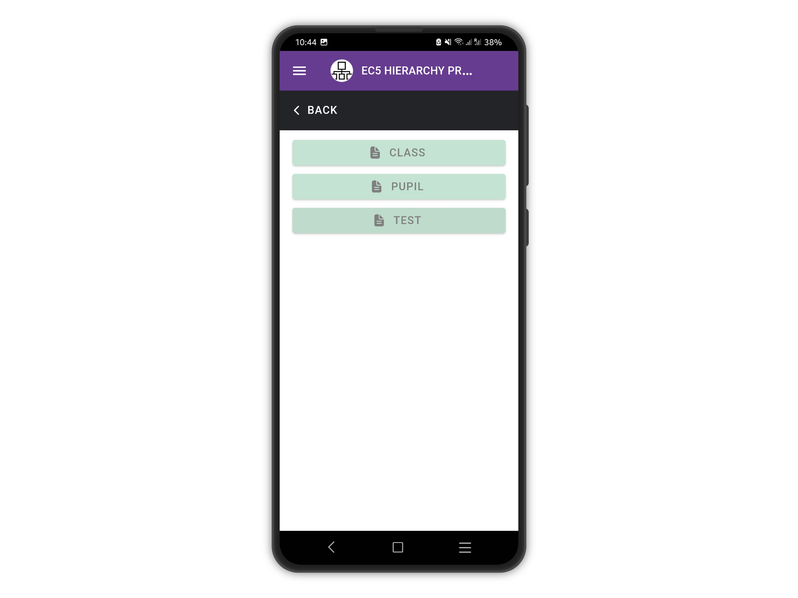<figcaption></figcaption></figure>

The remote entries are now all listed, with a desktop icon next to each of them to indicate they are "**remote**" i.e. **not directly editable**. Now you can add child entries or branches to existing entries (See [Add an entry](add-an-entry.md) and [Add a child entry](add-child-entries.md)).

<figure>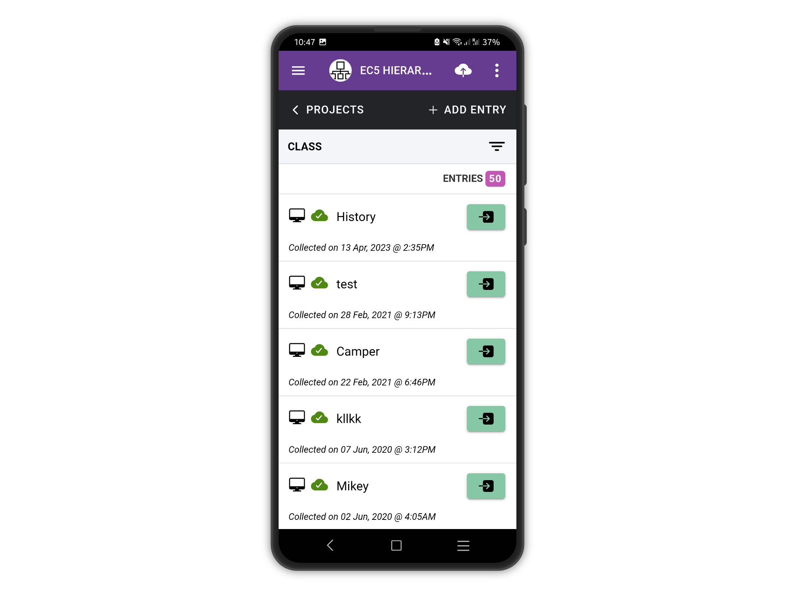<figcaption></figcaption></figure>

## Add branch entries to downloaded entries

Let's download some entries and add brach entries to them. For this example, we will use the [EC5 Branches Project.](https://five.epicollect.net/project/ec5-branches-project)

<figure>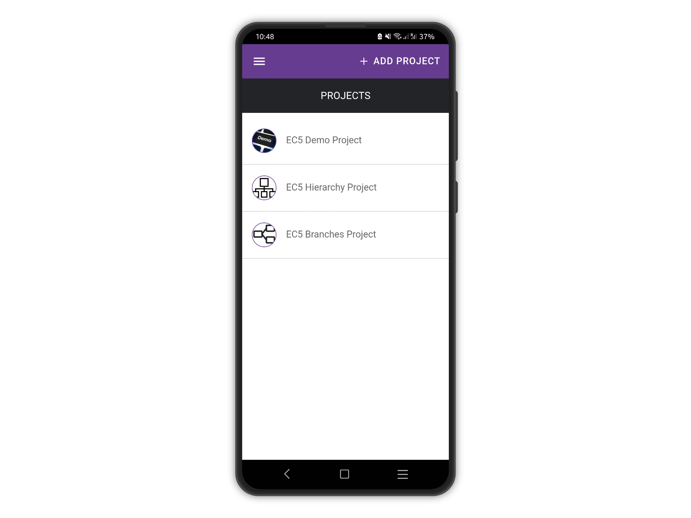<figcaption></figcaption></figure>

Select one of the entries downloaded, in this case "Mirko"

<figure>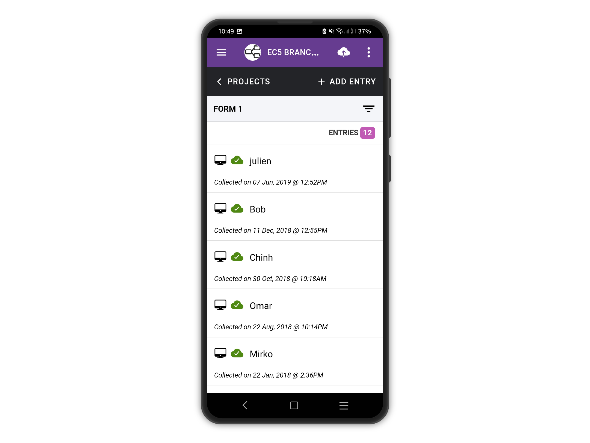<figcaption></figcaption></figure>

As you can see there are not edit buttons, but next to the branch question the view button is enabled. Tap it once to go to the add branch screen.

<figure>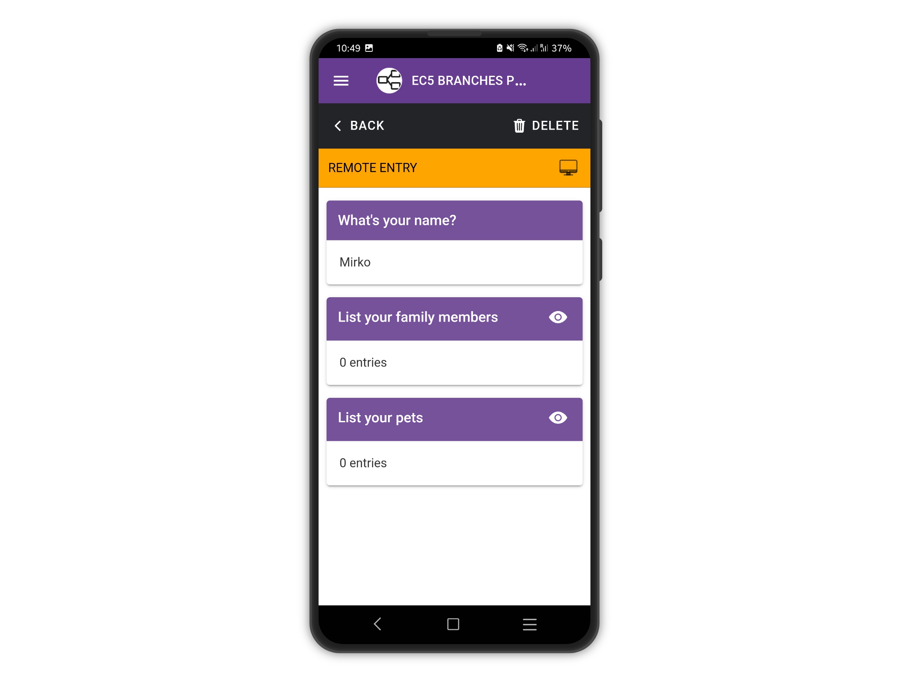<figcaption></figcaption></figure>

Tap the add branch button to add a branch entry.

<figure>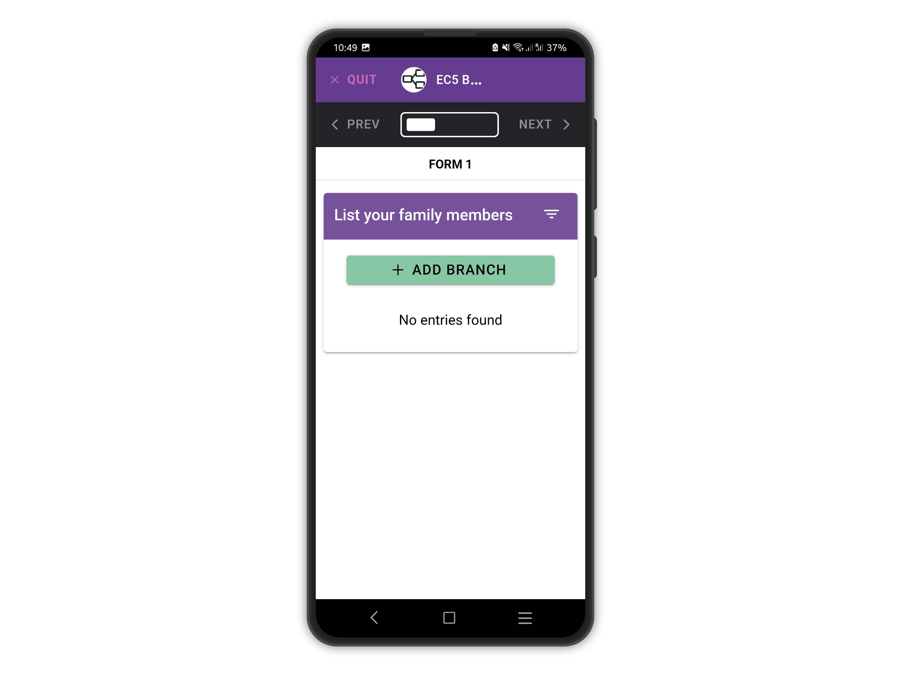<figcaption></figcaption></figure>

After you add a branch entry, you need to SAVE it before you can upload it. Obviously, you might add more branch entries and then save all of them at once.

<figure>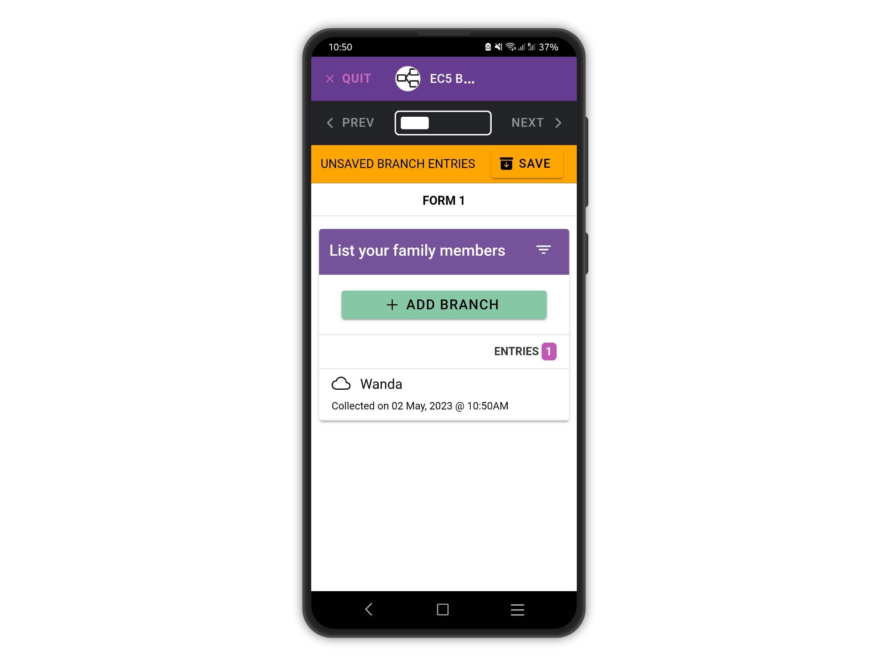<figcaption></figcaption></figure>

After you save the branch entry, you can upload it.

Notice the total of branch entries changed to "1 Entry"

<figure>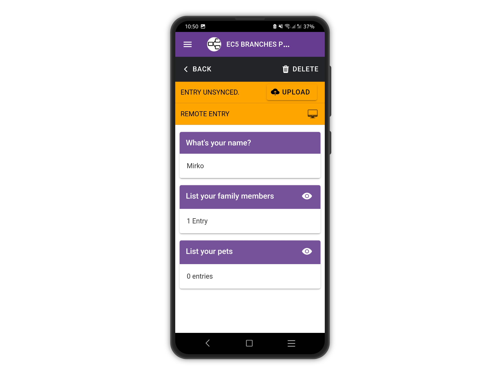<figcaption></figcaption></figure>
